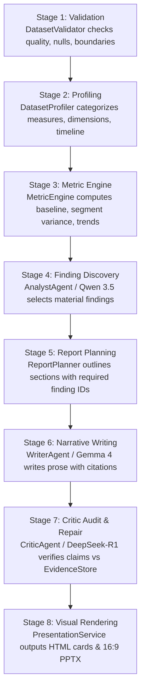

# PulseHR AI: Role-Based AI Report Generation Architecture

This document provides the definitive architectural specification for the modular, role-based AI report and presentation generation pipeline in PulseHR AI.

---

## 1. Architectural Philosophy: Strict Separation of Concerns

The architecture enforces a strict division of responsibilities:
1. **CODE computes the facts**: Pure Python, Pandas, and NumPy compute all numbers, sums, medians, segment breakdowns, rank orders, percentage gaps, and time-series trends. **LLMs are strictly forbidden from performing arithmetic or calculating statistics.**
2. **ANALYST determines what matters**: The `ANALYST` model (`Qwen 3.5 9B`) reviews the pre-calculated candidate facts ledger, filters noise, identifies key operational gaps, and populates the canonical `EvidenceStore`.
3. **PLANNER organizes the report**: The `ReportPlanner` outlines the document structure, requiring every section to explicitly cite verified finding IDs.
4. **WRITER determines how to explain it**: The `WRITER` model (`Google Gemma 4 12B`) produces executive prose strictly citing finding IDs (`[F-001]`, `[F-002]`), with sentence-level lineage logged into `TraceRegistry`.
5. **CRITIC verifies every claim**: The `CRITIC` model (`DeepSeek-R1 7B`) audits every statement against the `EvidenceStore`, classifying claims into `SUPPORTED`, `PARTIALLY_SUPPORTED`, `UNSUPPORTED`, or `CONTRADICTORY`. Unsupported claims trigger an automated repair loop.
6. **RENDERER visualizes the output**: Presentation and reporting builders format verified claims into responsive HTML cards and 16:9 widescreen PowerPoint slides with cryptographic evidence ledgers.

---

## 2. Model Routing & Logical Roles

All business code interacts exclusively with `ModelRole` enums via `ModelGateway.generate()`. No business logic hardcodes model strings.

| Logical Role | Primary Model | Fallback Model | Timeout | Key Responsibilities | Architectural Rationale |
| :--- | :--- | :--- | :--- | :--- | :--- |
| **`FAST`** | `phi4-mini:latest` (3.8B) | `llama3.1:8b` | 25.0s | Instant classification, schema detection, prompt intent routing. | Sub-400ms latency, minimal VRAM footprint, high instruction compliance. |
| **`ANALYST`** | `qwen3.5:9b` (9.7B) | `gemma4:12b` | 45.0s | Evaluating candidate facts, classifying finding types, materiality scoring. | State-of-the-art open coding/reasoning, native JSON tool formatting. |
| **`REASONER`** | `deepseek-r1:7b` (7.6B) | `qwen3.5:9b` | 60.0s | Root cause analysis, multi-sheet dynamics, strategic trade-offs. | Deep Chain-of-Thought reasoning; `<think>` tokens stripped via `clean_cot_reasoning()`. |
| **`WRITER`** | `gemma4:12b` (12B) | `qwen3.5:9b` | 45.0s | Executive summary prose, bullet takeaways, slide narratives. | Google Gemma 4 12B delivers state-of-the-art narrative coherence, executive vocabulary, and high prompt compliance. |
| **`CRITIC`** | `deepseek-r1:7b` (7.6B) | `llama3.1:8b` | 45.0s | Numerical claim verification, citation audit, automated repair. | Rigorous step-by-step verification; catches subtle statistical mismatches. |

---

## 3. Workflow State Machine

The end-to-end report generation pipeline executes through 8 sequential stages orchestrated by `WorkflowOrchestrator`:



---

## 4. Evidence Store & Traceability Contract

Every discovered insight is represented as a structured `Finding` in the canonical `EvidenceStore`:

```python
class Finding(BaseModel):
    finding_id: str                      # e.g., "F-001"
    type: FindingType                    # outperformer, headwind, performance_gap, etc.
    metric: str                          # e.g., "Performance Score"
    segment: str | None                  # e.g., "Engineering"
    segment_value: float | None          # e.g., 91.23
    overall_value: float | None          # e.g., 82.0
    difference: float | None             # e.g., 9.23
    difference_percentage_points: float  # e.g., 11.26
    importance: Importance               # high, medium, low
    headline: str                        # Executive takeaway (< 15 words)
    business_implication: str            # Impact & operational takeaway
    evidence: list[EvidenceReference]    # Source sheet, row counts, proof dict
```

Every sentence written in the narrative logs an audit record into `TraceRegistry`:
* `report_id`: Unique workflow run ID.
* `section_id`: Report section.
* `sentence_text`: Exact text rendered.
* `finding_id`: Verified finding ID cited (e.g. `F-001`).
* `metric_name`: Backing numerical metric.
* `source_columns`: Underlying CSV columns.

---

## 5. Endpoints & Integrations

### Full Workflow Generation
* **Endpoint**: `POST /api/reports/orchestrate`
* **Request Body**:
  ```json
  {
    "sheet_id": 1,
    "objective": "Quarterly Operational Review & Performance Architecture"
  }
  ```
* **Response Payload**:
  ```json
  {
    "status": "COMPLETED",
    "report_id": "rep-7f89b...",
    "objective": "Quarterly Operational Review",
    "quality_report": { "is_valid": true, "quality_score": 100 },
    "finding_count": 6,
    "plan": { "title": "...", "sections": [...] },
    "report": { "sections": [...] },
    "critic_summary": { "claims_audited": 6, "all_supported": true },
    "deck_spec": { "slides": [...], "evidence_ledger": [...] }
  }
  ```

---

## 6. Local Model Verification & Upgrades

The Ollama daemon running on macOS hosts the following active open-weights models:
```bash
ollama list
# NAME              ID              SIZE
# gemma4:12b        4eb23ef187e2    7.6 GB
# qwen3.5:9b        6488c96fa5fa    6.6 GB
# deepseek-r1:7b    755ced02ce7b    4.7 GB
# phi4-mini:latest  4b204642674e    2.5 GB
# llama3.1:8b       46e0c10c039e    4.9 GB
```
Legacy model `qwen2.5:7b-instruct` has been removed.
