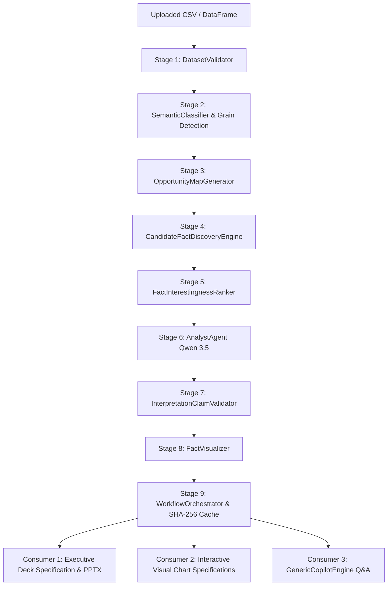

# Generic Analytics Pipeline: Architecture & Technical Specification

This document provides the technical specification for the unified, single-source-of-truth generic analytics pipeline in PulseHR AI.

---

## 1. Architectural Philosophy: One Pipeline, Multiple Consumers

The core design principle is:

```
ONE DATASET 
  → ONE VERIFIED EVIDENCE PIPELINE 
  → MULTIPLE CONSUMERS (Deck / Dashboard / Chatbot)
```

The system establishes analytical truth through deterministic computation before introducing language models for strategic interpretation. Downstream consumers—including the executive slide deck, visualization charts, and conversational Copilot—never independently recalculate mathematical metrics or invent findings.



---

## 2. Pipeline Execution Stages

### Stage 1: Dataset Validation (`DatasetValidator`)
- Validates row count, column structure, missingness, and structural anomalies.
- Rejects completely empty datasets or unparseable files with structured `DataQualityReport`.

### Stage 2: Generic Semantic Profiling & Grain Detection (`SemanticClassifier`)
- Operates without any hardcoded domain assumptions (works for retail, manufacturing, logistics, healthcare, finance, or generic tables).
- Classifies each column into its semantic role:
  - `entity_key` / `identifier`
  - `temporal_point` / `date`
  - `categorical_dimension` (nominal, low-cardinality, or ordinal)
  - `numeric_measure` (currency, counts, percentages, physical quantities)
- Infers primary table grain (e.g. transaction level, entity-date level, or aggregated summary).

### Stage 3: Analysis Opportunity Mapping (`OpportunityMapGenerator`)
- Analyzes the semantic profile to determine all mathematically sound analytical avenues:
  - **Univariate Distributions**: For measures across row observations.
  - **Period Trends**: When temporal points and measures coexist.
  - **Segment Breakdowns**: Bivariate pairings of categorical dimensions with measures.
  - **Measure Relationships**: Continuous correlations across paired measures.
- Prevents nonsensical analyses (e.g., aggregating entity IDs or grouping by continuous timestamps).

### Stage 4: Deterministic Candidate Fact Discovery (`CandidateFactDiscoveryEngine`)
- Executes pure statistical calculations across identified opportunities with zero LLM math:
  - **Segment Comparisons**: Group means, percentage deviations from baseline, Welch's t-test p-values, sample size bounds.
  - **Period Trends**: Period-over-period delta, percentage change, annualized growth rate.
  - **Measure Relationships**: Pearson correlation coefficient, p-value, sample size.
  - **Concentrations**: Top segment share, Pareto distribution.
- Assigns stable, cryptographic `FACT-XXX` identifiers and marks facts as `reliable` or `skipped` based on sample sizes.

### Stage 5: Multi-Signal Interestingness Ranking (`FactInterestingnessRanker`)
- Evaluates candidate facts using multi-signal scoring:
  - Effect magnitude and statistical significance.
  - Baseline deviation and sample size evidence strength.
  - Concentration and temporal movement.
- **Tautology & Derived Relationship Penalty**: Detects accounting identities and derived columns (e.g. `total = price * quantity`, `profit = revenue - cost`) to prevent obvious facts from dominating surprise rankings.
- **Small Baseline Protection**: Penalizes massive percentage swings (e.g., +1500%) caused by near-zero baselines.

### Stage 6: Evidence-Grounded AI Interpretation (`AnalystAgent`)
- Uses Qwen 3.5 to synthesize top-ranked facts into high-level strategic business insights.
- The model receives verified evidence, semantic profiles, and fact IDs—**it is strictly forbidden from independently calculating metrics or querying raw tables**.

### Stage 7: Deterministic Claim Audit (`InterpretationClaimValidator`)
- Audits generated interpretation claims against candidate facts:
  - **Zero Invented Intersections**: If `FACT-A` refers to shift deviations and `FACT-B` refers to machine scrap, prevents concluding that `Shift × Machine` is problematic unless an intersection fact exists.
  - **Separation of Evidence from Hypotheses**: Disallows unwarranted causal assertions ("root cause", "systemic failure") unless directly established.
  - **Neutral Tone for Low-Confidence Semantics**: Ensures masked or ambiguous columns (`col_b`, `val1`) are described neutrally without hallucinating business meaning.

### Stage 8: Intelligent Visualization Recommendation (`FactVisualizer`)
- Automatically maps candidate facts and insights to zero-hallucination chart specifications:
  - Segment comparisons → Column / Horizontal Bar Charts.
  - Chronological trends → Line / Area Trend Charts.
  - Measure relationships → Scatter Plots with paired coordinate points.
  - Share of total → Donut / Pie Charts.
  - Distributions → Boxplot / Histogram.

### Stage 9: Unified Caching & Presentation Materialization (`WorkflowOrchestrator`)
- Assembles presentation deck specifications with theme palettes, headers, and speaker notes.
- Computes SHA-256 fingerprint from DataFrame schema, shape, and sample values (`_GENERIC_WORKFLOW_CACHE`), ensuring repeated queries or multiple downstream consumers reuse the identical artifact.

---

## 3. Conversational Copilot Integration (`GenericCopilotEngine`)

The conversational engine answers questions using the verified pipeline artifacts with a **"Cheapest Path First"** execution strategy:

| User Intent | Execution Strategy | LLM Calls | Latency |
| :--- | :--- | :---: | :---: |
| **Deterministic Aggregations** ("What is total sales?") | Pure DataFrame computation | **0** | < 10ms |
| **Rankings / Extremes** ("Which region had lowest scrap?") | Extracted from segment comparison facts | **0** | < 5ms |
| **Chronological Trends** ("Show trend for profit") | Extracted from period trend facts + Line chart | **0** | < 5ms |
| **"Surprise Me" Inquiries** | Directly reuses top `RankedFact` items | **0** | < 2ms |
| **Analyzed Entity Drilldowns** ("Why is LATAM unusual?") | Reuses precomputed `InterpretationInsight` | **0** | < 2ms |
| **Ambiguous Column Queries** ("What does col_b mean?") | Deterministic semantic guardrail message | **0** | < 1ms |
| **Unanalyzed Strategic Synthesis** | Calls Qwen 3.5 bounded strictly by candidate facts | **1** | ~1.5s |

---

## 4. API Endpoints & Routing Architecture

### Generic Endpoints
- `POST /api/reports/orchestrate`:
  - Input: `{"sheet_id": 1, "objective": "Executive Leadership Review"}`
  - Output: Full `WorkflowExecutionResult` with candidate facts, ranked facts, interpretations, audit result, visual charts, and deck spec.
- `POST /api/copilot/generic`:
  - Input: `{"query": "...", "sheet_id": 1}`
  - Output: `GroundedAnswer` executed strictly through `GenericCopilotEngine`.

### Shared Endpoints (Deterministic Auto-Routing)
- `POST /api/copilot/query`:
  - Inspects query parameters:
    - If `engine == "generic"`: routes to `GenericCopilotEngine`.
    - If `engine == "legacy"`: routes to legacy hybrid retrieval `query_copilot`.
    - If `engine == "auto"`: if active tabular sheet exists and query is not explicit HR workforce operations, executes via `GenericCopilotEngine`.
- `POST /api/reports/presentation`:
  - If `engine == "generic"` or active generic sheet is present, orchestrates and exports via `export_spec_to_pptx`.
  - If `engine == "legacy"`, generates legacy PPTX overview.

### Legacy Backward-Compatible Endpoints
- `GET /api/reports/presentation/latest`: Legacy PPTX download.
- `GET /api/reports/executive-html`: Legacy HTML overview report.

---

## 5. Verification Suite

The pipeline is verified by a focused suite of automated tests:
- `backend/tests/test_generic_semantic_profiler.py` (Profiling & grain detection)
- `backend/tests/test_generic_candidate_fact_discovery.py` (Deterministic fact engine)
- `backend/tests/test_generic_interestingness_ranker.py` (Multi-signal surprise ranker)
- `backend/tests/test_evidence_grounded_interpretation.py` (Analyst interpretation & validator)
- `backend/tests/test_fact_visualizer.py` (Intelligent chart mapping)
- `backend/tests/test_generic_workflow_orchestrator.py` (End-to-end report & deck pipeline)
- `backend/tests/test_generic_copilot_engine.py` (Grounded conversational Q&A)
