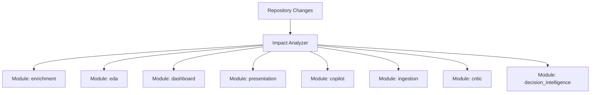

# Modular Test Architecture & Developer Policy

## 1. Executive Architectural Consultation

### Test Architect Consultation
- **Historical Diagnosis**: The test suite previously accumulated 673 tests across 64 flat files in `backend/tests/`. Heavy benchmarks, end-to-end evaluation loops, and pure unit tests were mingled together. Every single test executed SQLite database file creation and migrations via an unconditional fixture (`init_db()`), introducing massive disk I/O, slow execution times, and environmental fragility.
- **Architectural Remedy**:
  1. **Strict Test Pyramid**: Segregate pure in-memory unit tests (`unit`), service integration tests (`integration`), and heavy benchmarks (`benchmark`).
  2. **Domain Module Categorization**: Partition the test suite into 8 autonomous domain modules:
     - `enrichment`
     - `eda`
     - `dashboard`
     - `presentation`
     - `copilot`
     - `ingestion`
     - `critic`
     - `decision_intelligence`
  3. **Pytest Markers & Benchmark Quarantine**: Formally configure `pytest.ini` with custom markers and enforce `-m "not benchmark"` by default. Benchmarks are quarantined in `tests/benchmarks/`.

### Development Architect Consultation
- **Domain Decoupling & Pure Interfaces**:
  1. Core algorithmic services (such as `BudgetGuard`, `FormulaDiscovery`, `GroupByAnalyzer`, `PrimitiveFeatureDeriver`, `Normalizer`) are pure data transformers taking standard types (`DataFrame`, `dict`, `dataclass`) and returning typed contracts.
  2. Pure unit tests for these services execute in memory in `<10ms` without accessing SQLite, disk storage, or network APIs.
  3. The `isolated_workspace` test fixture is optimized to skip SQLite table initialization for any test marked with `@pytest.mark.unit` unless explicitly tagged with `@pytest.mark.db`.
- **Pre-Push Impact Verification**:
  1. A developer must never be forced to run the full 673-test suite locally.
  2. Instead, an automated impact analyzer inspects `git status` and `git diff` against `origin/main`, detects the impacted module(s), and executes only the relevant tests.

---

## 2. Test Pyramid & Execution Tiers

| Tier | Marker | Description | Typical Speed | Target Use-Case |
| :--- | :--- | :--- | :--- | :--- |
| **Tier 1: Unit** | `@pytest.mark.unit` | Pure algorithmic in-memory validation. Zero DB writes, zero network, zero LLMs. | `< 0.05s` / test | Active development loop, hot reload, save hooks |
| **Tier 2: Integration** | `@pytest.mark.integration`, `@pytest.mark.db` | Boundary verification, SQLite persistence, router endpoints, multi-stage pipelines. | `0.5s - 5s` / module | Pre-push verification of touched modules |
| **Tier 3: Benchmark** | `@pytest.mark.benchmark` | 50-case LLM evaluations, large matrix latency profiling, synthetic scaling tests. | `30s - 15m` | Explicit manual runs or nightly CI only |

---

## 3. Registered Domain Modules & Scope



1. **`enrichment`**:
   - Source: `backend/app/services/enrichment/**`
   - Test Files: `tests/test_enrichment_pipeline.py`
   - Pytest Marker: `@pytest.mark.enrichment`
2. **`eda`**:
   - Source: `backend/app/services/eda/**`, `backend/app/routers/eda.py`
   - Test Files: `tests/test_eda_pipeline.py`, `tests/test_walmart_sales_analytics.py`, `tests/test_hr_executive_analytics.py`, `tests/test_industrial_analytics.py`
   - Pytest Marker: `@pytest.mark.eda`
3. **`dashboard`**:
   - Source: `backend/app/services/adaptive_dashboard/**`, `backend/app/routers/adaptive_dashboard.py`
   - Test Files: `tests/test_adaptive_dashboard.py`
   - Pytest Marker: `@pytest.mark.dashboard`
4. **`presentation`**:
   - Source: `backend/app/services/presentation/**`, `backend/app/routers/presentation.py`, `backend/app/services/pptx/**`
   - Test Files: `tests/test_presentation_*.py`, `tests/test_spatial_overflow_monitor.py`, `tests/test_decision_deck.py`, `tests/test_local_voiceover.py`
   - Pytest Marker: `@pytest.mark.presentation`
5. **`copilot`**:
   - Source: `backend/app/services/copilot/**`, `backend/app/services/ai_copilot.py`, `backend/app/routers/copilot.py`
   - Test Files: `tests/test_copilot_*.py`, `tests/test_generic_copilot_engine.py`, `tests/test_chatbot_decision_integration.py`, `tests/test_hybrid_retrieval.py`
   - Pytest Marker: `@pytest.mark.copilot`
6. **`ingestion`**:
   - Source: `backend/app/routers/upload.py`, `backend/app/services/sheet_catalog.py`, `backend/app/services/input_intelligence/**`
   - Test Files: `tests/test_sheet_catalog.py`, `tests/test_ingestion_null_pruning.py`, `tests/test_backend.py`, etc.
   - Pytest Marker: `@pytest.mark.ingestion`
7. **`critic`**:
   - Source: `backend/app/services/critic/**`, `backend/app/services/evidence/**`
   - Test Files: `tests/test_critic_claim_verification.py`, `tests/test_deterministic_claim_validator.py`, etc.
   - Pytest Marker: `@pytest.mark.critic`
8. **`decision_intelligence`**:
   - Source: `backend/app/services/decision_intelligence.py`, `backend/app/services/decision_engine/**`, `backend/app/services/investigation/**`
   - Test Files: `tests/test_decision_intelligence.py`, `tests/test_insight_strategy_reproduction.py`, etc.
   - Pytest Marker: `@pytest.mark.decision_intelligence`

---

## 4. Developer Workflows & Commands

### Workflow A: Active Feature Development (Policy: Unit Tests Only)
When developing or debugging within a specific module, run **only** that module's unit tests:
```bash
# Example: working on semantic enrichment
python scripts/run_impacted_tests.py --module enrichment --unit

# Example: working on EDA calculations or group-by
python scripts/run_impacted_tests.py --module eda --unit

# Native pytest equivalent:
pytest -m "enrichment and not integration"
pytest -m "eda and not integration"
```
**Execution Speed**: `< 1.5 seconds`. Instant feedback loop.

### Workflow B: Ready to Commit & Push to GitHub (Policy: Impacted Modules Only)
When preparing to push your branch, execute the Impact Analyzer:
```bash
# Detects changed files via git diff against origin/main and runs impacted test suites:
python scripts/run_impacted_tests.py
```
- If only `enrichment` and `eda` were modified, **only** `enrichment` and `eda` tests run.
- Unrelated modules (`copilot`, `critic`, `presentation`, `decision_intelligence`) are automatically skipped.

### Workflow C: Automated Pre-Push Git Hook
Install the automated pre-push hook with a single command:
```bash
python scripts/run_impacted_tests.py --install-hook
```
Now, whenever you run `git push`, the hook automatically runs `python scripts/run_impacted_tests.py --pre-push`.
If any test in an impacted module fails, the push is prevented, protecting the remote repository.

### Workflow D: List Modules & Dry-Run
```bash
# List all registered modules and their tests
python scripts/run_impacted_tests.py --list

# Inspect planned test executions without running them
python scripts/run_impacted_tests.py --dry-run
```
