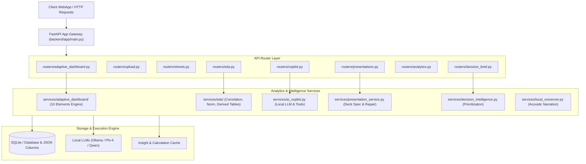

# PulseHR-AI Architectural AST Graph & Structural Code Map

> **Generated**: 2026-09-27T09:29:08.140Z  
> **Total Parsed Codebase**: **Backend (170 modules)** | **Frontend (83 modules)**  
> **Total Endpoints**: 65 | **Backend Classes**: 174 | **Backend Functions**: 361 | **React Components**: 70  
> **Evaluation Standard**: Verified AST Syntax Tree Mapping with Direct File Links

---

## 1. Quick Navigation Hub

- **Core Application Views & Layouts**:
  - [`frontend/src/App.jsx`](file:///Users/vinayksharma/Developer/pulsehr-ai/frontend/src/App.jsx) (Root Shell & Navigation)
  - [`frontend/src/pages/AdaptiveDashboardPage.jsx`](file:///Users/vinayksharma/Developer/pulsehr-ai/frontend/src/pages/AdaptiveDashboardPage.jsx) (Adaptive Intelligence Dashboard)
  - [`frontend/src/pages/DataExplorerPage.jsx`](file:///Users/vinayksharma/Developer/pulsehr-ai/frontend/src/pages/DataExplorerPage.jsx) (Data Explorer & Tabular Analysis)
  - [`frontend/src/pages/PresentationPage.jsx`](file:///Users/vinayksharma/Developer/pulsehr-ai/frontend/src/pages/PresentationPage.jsx) (Boardroom Presentation Engine)
  - [`frontend/src/components/GlobalCopilotWidget.jsx`](file:///Users/vinayksharma/Developer/pulsehr-ai/frontend/src/components/GlobalCopilotWidget.jsx) (HRIDAY AI Assistant & Orb)
- **Backend Analytics & Orchestration Services**:
  - [`backend/app/main.py`](file:///Users/vinayksharma/Developer/pulsehr-ai/backend/app/main.py) (FastAPI Gateway)
  - [`backend/app/routers/adaptive_dashboard.py`](file:///Users/vinayksharma/Developer/pulsehr-ai/backend/app/routers/adaptive_dashboard.py) (10-Element Adaptive API)
  - [`backend/app/services/adaptive_dashboard/`](file:///Users/vinayksharma/Developer/pulsehr-ai/backend/app/services/adaptive_dashboard) (Adaptive Service Layer)
  - [`backend/app/routers/copilot.py`](file:///Users/vinayksharma/Developer/pulsehr-ai/backend/app/routers/copilot.py) (Copilot Query Engine & Streaming)
  - [`backend/app/routers/eda.py`](file:///Users/vinayksharma/Developer/pulsehr-ai/backend/app/routers/eda.py) (Exploratory Data Analysis)
  - [`backend/app/routers/presentations.py`](file:///Users/vinayksharma/Developer/pulsehr-ai/backend/app/routers/presentations.py) (Presentation Engine)

---

## 2. System Architecture Flowcharts

### 2.1 Backend Pipeline & Service Topology

---

### 2.2 Frontend Component Tree & UI State Hierarchy

```mermaid
flowchart TD
    App["App.jsx (Root)"] --> Header["Header.jsx (Nav, Mode & Upload Trigger)"]
    App --> SkipLink["Skip Link (WCAG 2.4.1)"]
    App --> Toast["Notification Toast (aria-live)"]
    App --> Main["main#main-content"]

    subgraph Views["Primary Views"]
        Main --> AdaptiveView["AdaptiveDashboardPage.jsx"]
        Main --> ExplorerView["DataExplorerPage.jsx"]
        Main --> PresView["PresentationPage.jsx"]
    end

    subgraph AdaptiveComponents["10-Element Adaptive Dashboard"]
        AdaptiveView --> E1["E1: Headline Narrative"]
        AdaptiveView --> E2["E2: Period Trajectory"]
        AdaptiveView --> E3["E3: Category Distribution"]
        AdaptiveView --> E4["E4: Benchmark Comparison"]
        AdaptiveView --> E5["E5: Priority Decision Card"]
        AdaptiveView --> E6["E6: Executive Briefing"]
        AdaptiveView --> E7["E7: Disparity Analysis"]
        AdaptiveView --> E8["E8: Exception Watch"]
        AdaptiveView --> E9["E9: Forward Outlook"]
        AdaptiveView --> E10["E10: Enterprise Synthesis"]
    end

    subgraph ExplorerComponents["Data Explorer Components"]
        ExplorerView --> DataTable["DataTable.jsx"]
        DataTable --> DTToolbar["DataTableToolbar.jsx"]
        DataTable --> DTGrid["DataTableGrid.jsx (scope=col, aria-sort)"]
        DataTable --> DTPagination["DataTablePagination.jsx"]
    end

    subgraph PresComponents["Presentation Studio Components"]
        PresView --> PromptStudio["PromptStudioScreen.jsx"]
        PresView --> DeckViewer["PresentationDeckViewer.jsx"]
        PresView --> SlideEditor["SlidePanels.jsx"]
    end

    subgraph GlobalWidgets["Global Drawers & Modals"]
        App --> Copilot["GlobalCopilotWidget.jsx (section role=dialog)"]
        Copilot --> Orb["AnimatedAcousticOrb.jsx"]
        App --> UploadModal["UploadModal.jsx (Focus Trap & aria-modal)"]
        AdaptiveView --> InspectModal["AdaptiveInspectModal.jsx"]
    end
```

---

## 3. Backend Routes & API Endpoints AST

| HTTP Method & Route | Handler Function | Source File | Line |
| :--- | :--- | :--- | :--- |
| `GET ` | `decision_brief` | [`backend/app/routers/decision_brief.py`](file:///Users/vinayksharma/Developer/pulsehr-ai/backend/app/routers/decision_brief.py#L63) | L63 |
| `GET ` | `list_employees` | [`backend/app/routers/employees.py`](file:///Users/vinayksharma/Developer/pulsehr-ai/backend/app/routers/employees.py#L7) | L7 |
| `GET ` | `list_sheets` | [`backend/app/routers/sheets.py`](file:///Users/vinayksharma/Developer/pulsehr-ai/backend/app/routers/sheets.py#L16) | L16 |
| `POST /{deck_id}/narration` | `generate_narration` | [`backend/app/routers/presentations.py`](file:///Users/vinayksharma/Developer/pulsehr-ai/backend/app/routers/presentations.py#L311) | L311 |
| `GET /{deck_id}/narration` | `get_narration` | [`backend/app/routers/presentations.py`](file:///Users/vinayksharma/Developer/pulsehr-ai/backend/app/routers/presentations.py#L325) | L325 |
| `GET /{deck_id}/narration/slide/{slide_order}` | `stream_slide_narration` | [`backend/app/routers/presentations.py`](file:///Users/vinayksharma/Developer/pulsehr-ai/backend/app/routers/presentations.py#L341) | L341 |
| `GET /{emp_id}` | `get_employee_detail` | [`backend/app/routers/employees.py`](file:///Users/vinayksharma/Developer/pulsehr-ai/backend/app/routers/employees.py#L82) | L82 |
| `GET /{sheet_id}/download` | `download_sheet` | [`backend/app/routers/sheets.py`](file:///Users/vinayksharma/Developer/pulsehr-ai/backend/app/routers/sheets.py#L120) | L120 |
| `GET /{sheet_id}/projections` | `sheet_raw_projections` | [`backend/app/routers/sheets.py`](file:///Users/vinayksharma/Developer/pulsehr-ai/backend/app/routers/sheets.py#L166) | L166 |
| `GET /{sheet_id}/rows` | `sheet_rows` | [`backend/app/routers/sheets.py`](file:///Users/vinayksharma/Developer/pulsehr-ai/backend/app/routers/sheets.py#L47) | L47 |
| `GET /api/health` | `health_check` | [`backend/app/main.py`](file:///Users/vinayksharma/Developer/pulsehr-ai/backend/app/main.py#L51) | L51 |
| `GET /calculation-columns` | `calculation_columns` | [`backend/app/routers/copilot.py`](file:///Users/vinayksharma/Developer/pulsehr-ai/backend/app/routers/copilot.py#L533) | L533 |
| `GET /cross-sheet-correlations` | `get_cross_sheet_correlations` | [`backend/app/routers/eda.py`](file:///Users/vinayksharma/Developer/pulsehr-ai/backend/app/routers/eda.py#L117) | L117 |
| `GET /datasets` | `list_datasets` | [`backend/app/routers/upload.py`](file:///Users/vinayksharma/Developer/pulsehr-ai/backend/app/routers/upload.py#L107) | L107 |
| `DELETE /datasets` | `delete_all_datasets` | [`backend/app/routers/upload.py`](file:///Users/vinayksharma/Developer/pulsehr-ai/backend/app/routers/upload.py#L267) | L267 |
| `DELETE /datasets/{dataset_id}` | `delete_dataset` | [`backend/app/routers/upload.py`](file:///Users/vinayksharma/Developer/pulsehr-ai/backend/app/routers/upload.py#L236) | L236 |
| `POST /datasets/{dataset_id}/brief` | `submit_dataset_brief` | [`backend/app/routers/upload.py`](file:///Users/vinayksharma/Developer/pulsehr-ai/backend/app/routers/upload.py#L296) | L296 |
| `GET /datasets/{dataset_id}/brief` | `get_dataset_brief` | [`backend/app/routers/upload.py`](file:///Users/vinayksharma/Developer/pulsehr-ai/backend/app/routers/upload.py#L340) | L340 |
| `GET /datasets/{dataset_id}/download` | `download_dataset` | [`backend/app/routers/upload.py`](file:///Users/vinayksharma/Developer/pulsehr-ai/backend/app/routers/upload.py#L125) | L125 |
| `POST /datasets/bulk-delete` | `bulk_delete_datasets` | [`backend/app/routers/upload.py`](file:///Users/vinayksharma/Developer/pulsehr-ai/backend/app/routers/upload.py#L279) | L279 |
| `GET /decks` | `list_presentation_decks` | [`backend/app/routers/presentations.py`](file:///Users/vinayksharma/Developer/pulsehr-ai/backend/app/routers/presentations.py#L168) | L168 |
| `GET /decks/{deck_id}` | `get_presentation_deck` | [`backend/app/routers/presentations.py`](file:///Users/vinayksharma/Developer/pulsehr-ai/backend/app/routers/presentations.py#L197) | L197 |
| `PUT /decks/{deck_id}` | `update_presentation_deck` | [`backend/app/routers/presentations.py`](file:///Users/vinayksharma/Developer/pulsehr-ai/backend/app/routers/presentations.py#L217) | L217 |
| `GET /decks/{deck_id}/evidence` | `get_deck_evidence` | [`backend/app/routers/presentations.py`](file:///Users/vinayksharma/Developer/pulsehr-ai/backend/app/routers/presentations.py#L117) | L117 |
| `GET /derived-tables` | `list_derived_tables` | [`backend/app/routers/eda.py`](file:///Users/vinayksharma/Developer/pulsehr-ai/backend/app/routers/eda.py#L43) | L43 |
| `GET /derived-tables/{derived_id}/rows` | `get_derived_table_rows` | [`backend/app/routers/eda.py`](file:///Users/vinayksharma/Developer/pulsehr-ai/backend/app/routers/eda.py#L69) | L69 |
| `GET /download/{deck_id}` | `download_deck_pptx` | [`backend/app/routers/presentations.py`](file:///Users/vinayksharma/Developer/pulsehr-ai/backend/app/routers/presentations.py#L280) | L280 |
| `GET /executive-html` | `get_executive_html_report` | [`backend/app/routers/reports.py`](file:///Users/vinayksharma/Developer/pulsehr-ai/backend/app/routers/reports.py#L108) | L108 |
| `POST /export-pptx` | `export_presentation_to_pptx` | [`backend/app/routers/presentations.py`](file:///Users/vinayksharma/Developer/pulsehr-ai/backend/app/routers/presentations.py#L259) | L259 |
| `POST /file` | `upload_file` | [`backend/app/routers/upload.py`](file:///Users/vinayksharma/Developer/pulsehr-ai/backend/app/routers/upload.py#L23) | L23 |
| `GET /findings` | `get_dashboard_findings` | [`backend/app/routers/adaptive_dashboard.py`](file:///Users/vinayksharma/Developer/pulsehr-ai/backend/app/routers/adaptive_dashboard.py#L21) | L21 |
| `POST /generate` | `start_presentation_generation` | [`backend/app/routers/presentations.py`](file:///Users/vinayksharma/Developer/pulsehr-ai/backend/app/routers/presentations.py#L91) | L91 |
| `POST /generic` | `ask_generic_copilot` | [`backend/app/routers/copilot.py`](file:///Users/vinayksharma/Developer/pulsehr-ai/backend/app/routers/copilot.py#L408) | L408 |
| `GET /images/search` | `get_free_images` | [`backend/app/routers/presentations.py`](file:///Users/vinayksharma/Developer/pulsehr-ai/backend/app/routers/presentations.py#L66) | L66 |
| `GET /investigate` | `api_analytics_investigate` | [`backend/app/routers/analytics.py`](file:///Users/vinayksharma/Developer/pulsehr-ai/backend/app/routers/analytics.py#L109) | L109 |
| `GET /jobs/{job_id}` | `get_presentation_job_status` | [`backend/app/routers/presentations.py`](file:///Users/vinayksharma/Developer/pulsehr-ai/backend/app/routers/presentations.py#L142) | L142 |
| `POST /jobs/{job_id}/cancel` | `cancel_presentation_job` | [`backend/app/routers/presentations.py`](file:///Users/vinayksharma/Developer/pulsehr-ai/backend/app/routers/presentations.py#L159) | L159 |
| `GET /models` | `list_models` | [`backend/app/routers/copilot.py`](file:///Users/vinayksharma/Developer/pulsehr-ai/backend/app/routers/copilot.py#L517) | L517 |
| `POST /orchestrate` | `orchestrate_evidence_report` | [`backend/app/routers/reports.py`](file:///Users/vinayksharma/Developer/pulsehr-ai/backend/app/routers/reports.py#L130) | L130 |
| `GET /overview` | `get_analytics_overview` | [`backend/app/routers/analytics.py`](file:///Users/vinayksharma/Developer/pulsehr-ai/backend/app/routers/analytics.py#L136) | L136 |
| `GET /overview/base` | `api_overview_base` | [`backend/app/routers/analytics.py`](file:///Users/vinayksharma/Developer/pulsehr-ai/backend/app/routers/analytics.py#L42) | L42 |
| `GET /overview/evidence-package` | `api_overview_evidence_package` | [`backend/app/routers/analytics.py`](file:///Users/vinayksharma/Developer/pulsehr-ai/backend/app/routers/analytics.py#L96) | L96 |
| `POST /overview/refresh-story` | `refresh_analytics_story` | [`backend/app/routers/analytics.py`](file:///Users/vinayksharma/Developer/pulsehr-ai/backend/app/routers/analytics.py#L172) | L172 |
| `GET /overview/relational` | `api_overview_relational` | [`backend/app/routers/analytics.py`](file:///Users/vinayksharma/Developer/pulsehr-ai/backend/app/routers/analytics.py#L82) | L82 |
| `GET /overview/story` | `api_overview_story` | [`backend/app/routers/analytics.py`](file:///Users/vinayksharma/Developer/pulsehr-ai/backend/app/routers/analytics.py#L63) | L63 |
| `GET /overview/visuals` | `api_overview_visuals` | [`backend/app/routers/analytics.py`](file:///Users/vinayksharma/Developer/pulsehr-ai/backend/app/routers/analytics.py#L48) | L48 |
| `POST /presentation` | `create_presentation` | [`backend/app/routers/reports.py`](file:///Users/vinayksharma/Developer/pulsehr-ai/backend/app/routers/reports.py#L19) | L19 |
| `GET /presentation/files/{filename}` | `download_presentation` | [`backend/app/routers/reports.py`](file:///Users/vinayksharma/Developer/pulsehr-ai/backend/app/routers/reports.py#L113) | L113 |
| `GET /presentation/latest` | `get_latest_presentation` | [`backend/app/routers/reports.py`](file:///Users/vinayksharma/Developer/pulsehr-ai/backend/app/routers/reports.py#L94) | L94 |
| `GET /primary-element` | `get_primary_element` | [`backend/app/routers/adaptive_dashboard.py`](file:///Users/vinayksharma/Developer/pulsehr-ai/backend/app/routers/adaptive_dashboard.py#L10) | L10 |
| `POST /prioritize` | `prioritize` | [`backend/app/routers/decision_brief.py`](file:///Users/vinayksharma/Developer/pulsehr-ai/backend/app/routers/decision_brief.py#L89) | L89 |
| `POST /query` | `ask_copilot` | [`backend/app/routers/copilot.py`](file:///Users/vinayksharma/Developer/pulsehr-ai/backend/app/routers/copilot.py#L421) | L421 |
| `POST /query/stream` | `ask_copilot_stream` | [`backend/app/routers/copilot.py`](file:///Users/vinayksharma/Developer/pulsehr-ai/backend/app/routers/copilot.py#L457) | L457 |
| `POST /regenerate-slide` | `handle_regenerate_slide` | [`backend/app/routers/presentations.py`](file:///Users/vinayksharma/Developer/pulsehr-ai/backend/app/routers/presentations.py#L248) | L248 |
| `GET /relationships/{relationship_id}/rows` | `joined_rows` | [`backend/app/routers/sheets.py`](file:///Users/vinayksharma/Developer/pulsehr-ai/backend/app/routers/sheets.py#L25) | L25 |
| `GET /report-evidence` | `leadership_report_evidence` | [`backend/app/routers/decision_brief.py`](file:///Users/vinayksharma/Developer/pulsehr-ai/backend/app/routers/decision_brief.py#L191) | L191 |
| `POST /report-plan` | `leadership_report_plan` | [`backend/app/routers/decision_brief.py`](file:///Users/vinayksharma/Developer/pulsehr-ai/backend/app/routers/decision_brief.py#L182) | L182 |
| `GET /reports/{sheet_id}` | `get_sheet_eda_report` | [`backend/app/routers/eda.py`](file:///Users/vinayksharma/Developer/pulsehr-ai/backend/app/routers/eda.py#L16) | L16 |
| `POST /reseed-kaggle` | `reseed_kaggle` | [`backend/app/routers/upload.py`](file:///Users/vinayksharma/Developer/pulsehr-ai/backend/app/routers/upload.py#L184) | L184 |
| `POST /revalidate` | `revalidate_deck_claims` | [`backend/app/routers/presentations.py`](file:///Users/vinayksharma/Developer/pulsehr-ai/backend/app/routers/presentations.py#L133) | L133 |
| `POST /run` | `trigger_eda` | [`backend/app/routers/eda.py`](file:///Users/vinayksharma/Developer/pulsehr-ai/backend/app/routers/eda.py#L153) | L153 |
| `POST /scope-preview` | `get_scope_preview` | [`backend/app/routers/presentations.py`](file:///Users/vinayksharma/Developer/pulsehr-ai/backend/app/routers/presentations.py#L83) | L83 |
| `GET /suggestions` | `get_query_suggestions` | [`backend/app/routers/copilot.py`](file:///Users/vinayksharma/Developer/pulsehr-ai/backend/app/routers/copilot.py#L521) | L521 |
| `GET /themes` | `get_themes` | [`backend/app/routers/presentations.py`](file:///Users/vinayksharma/Developer/pulsehr-ai/backend/app/routers/presentations.py#L77) | L77 |
| `POST /voiceover` | `local_voiceover` | [`backend/app/routers/decision_brief.py`](file:///Users/vinayksharma/Developer/pulsehr-ai/backend/app/routers/decision_brief.py#L162) | L162 |

---

## 4. Frontend Components & Hierarchy AST

| Component Name | Source File | Line | Hooks Used | Rendered Children / Subcomponents |
| :--- | :--- | :--- | :--- | :--- |
| [`client`](file:///Users/vinayksharma/Developer/pulsehr-ai/frontend/src/api/client.js#L1) | [`frontend/src/api/client.js`](file:///Users/vinayksharma/Developer/pulsehr-ai/frontend/src/api/client.js) | L1 | `none` | `standard DOM` |
| [`App`](file:///Users/vinayksharma/Developer/pulsehr-ai/frontend/src/App.jsx#L27) | [`frontend/src/App.jsx`](file:///Users/vinayksharma/Developer/pulsehr-ai/frontend/src/App.jsx) | L27 | `useState, useEffect` | `Header, CheckCircle2, Table, X, AdaptiveDashboardPage, DataExplorerPage (+5 more)` |
| [`AnalysisCoverageSection`](file:///Users/vinayksharma/Developer/pulsehr-ai/frontend/src/components/adaptive/AnalysisCoverageSection.jsx#L180) | [`frontend/src/components/adaptive/AnalysisCoverageSection.jsx`](file:///Users/vinayksharma/Developer/pulsehr-ai/frontend/src/components/adaptive/AnalysisCoverageSection.jsx) | L180 | `useState, useMemo` | `CheckCircle2, Sparkles, XCircle, AlertOctagon, HelpCircle, Briefcase (+7 more)` |
| [`EnterpriseSynthesisCard`](file:///Users/vinayksharma/Developer/pulsehr-ai/frontend/src/components/adaptive/EnterpriseSynthesisCard.jsx#L20) | [`frontend/src/components/adaptive/EnterpriseSynthesisCard.jsx`](file:///Users/vinayksharma/Developer/pulsehr-ai/frontend/src/components/adaptive/EnterpriseSynthesisCard.jsx) | L20 | `useState, useTheme, useMemo` | `Network, Info, Table, SafeReactECharts, AlertCircle, ExternalLink` |
| [`ExceptionWatchCard`](file:///Users/vinayksharma/Developer/pulsehr-ai/frontend/src/components/adaptive/ExceptionWatchCard.jsx#L112) | [`frontend/src/components/adaptive/ExceptionWatchCard.jsx`](file:///Users/vinayksharma/Developer/pulsehr-ai/frontend/src/components/adaptive/ExceptionWatchCard.jsx) | L112 | `useState, useMemo` | `Info, ArrowRight, SafeReactECharts` |
| [`ExecutiveBriefingCard`](file:///Users/vinayksharma/Developer/pulsehr-ai/frontend/src/components/adaptive/ExecutiveBriefingCard.jsx#L6) | [`frontend/src/components/adaptive/ExecutiveBriefingCard.jsx`](file:///Users/vinayksharma/Developer/pulsehr-ai/frontend/src/components/adaptive/ExecutiveBriefingCard.jsx) | L6 | `useState` | `AnimatedAcousticOrb, Info, VoiceoverPlayer, ChevronUp, ChevronDown, ShieldCheck` |
| [`ForwardOutlookCard`](file:///Users/vinayksharma/Developer/pulsehr-ai/frontend/src/components/adaptive/ForwardOutlookCard.jsx#L30) | [`frontend/src/components/adaptive/ForwardOutlookCard.jsx`](file:///Users/vinayksharma/Developer/pulsehr-ai/frontend/src/components/adaptive/ForwardOutlookCard.jsx) | L30 | `useState, useMemo` | `Target, TrendingUp, ShieldCheck, Info, SafeReactECharts, Table` |
| [`PriorityInsightCard`](file:///Users/vinayksharma/Developer/pulsehr-ai/frontend/src/components/adaptive/PriorityInsightCard.jsx#L345) | [`frontend/src/components/adaptive/PriorityInsightCard.jsx`](file:///Users/vinayksharma/Developer/pulsehr-ai/frontend/src/components/adaptive/PriorityInsightCard.jsx) | L345 | `useState, useMemo, useEffect, useTheme` | `ExternalLink, Volume2, SlidersHorizontal, ChevronUp, ChevronDown, TrendingUp (+10 more)` |
| [`BradfordFactorChart`](file:///Users/vinayksharma/Developer/pulsehr-ai/frontend/src/components/analytics/BradfordFactorChart.jsx#L3) | [`frontend/src/components/analytics/BradfordFactorChart.jsx`](file:///Users/vinayksharma/Developer/pulsehr-ai/frontend/src/components/analytics/BradfordFactorChart.jsx) | L3 | `none` | `DataChart` |
| [`BurnoutStrainChart`](file:///Users/vinayksharma/Developer/pulsehr-ai/frontend/src/components/analytics/BurnoutStrainChart.jsx#L3) | [`frontend/src/components/analytics/BurnoutStrainChart.jsx`](file:///Users/vinayksharma/Developer/pulsehr-ai/frontend/src/components/analytics/BurnoutStrainChart.jsx) | L3 | `none` | `standard DOM` |
| [`ChartDetailModal`](file:///Users/vinayksharma/Developer/pulsehr-ai/frontend/src/components/analytics/ChartDetailModal.jsx#L5) | [`frontend/src/components/analytics/ChartDetailModal.jsx`](file:///Users/vinayksharma/Developer/pulsehr-ai/frontend/src/components/analytics/ChartDetailModal.jsx) | L5 | `useState, useEffect` | `Table, X, Search, ArrowUpDown, ChevronRight` |
| [`ChartEvidenceHeader`](file:///Users/vinayksharma/Developer/pulsehr-ai/frontend/src/components/analytics/ChartEvidenceHeader.jsx#L5) | [`frontend/src/components/analytics/ChartEvidenceHeader.jsx`](file:///Users/vinayksharma/Developer/pulsehr-ai/frontend/src/components/analytics/ChartEvidenceHeader.jsx) | L5 | `none` | `ExternalLink` |
| [`ComparativeBarChart`](file:///Users/vinayksharma/Developer/pulsehr-ai/frontend/src/components/analytics/ComparativeBarChart.jsx#L3) | [`frontend/src/components/analytics/ComparativeBarChart.jsx`](file:///Users/vinayksharma/Developer/pulsehr-ai/frontend/src/components/analytics/ComparativeBarChart.jsx) | L3 | `none` | `DataChart` |
| [`DataDensityToolbar`](file:///Users/vinayksharma/Developer/pulsehr-ai/frontend/src/components/analytics/DataDensityToolbar.jsx#L4) | [`frontend/src/components/analytics/DataDensityToolbar.jsx`](file:///Users/vinayksharma/Developer/pulsehr-ai/frontend/src/components/analytics/DataDensityToolbar.jsx) | L4 | `none` | `Table, Search, X` |
| [`DynamicBarChart`](file:///Users/vinayksharma/Developer/pulsehr-ai/frontend/src/components/analytics/DynamicBarChart.jsx#L7) | [`frontend/src/components/analytics/DynamicBarChart.jsx`](file:///Users/vinayksharma/Developer/pulsehr-ai/frontend/src/components/analytics/DynamicBarChart.jsx) | L7 | `useState, useMemo` | `DataDensityToolbar, DataChart, ChartDetailModal` |
| [`DynamicDonutChart`](file:///Users/vinayksharma/Developer/pulsehr-ai/frontend/src/components/analytics/DynamicDonutChart.jsx#L6) | [`frontend/src/components/analytics/DynamicDonutChart.jsx`](file:///Users/vinayksharma/Developer/pulsehr-ai/frontend/src/components/analytics/DynamicDonutChart.jsx) | L6 | `useState, useMemo` | `PieChart, BarChart2, Table, DataChart, ChartDetailModal` |
| [`DynamicLineChart`](file:///Users/vinayksharma/Developer/pulsehr-ai/frontend/src/components/analytics/DynamicLineChart.jsx#L7) | [`frontend/src/components/analytics/DynamicLineChart.jsx`](file:///Users/vinayksharma/Developer/pulsehr-ai/frontend/src/components/analytics/DynamicLineChart.jsx) | L7 | `useState, useMemo` | `Table, DataChart, ChartDetailModal` |
| [`ElasticityChart`](file:///Users/vinayksharma/Developer/pulsehr-ai/frontend/src/components/analytics/ElasticityChart.jsx#L6) | [`frontend/src/components/analytics/ElasticityChart.jsx`](file:///Users/vinayksharma/Developer/pulsehr-ai/frontend/src/components/analytics/ElasticityChart.jsx) | L6 | `useTheme` | `SafeReactECharts` |
| [`ForecastChart`](file:///Users/vinayksharma/Developer/pulsehr-ai/frontend/src/components/analytics/ForecastChart.jsx#L6) | [`frontend/src/components/analytics/ForecastChart.jsx`](file:///Users/vinayksharma/Developer/pulsehr-ai/frontend/src/components/analytics/ForecastChart.jsx) | L6 | `useTheme` | `SafeReactECharts` |
| [`Talent9BoxMatrix`](file:///Users/vinayksharma/Developer/pulsehr-ai/frontend/src/components/analytics/Talent9BoxMatrix.jsx#L3) | [`frontend/src/components/analytics/Talent9BoxMatrix.jsx`](file:///Users/vinayksharma/Developer/pulsehr-ai/frontend/src/components/analytics/Talent9BoxMatrix.jsx) | L3 | `useState` | `standard DOM` |
| [`chartOptions`](file:///Users/vinayksharma/Developer/pulsehr-ai/frontend/src/components/charts/chartOptions.js#L1) | [`frontend/src/components/charts/chartOptions.js`](file:///Users/vinayksharma/Developer/pulsehr-ai/frontend/src/components/charts/chartOptions.js) | L1 | `none` | `standard DOM` |
| [`DataChart`](file:///Users/vinayksharma/Developer/pulsehr-ai/frontend/src/components/charts/DataChart.jsx#L6) | [`frontend/src/components/charts/DataChart.jsx`](file:///Users/vinayksharma/Developer/pulsehr-ai/frontend/src/components/charts/DataChart.jsx) | L6 | `useTheme` | `SafeReactECharts` |
| [`ExecutiveBarComparisonChart`](file:///Users/vinayksharma/Developer/pulsehr-ai/frontend/src/components/charts/ExecutiveBarComparisonChart.jsx#L3) | [`frontend/src/components/charts/ExecutiveBarComparisonChart.jsx`](file:///Users/vinayksharma/Developer/pulsehr-ai/frontend/src/components/charts/ExecutiveBarComparisonChart.jsx) | L3 | `none` | `DataChart` |
| [`ExecutiveDonutChart`](file:///Users/vinayksharma/Developer/pulsehr-ai/frontend/src/components/charts/ExecutiveDonutChart.jsx#L3) | [`frontend/src/components/charts/ExecutiveDonutChart.jsx`](file:///Users/vinayksharma/Developer/pulsehr-ai/frontend/src/components/charts/ExecutiveDonutChart.jsx) | L3 | `none` | `DataChart` |
| [`ExecutiveGaugeChart`](file:///Users/vinayksharma/Developer/pulsehr-ai/frontend/src/components/charts/ExecutiveGaugeChart.jsx#L4) | [`frontend/src/components/charts/ExecutiveGaugeChart.jsx`](file:///Users/vinayksharma/Developer/pulsehr-ai/frontend/src/components/charts/ExecutiveGaugeChart.jsx) | L4 | `useMemo` | `ReactECharts` |
| [`ExecutiveHeatmapChart`](file:///Users/vinayksharma/Developer/pulsehr-ai/frontend/src/components/charts/ExecutiveHeatmapChart.jsx#L4) | [`frontend/src/components/charts/ExecutiveHeatmapChart.jsx`](file:///Users/vinayksharma/Developer/pulsehr-ai/frontend/src/components/charts/ExecutiveHeatmapChart.jsx) | L4 | `useMemo` | `ReactECharts` |
| [`ExecutiveTrendChart`](file:///Users/vinayksharma/Developer/pulsehr-ai/frontend/src/components/charts/ExecutiveTrendChart.jsx#L3) | [`frontend/src/components/charts/ExecutiveTrendChart.jsx`](file:///Users/vinayksharma/Developer/pulsehr-ai/frontend/src/components/charts/ExecutiveTrendChart.jsx) | L3 | `none` | `DataChart` |
| [`SafeReactECharts`](file:///Users/vinayksharma/Developer/pulsehr-ai/frontend/src/components/charts/SafeReactECharts.jsx#L192) | [`frontend/src/components/charts/SafeReactECharts.jsx`](file:///Users/vinayksharma/Developer/pulsehr-ai/frontend/src/components/charts/SafeReactECharts.jsx) | L192 | `useRef, useState, useTheme, useEffect` | `standard DOM` |
| [`ErrorBoundary`](file:///Users/vinayksharma/Developer/pulsehr-ai/frontend/src/components/common/ErrorBoundary.jsx#L1) | [`frontend/src/components/common/ErrorBoundary.jsx`](file:///Users/vinayksharma/Developer/pulsehr-ai/frontend/src/components/common/ErrorBoundary.jsx) | L1 | `none` | `AlertTriangle, RefreshCw` |
| [`CopilotTools`](file:///Users/vinayksharma/Developer/pulsehr-ai/frontend/src/components/CopilotTools.jsx#L4) | [`frontend/src/components/CopilotTools.jsx`](file:///Users/vinayksharma/Developer/pulsehr-ai/frontend/src/components/CopilotTools.jsx) | L4 | `useState, useEffect` | `standard DOM` |
| [`DataTable`](file:///Users/vinayksharma/Developer/pulsehr-ai/frontend/src/components/DataTable.jsx#L18) | [`frontend/src/components/DataTable.jsx`](file:///Users/vinayksharma/Developer/pulsehr-ai/frontend/src/components/DataTable.jsx) | L18 | `useState, useRef, useEffect, useMemo` | `DataTableToolbar, X, DataTableGrid, DataTablePagination` |
| [`ColumnVisibilityPicker`](file:///Users/vinayksharma/Developer/pulsehr-ai/frontend/src/components/datatable/ColumnVisibilityPicker.jsx#L4) | [`frontend/src/components/datatable/ColumnVisibilityPicker.jsx`](file:///Users/vinayksharma/Developer/pulsehr-ai/frontend/src/components/datatable/ColumnVisibilityPicker.jsx) | L4 | `none` | `standard DOM` |
| [`DataTableGrid`](file:///Users/vinayksharma/Developer/pulsehr-ai/frontend/src/components/datatable/DataTableGrid.jsx#L5) | [`frontend/src/components/datatable/DataTableGrid.jsx`](file:///Users/vinayksharma/Developer/pulsehr-ai/frontend/src/components/datatable/DataTableGrid.jsx) | L5 | `none` | `ArrowUp, ArrowDown, ArrowUpDown` |
| [`DataTablePagination`](file:///Users/vinayksharma/Developer/pulsehr-ai/frontend/src/components/datatable/DataTablePagination.jsx#L4) | [`frontend/src/components/datatable/DataTablePagination.jsx`](file:///Users/vinayksharma/Developer/pulsehr-ai/frontend/src/components/datatable/DataTablePagination.jsx) | L4 | `none` | `ChevronsLeft, ChevronLeft, ChevronRight, ChevronsRight` |
| [`DataTableToolbar`](file:///Users/vinayksharma/Developer/pulsehr-ai/frontend/src/components/datatable/DataTableToolbar.jsx#L5) | [`frontend/src/components/datatable/DataTableToolbar.jsx`](file:///Users/vinayksharma/Developer/pulsehr-ai/frontend/src/components/datatable/DataTableToolbar.jsx) | L5 | `none` | `Search, X, Columns, ColumnVisibilityPicker, Download` |
| [`VisualEdaDashboard`](file:///Users/vinayksharma/Developer/pulsehr-ai/frontend/src/components/eda/VisualEdaDashboard.jsx#L21) | [`frontend/src/components/eda/VisualEdaDashboard.jsx`](file:///Users/vinayksharma/Developer/pulsehr-ai/frontend/src/components/eda/VisualEdaDashboard.jsx) | L21 | `useState, useMemo` | `Sparkles, BarChart2, Clock, Brain, GitBranch, Table (+5 more)` |
| [`EmployeeDrawer`](file:///Users/vinayksharma/Developer/pulsehr-ai/frontend/src/components/EmployeeDrawer.jsx#L5) | [`frontend/src/components/EmployeeDrawer.jsx`](file:///Users/vinayksharma/Developer/pulsehr-ai/frontend/src/components/EmployeeDrawer.jsx) | L5 | `useState, useEffect` | `X, Award, ShieldAlert, Calendar` |
| [`EvidenceInspectionDrawer`](file:///Users/vinayksharma/Developer/pulsehr-ai/frontend/src/components/EvidenceInspectionDrawer.jsx#L20) | [`frontend/src/components/EvidenceInspectionDrawer.jsx`](file:///Users/vinayksharma/Developer/pulsehr-ai/frontend/src/components/EvidenceInspectionDrawer.jsx) | L20 | `useState` | `ShieldCheck, X, FileCheck, Database, Layers, AlertCircle (+7 more)` |
| [`Footer`](file:///Users/vinayksharma/Developer/pulsehr-ai/frontend/src/components/Footer.jsx#L4) | [`frontend/src/components/Footer.jsx`](file:///Users/vinayksharma/Developer/pulsehr-ai/frontend/src/components/Footer.jsx) | L4 | `none` | `standard DOM` |
| [`FrontendSlidesDeck`](file:///Users/vinayksharma/Developer/pulsehr-ai/frontend/src/components/FrontendSlidesDeck.jsx#L18) | [`frontend/src/components/FrontendSlidesDeck.jsx`](file:///Users/vinayksharma/Developer/pulsehr-ai/frontend/src/components/FrontendSlidesDeck.jsx) | L18 | `useRef, useState, useCallback, useEffect` | `AcousticOrbPresenter, Monitor, PresentationSlideContent, ChevronLeft, ChevronRight, Download (+4 more)` |
| [`GlobalCopilotWidget`](file:///Users/vinayksharma/Developer/pulsehr-ai/frontend/src/components/GlobalCopilotWidget.jsx#L25) | [`frontend/src/components/GlobalCopilotWidget.jsx`](file:///Users/vinayksharma/Developer/pulsehr-ai/frontend/src/components/GlobalCopilotWidget.jsx) | L25 | `useState, useRef, useEffect` | `AnimatedAcousticOrb, Volume2, FileSpreadsheet, Maximize2, Minimize2, X (+10 more)` |
| [`Header`](file:///Users/vinayksharma/Developer/pulsehr-ai/frontend/src/components/Header.jsx#L14) | [`frontend/src/components/Header.jsx`](file:///Users/vinayksharma/Developer/pulsehr-ai/frontend/src/components/Header.jsx) | L14 | `none` | `Icon, ThemeToggle, Loader2, UploadCloud` |
| [`AnalysisBriefCard`](file:///Users/vinayksharma/Developer/pulsehr-ai/frontend/src/components/ingestion/AnalysisBriefCard.jsx#L17) | [`frontend/src/components/ingestion/AnalysisBriefCard.jsx`](file:///Users/vinayksharma/Developer/pulsehr-ai/frontend/src/components/ingestion/AnalysisBriefCard.jsx) | L17 | `useState, useEffect` | `Sparkles, Edit3, ChevronUp, ChevronDown, Trash2, Plus (+4 more)` |
| [`DatasetListCard`](file:///Users/vinayksharma/Developer/pulsehr-ai/frontend/src/components/ingestion/DatasetListCard.jsx#L6) | [`frontend/src/components/ingestion/DatasetListCard.jsx`](file:///Users/vinayksharma/Developer/pulsehr-ai/frontend/src/components/ingestion/DatasetListCard.jsx) | L6 | `useState` | `FileSpreadsheet, Layers, Download, Sparkles, Trash2, AnalysisBriefCard` |
| [`DeleteConsentModal`](file:///Users/vinayksharma/Developer/pulsehr-ai/frontend/src/components/ingestion/DeleteConsentModal.jsx#L4) | [`frontend/src/components/ingestion/DeleteConsentModal.jsx`](file:///Users/vinayksharma/Developer/pulsehr-ai/frontend/src/components/ingestion/DeleteConsentModal.jsx) | L4 | `none` | `AlertTriangle, X, FileSpreadsheet, Trash2` |
| [`UploadModal`](file:///Users/vinayksharma/Developer/pulsehr-ai/frontend/src/components/ingestion/UploadModal.jsx#L17) | [`frontend/src/components/ingestion/UploadModal.jsx`](file:///Users/vinayksharma/Developer/pulsehr-ai/frontend/src/components/ingestion/UploadModal.jsx) | L17 | `useState, useRef, useEffect` | `UploadCloud, X, FileSpreadsheet, Sparkles, ArrowLeft, ArrowRight (+5 more)` |
| [`UploadProgressCard`](file:///Users/vinayksharma/Developer/pulsehr-ai/frontend/src/components/ingestion/UploadProgressCard.jsx#L4) | [`frontend/src/components/ingestion/UploadProgressCard.jsx`](file:///Users/vinayksharma/Developer/pulsehr-ai/frontend/src/components/ingestion/UploadProgressCard.jsx) | L4 | `none` | `Loader2, FileSpreadsheet, Clock, CheckCircle2, ShieldCheck` |
| [`UploadResultCard`](file:///Users/vinayksharma/Developer/pulsehr-ai/frontend/src/components/ingestion/UploadResultCard.jsx#L6) | [`frontend/src/components/ingestion/UploadResultCard.jsx`](file:///Users/vinayksharma/Developer/pulsehr-ai/frontend/src/components/ingestion/UploadResultCard.jsx) | L6 | `none` | `CheckCircle2, Link2, Download, AnalysisBriefCard, Table` |
| [`InvestigationDrawer`](file:///Users/vinayksharma/Developer/pulsehr-ai/frontend/src/components/InvestigationDrawer.jsx#L19) | [`frontend/src/components/InvestigationDrawer.jsx`](file:///Users/vinayksharma/Developer/pulsehr-ai/frontend/src/components/InvestigationDrawer.jsx) | L19 | `useState, useEffect` | `ChevronRight, FileSpreadsheet, X, ShieldAlert, Layers, ArrowRight (+5 more)` |
| [`MarkdownView`](file:///Users/vinayksharma/Developer/pulsehr-ai/frontend/src/components/MarkdownView.js#L50) | [`frontend/src/components/MarkdownView.js`](file:///Users/vinayksharma/Developer/pulsehr-ai/frontend/src/components/MarkdownView.js) | L50 | `none` | `standard DOM` |
| [`MarkdownView`](file:///Users/vinayksharma/Developer/pulsehr-ai/frontend/src/components/MarkdownView.jsx#L1) | [`frontend/src/components/MarkdownView.jsx`](file:///Users/vinayksharma/Developer/pulsehr-ai/frontend/src/components/MarkdownView.jsx) | L1 | `none` | `standard DOM` |
| [`AcousticOrbPresenter`](file:///Users/vinayksharma/Developer/pulsehr-ai/frontend/src/components/presentation/AcousticOrbPresenter.jsx#L8) | [`frontend/src/components/presentation/AcousticOrbPresenter.jsx`](file:///Users/vinayksharma/Developer/pulsehr-ai/frontend/src/components/presentation/AcousticOrbPresenter.jsx) | L8 | `useState` | `AnimatedAcousticOrb, Minimize2, Sparkles, VoiceoverPlayer` |
| [`AnimatedAcousticOrb`](file:///Users/vinayksharma/Developer/pulsehr-ai/frontend/src/components/presentation/AnimatedAcousticOrb.jsx#L15) | [`frontend/src/components/presentation/AnimatedAcousticOrb.jsx`](file:///Users/vinayksharma/Developer/pulsehr-ai/frontend/src/components/presentation/AnimatedAcousticOrb.jsx) | L15 | `useRef, useEffect` | `standard DOM` |
| [`DeckConfigView`](file:///Users/vinayksharma/Developer/pulsehr-ai/frontend/src/components/presentation/DeckConfigView.jsx#L16) | [`frontend/src/components/presentation/DeckConfigView.jsx`](file:///Users/vinayksharma/Developer/pulsehr-ai/frontend/src/components/presentation/DeckConfigView.jsx) | L16 | `none` | `IconComp, CheckCircle2, ShieldCheck, RotateCw, Database, Calendar (+4 more)` |
| [`DeckGeneratingView`](file:///Users/vinayksharma/Developer/pulsehr-ai/frontend/src/components/presentation/DeckGeneratingView.jsx#L12) | [`frontend/src/components/presentation/DeckGeneratingView.jsx`](file:///Users/vinayksharma/Developer/pulsehr-ai/frontend/src/components/presentation/DeckGeneratingView.jsx) | L12 | `none` | `CheckCircle2, RotateCw, Presentation, Download, AlertTriangle, RefreshCw (+1 more)` |
| [`DeckStudioView`](file:///Users/vinayksharma/Developer/pulsehr-ai/frontend/src/components/presentation/DeckStudioView.jsx#L38) | [`frontend/src/components/presentation/DeckStudioView.jsx`](file:///Users/vinayksharma/Developer/pulsehr-ai/frontend/src/components/presentation/DeckStudioView.jsx) | L38 | `useState` | `Palette, ShieldCheck, Sparkles, Image, FileText, Plus (+13 more)` |
| [`PromptStudioScreen`](file:///Users/vinayksharma/Developer/pulsehr-ai/frontend/src/components/presentation/PromptStudioScreen.jsx#L18) | [`frontend/src/components/presentation/PromptStudioScreen.jsx`](file:///Users/vinayksharma/Developer/pulsehr-ai/frontend/src/components/presentation/PromptStudioScreen.jsx) | L18 | `useState` | `Sparkles, Layers, Palette, Image, Film, ShieldCheck (+3 more)` |
| [`SlideImagePickerModal`](file:///Users/vinayksharma/Developer/pulsehr-ai/frontend/src/components/presentation/SlideImagePickerModal.jsx#L12) | [`frontend/src/components/presentation/SlideImagePickerModal.jsx`](file:///Users/vinayksharma/Developer/pulsehr-ai/frontend/src/components/presentation/SlideImagePickerModal.jsx) | L12 | `useState, useEffect` | `Image, X, Search, Sliders, Sparkles, Check` |
| [`SlideRegenModal`](file:///Users/vinayksharma/Developer/pulsehr-ai/frontend/src/components/presentation/SlideRegenModal.jsx#L4) | [`frontend/src/components/presentation/SlideRegenModal.jsx`](file:///Users/vinayksharma/Developer/pulsehr-ai/frontend/src/components/presentation/SlideRegenModal.jsx) | L4 | `none` | `Sparkles, X` |
| [`FormattedText`](file:///Users/vinayksharma/Developer/pulsehr-ai/frontend/src/components/presentation/slides/FormattedText.jsx#L14) | [`frontend/src/components/presentation/slides/FormattedText.jsx`](file:///Users/vinayksharma/Developer/pulsehr-ai/frontend/src/components/presentation/slides/FormattedText.jsx) | L14 | `none` | `standard DOM` |
| [`SlideChart`](file:///Users/vinayksharma/Developer/pulsehr-ai/frontend/src/components/presentation/slides/SlideChart.jsx#L7) | [`frontend/src/components/presentation/slides/SlideChart.jsx`](file:///Users/vinayksharma/Developer/pulsehr-ai/frontend/src/components/presentation/slides/SlideChart.jsx) | L7 | `useTheme` | `DataChart, SafeReactECharts` |
| [`SlideLayoutViews`](file:///Users/vinayksharma/Developer/pulsehr-ai/frontend/src/components/presentation/slides/SlideLayoutViews.jsx#L8) | [`frontend/src/components/presentation/slides/SlideLayoutViews.jsx`](file:///Users/vinayksharma/Developer/pulsehr-ai/frontend/src/components/presentation/slides/SlideLayoutViews.jsx) | L8 | `useState` | `Sparkles, FormattedText, TrendingUp, Award, ChevronRight, SlideTalent9BoxMatrix (+2 more)` |
| [`SlideTalent9BoxMatrix, SlideBurnoutStrainPanel`](file:///Users/vinayksharma/Developer/pulsehr-ai/frontend/src/components/presentation/slides/SlidePanels.jsx#L3) | [`frontend/src/components/presentation/slides/SlidePanels.jsx`](file:///Users/vinayksharma/Developer/pulsehr-ai/frontend/src/components/presentation/slides/SlidePanels.jsx) | L3 | `none` | `standard DOM` |
| [`usePresentationWorkflow`](file:///Users/vinayksharma/Developer/pulsehr-ai/frontend/src/components/presentation/usePresentationWorkflow.js#L1) | [`frontend/src/components/presentation/usePresentationWorkflow.js`](file:///Users/vinayksharma/Developer/pulsehr-ai/frontend/src/components/presentation/usePresentationWorkflow.js) | L1 | `useState, useRef, useEffect` | `standard DOM` |
| [`PresentationRevealDeck`](file:///Users/vinayksharma/Developer/pulsehr-ai/frontend/src/components/PresentationRevealDeck.jsx#L15) | [`frontend/src/components/PresentationRevealDeck.jsx`](file:///Users/vinayksharma/Developer/pulsehr-ai/frontend/src/components/PresentationRevealDeck.jsx) | L15 | `none` | `FrontendSlidesDeck` |
| [`PresentationSlideContent`](file:///Users/vinayksharma/Developer/pulsehr-ai/frontend/src/components/PresentationSlideContent.jsx#L10) | [`frontend/src/components/PresentationSlideContent.jsx`](file:///Users/vinayksharma/Developer/pulsehr-ai/frontend/src/components/PresentationSlideContent.jsx) | L10 | `useState` | `ShieldCheck, SlideLayoutViews` |
| [`ThemeToggle`](file:///Users/vinayksharma/Developer/pulsehr-ai/frontend/src/components/ThemeToggle.jsx#L5) | [`frontend/src/components/ThemeToggle.jsx`](file:///Users/vinayksharma/Developer/pulsehr-ai/frontend/src/components/ThemeToggle.jsx) | L5 | `useTheme` | `Sun, Moon` |
| [`VoiceoverPlayer`](file:///Users/vinayksharma/Developer/pulsehr-ai/frontend/src/components/VoiceoverPlayer.jsx#L4) | [`frontend/src/components/VoiceoverPlayer.jsx`](file:///Users/vinayksharma/Developer/pulsehr-ai/frontend/src/components/VoiceoverPlayer.jsx) | L4 | `useRef, useState, useEffect` | `Volume2, Square` |
| [`ThemeProvider`](file:///Users/vinayksharma/Developer/pulsehr-ai/frontend/src/context/ThemeContext.jsx#L12) | [`frontend/src/context/ThemeContext.jsx`](file:///Users/vinayksharma/Developer/pulsehr-ai/frontend/src/context/ThemeContext.jsx) | L12 | `useState, useEffect, useContext` | `ThemeContext.Provider` |
| [`main`](file:///Users/vinayksharma/Developer/pulsehr-ai/frontend/src/main.jsx#L1) | [`frontend/src/main.jsx`](file:///Users/vinayksharma/Developer/pulsehr-ai/frontend/src/main.jsx) | L1 | `none` | `React.StrictMode, ThemeProvider, App` |
| [`AdaptiveDashboardPage, SecondaryFindingsWrapper`](file:///Users/vinayksharma/Developer/pulsehr-ai/frontend/src/pages/AdaptiveDashboardPage.jsx#L83) | [`frontend/src/pages/AdaptiveDashboardPage.jsx`](file:///Users/vinayksharma/Developer/pulsehr-ai/frontend/src/pages/AdaptiveDashboardPage.jsx) | L83 | `useState, useRef, useEffect, useMemo` | `PriorityInsightCard, AnalysisCoverageSection, Info, SafeReactECharts, SecondaryFindingsWrapper, ArrowRight (+7 more)` |
| [`CopilotPage`](file:///Users/vinayksharma/Developer/pulsehr-ai/frontend/src/pages/CopilotPage.jsx#L21) | [`frontend/src/pages/CopilotPage.jsx`](file:///Users/vinayksharma/Developer/pulsehr-ai/frontend/src/pages/CopilotPage.jsx) | L21 | `useState, useRef, useEffect` | `BrainCircuit, Cpu, FileSpreadsheet, Sparkles, CopilotTools, Bot (+6 more)` |
| [`DataExplorerPage`](file:///Users/vinayksharma/Developer/pulsehr-ai/frontend/src/pages/DataExplorerPage.jsx#L28) | [`frontend/src/pages/DataExplorerPage.jsx`](file:///Users/vinayksharma/Developer/pulsehr-ai/frontend/src/pages/DataExplorerPage.jsx) | L28 | `useState, useEffect` | `FileSpreadsheet, GitMerge, Search, Layers, ChevronDown, Download (+4 more)` |
| [`PresentationPage`](file:///Users/vinayksharma/Developer/pulsehr-ai/frontend/src/pages/PresentationPage.jsx#L26) | [`frontend/src/pages/PresentationPage.jsx`](file:///Users/vinayksharma/Developer/pulsehr-ai/frontend/src/pages/PresentationPage.jsx) | L26 | `usePresentationWorkflow, useState, useEffect` | `Sliders, RefreshCw, Plus, Download, Sparkles, PromptStudioScreen (+5 more)` |
| [`dashboardToPresentation`](file:///Users/vinayksharma/Developer/pulsehr-ai/frontend/src/utils/dashboardToPresentation.js#L1) | [`frontend/src/utils/dashboardToPresentation.js`](file:///Users/vinayksharma/Developer/pulsehr-ai/frontend/src/utils/dashboardToPresentation.js) | L1 | `none` | `standard DOM` |
| [`displayFormatters`](file:///Users/vinayksharma/Developer/pulsehr-ai/frontend/src/utils/displayFormatters.js#L1) | [`frontend/src/utils/displayFormatters.js`](file:///Users/vinayksharma/Developer/pulsehr-ai/frontend/src/utils/displayFormatters.js) | L1 | `none` | `standard DOM` |
| [`exportFormatter`](file:///Users/vinayksharma/Developer/pulsehr-ai/frontend/src/utils/exporter/exportFormatter.js#L1) | [`frontend/src/utils/exporter/exportFormatter.js`](file:///Users/vinayksharma/Developer/pulsehr-ai/frontend/src/utils/exporter/exportFormatter.js) | L1 | `none` | `standard DOM` |
| [`exportTemplate`](file:///Users/vinayksharma/Developer/pulsehr-ai/frontend/src/utils/exporter/exportTemplate.js#L1) | [`frontend/src/utils/exporter/exportTemplate.js`](file:///Users/vinayksharma/Developer/pulsehr-ai/frontend/src/utils/exporter/exportTemplate.js) | L1 | `none` | `standard DOM` |
| [`exportThemes`](file:///Users/vinayksharma/Developer/pulsehr-ai/frontend/src/utils/exporter/exportThemes.js#L1) | [`frontend/src/utils/exporter/exportThemes.js`](file:///Users/vinayksharma/Developer/pulsehr-ai/frontend/src/utils/exporter/exportThemes.js) | L1 | `none` | `standard DOM` |
| [`slideHtmlBuilder`](file:///Users/vinayksharma/Developer/pulsehr-ai/frontend/src/utils/exporter/slideHtmlBuilder.js#L1) | [`frontend/src/utils/exporter/slideHtmlBuilder.js`](file:///Users/vinayksharma/Developer/pulsehr-ai/frontend/src/utils/exporter/slideHtmlBuilder.js) | L1 | `none` | `standard DOM` |
| [`hridayVoice`](file:///Users/vinayksharma/Developer/pulsehr-ai/frontend/src/utils/hridayVoice.js#L1) | [`frontend/src/utils/hridayVoice.js`](file:///Users/vinayksharma/Developer/pulsehr-ai/frontend/src/utils/hridayVoice.js) | L1 | `none` | `standard DOM` |
| [`reportPresentation`](file:///Users/vinayksharma/Developer/pulsehr-ai/frontend/src/utils/reportPresentation.js#L1) | [`frontend/src/utils/reportPresentation.js`](file:///Users/vinayksharma/Developer/pulsehr-ai/frontend/src/utils/reportPresentation.js) | L1 | `none` | `standard DOM` |
| [`standaloneHtmlExporter`](file:///Users/vinayksharma/Developer/pulsehr-ai/frontend/src/utils/standaloneHtmlExporter.js#L1) | [`frontend/src/utils/standaloneHtmlExporter.js`](file:///Users/vinayksharma/Developer/pulsehr-ai/frontend/src/utils/standaloneHtmlExporter.js) | L1 | `none` | `standard DOM` |

---

## 5. Backend Services & Pipeline Modules AST

### [`backend/app/services/__init__.py`](file:///Users/vinayksharma/Developer/pulsehr-ai/backend/app/services/__init__.py)

### [`backend/app/services/adaptive_dashboard/__init__.py`](file:///Users/vinayksharma/Developer/pulsehr-ai/backend/app/services/adaptive_dashboard/__init__.py)

### [`backend/app/services/adaptive_dashboard/briefing.py`](file:///Users/vinayksharma/Developer/pulsehr-ai/backend/app/services/adaptive_dashboard/briefing.py)

- **Functions**: `_count_words(text)`, `_format_pp_for_speech(text)`, `_detect_reporting_period(manifest, secondary)`, `_is_flat_time_series(chart)`, `validate_briefing_claims(claims, spoken_text, manifest_snapshot, available_component_ids)`, `build_executive_briefing_element(manifest, contract, primary, secondary, tertiary, quaternary, quinary, decision, enterprise)`

### [`backend/app/services/adaptive_dashboard/contracts.py`](file:///Users/vinayksharma/Developer/pulsehr-ai/backend/app/services/adaptive_dashboard/contracts.py)

- **Classes**: **`SourceManifest`** (methods: none); **`SemanticContract`** (methods: none); **`MetricRequest`** (methods: none); **`EvidenceResult`** (methods: none); **`GlanceSpec`** (methods: none); **`ExplainSpec`** (methods: none); **`InspectSpec`** (methods: none); **`NoticeSpec`** (methods: none); **`ComponentSpec`** (methods: none); **`ChartPoint`** (methods: none); **`ChartSeries`** (methods: none); **`ChartSpec`** (methods: none); **`BreakdownItem`** (methods: none); **`ComparatorItem`** (methods: none); **`ComparatorSpec`** (methods: none); **`BreakdownSpec`** (methods: none); **`DisparityItem`** (methods: none); **`DisparitySpec`** (methods: none); **`DecisionFocusSpec`** (methods: none); **`BriefingClaim`** (methods: none); **`ExecutiveBriefingSpec`** (methods: none); **`AdaptiveDashboardResponse`** (methods: none); **`UnifiedFinding`** (methods: none); **`PriorityInsightSpec`** (methods: none); **`StrategyCoverageItem`** (methods: none); **`AnalysisCoverageSummary`** (methods: none); **`ExceptionPoint`** (methods: none); **`ExceptionItem`** (methods: none); **`ExceptionVisualSpec`** (methods: none); **`ExceptionWatchSpec`** (methods: none); **`OutlookPoint`** (methods: none); **`ModelValidationResult`** (methods: none); **`ForwardOutlookSpec`** (methods: none); **`EnterpriseSourceRef`** (methods: none); **`CrossSourceEvidence`** (methods: none); **`EnterpriseVisualPoint`** (methods: none); **`EnterpriseVisualSpec`** (methods: none); **`EnterpriseDrilldownTarget`** (methods: none); **`EnterpriseSynthesisSpec`** (methods: none)

### [`backend/app/services/adaptive_dashboard/engine.py`](file:///Users/vinayksharma/Developer/pulsehr-ai/backend/app/services/adaptive_dashboard/engine.py)

- **Functions**: `compute_source_snapshot(sheet_id, columns, rows)`, `parse_date_safe(val)`, `format_currency_short(val)`, `parse_date_range(rows, date_col)`, `classify_domain_and_persona(columns, sheet_name, file_name, rows)`, `profile_source(sheet_id, sheet_name, file_name, display_name, columns, rows)`, `evaluate_and_select_primary_metric(manifest, contract, rows)`, `parse_clock_interval(val)`, `linear_quantile(values, p)`, `compute_focused_duration_scale(plotted_values_minutes)`, `parse_iso_date(val)`, `calendar_month_range(start_ym, end_ym)`, `format_month_label(ym)`, `format_month_tick(ym)`, `build_average_logged_time_chart(manifest, contract, rows)` *(+9 more functions)*

### [`backend/app/services/adaptive_dashboard/enterprise.py`](file:///Users/vinayksharma/Developer/pulsehr-ai/backend/app/services/adaptive_dashboard/enterprise.py)

- **Functions**: `is_pii_column(col_name)`, `compute_combined_snapshot(sources)`, `normalize_token(s)`, `extract_entity_namespace(col_name)`, `detect_candidate_join_keys(left_cols, right_cols, left_rows, right_rows)`, `find_semantic_shared_measures(left_columns, right_columns, left_key, right_key, left_name, right_name)`, `inspect_cardinality(left_rows, right_rows, left_col, right_col)`, `find_grouping_dimension(cols, rows)`, `find_numeric_metric_column(cols, rows, exclude_cols)`, `_calc_std(vals)`, `_calc_pearson(x, y)`, `_calc_spearman(x, y)`, `_currency_code(column_name)`, `_period_tokens(columns, rows)`, `_mean_by_key(rows, key_column, metric_column)` *(+1 more functions)*

### [`backend/app/services/adaptive_dashboard/exceptions.py`](file:///Users/vinayksharma/Developer/pulsehr-ai/backend/app/services/adaptive_dashboard/exceptions.py)

- **Functions**: `format_compact_metric(val, unit)`, `format_range_compact(lower, upper, unit)`, `format_deviation_compact(bound_dist, dev, unit)`, `format_human_date(date_str)`, `compute_robust_center_and_spread(values)`, `evaluate_robust_deviation(val, stats)`, `is_eligible_numeric_measure(col_name, values, contract)`, `discover_segment_exception_candidates(manifest, contract, rows, decision_element)`, `discover_temporal_exception_candidates(manifest, contract, rows, decision_element)`, `build_exception_watch_element(manifest, contract, rows, primary_element, decision_element, eda_report)`

### [`backend/app/services/adaptive_dashboard/findings.py`](file:///Users/vinayksharma/Developer/pulsehr-ai/backend/app/services/adaptive_dashboard/findings.py)

- **Functions**: `extract_findings_from_response(response)`, `rank_and_deduplicate_findings(findings, max_findings)`, `get_shared_findings_for_sheet(sheet_id)`

### [`backend/app/services/adaptive_dashboard/obligations.py`](file:///Users/vinayksharma/Developer/pulsehr-ai/backend/app/services/adaptive_dashboard/obligations.py)

- **Classes**: **`ScheduledObligationResult`** (methods: none); **`MeaningfulChangeResult`** (methods: none); **`BlindSpotAuditResult`** (methods: none); **`TargetCommitmentGapResult`** (methods: none); **`SegmentMetric`** (methods: none); **`SegmentDisparityEvaluation`** (methods: none); **`RecurrencePersistenceResult`** (methods: none); **`ReasonConcentrationItem`** (methods: none); **`RecordedReasonsResult`** (methods: none); **`CapacityDemandResult`** (methods: none); **`CalendarShiftPatternResult`** (methods: none); **`MonthlyProgressionPoint`** (methods: none); **`TemporalProgressionResult`** (methods: none); **`FunnelStageItem`** (methods: none); **`FunnelLeakageResult`** (methods: none); **`BacklogItemAging`** (methods: none); **`BacklogAgingResult`** (methods: none); **`CompositionReversalResult`** (methods: none); **`SegmentDeltaItem`** (methods: none); **`ContributionToChangeResult`** (methods: none); **`SpreadTailBurdenResult`** (methods: none); **`CohortRetentionResult`** (methods: none); **`UnitEconomicsResult`** (methods: none); **`RelationshipInferenceResult`** (methods: none); **`ScenarioSimulationResult`** (methods: none)
- **Functions**: `evaluate_scheduled_obligations(total_calendar_days, scheduled_days, fulfilled_days, excused_days, explicit_absence_days, unknown_days, off_duty_days, policy_excludes_excused)`, `evaluate_meaningful_change(current_value, previous_value, is_rate_or_percentage, historical_series)`, `evaluate_decision_blind_spots(observed_entity_count, expected_population, unresolved_meanings, missing_fields)`, `evaluate_target_commitment_gap(metric_name, target_name, actual_values, target_values, unit)`, `evaluate_comparable_segment_differences(metric_name, segments, min_sample_size)`, `evaluate_recurrence_and_persistence(events, ordered_observations)`, `evaluate_recorded_reasons(reason_counts, is_multi_label, top_n)`, `evaluate_capacity_vs_demand(required_shift_demand, scheduled_headcount, present_headcount, excused_leave_headcount, unexcused_absence_headcount)`, `evaluate_calendar_shift_patterns(source_grain, bucket_lengths, has_explicit_year)`, `evaluate_temporal_progression(points_data)`, `evaluate_funnel_leakage(records, conversion_window_hours, as_of_timestamp, is_cohort_linked)`, `evaluate_backlog_aging(items_data, sla_days, as_of_days)`, `evaluate_composition_reversal(group_a_strata, group_b_strata, reference_weights)`, `evaluate_contribution_to_change(deltas, near_zero_threshold)`, `evaluate_spread_and_tail_burden(values, mean_only)` *(+4 more functions)*

### [`backend/app/services/adaptive_dashboard/orchestrator.py`](file:///Users/vinayksharma/Developer/pulsehr-ai/backend/app/services/adaptive_dashboard/orchestrator.py)

- **Classes**: **`BoundSemanticInputs`** (methods: none)
- **Functions**: `_detect_column_unit(col_name)`, `_format_metric_value(val, unit)`, `_is_employee_grain(entity_type, entity_col, rows)`, `bind_semantic_inputs(manifest, contract, rows, sibling_sources)`, `calculate_data_dependent_rank_score(finding, manifest, contract, rows)`, `_generate_finding_id(recipe_id, seed)`, `_build_echarts_bar_option(title, categories, values, unit)`, `_build_echarts_line_option(title, periods, values, unit)`, `orchestrate_sheet_strategies(sheet_id, rows, manifest, contract, sibling_sources)`

### [`backend/app/services/adaptive_dashboard/outlook.py`](file:///Users/vinayksharma/Developer/pulsehr-ai/backend/app/services/adaptive_dashboard/outlook.py)

- **Functions**: `is_protected_or_individual_outcome(concept, metric_name, entity_type, columns)`, `detect_target_column(columns, metric_name)`, `calculate_wape(actuals, preds)`, `calculate_mae(actuals, preds)`, `fit_and_predict_candidate(model_id, train_y, horizon, seasonal_period)`, `backtest_candidate_models(series, grain)`, `format_forecast_value(val, unit)`, `build_forward_outlook_element(sheet_id, rows, manifest, contract, primary_element, secondary_element, analysis_context)`, `build_unavailable_outlook(concept, metric_name, unit, sheet_id, manifest, reason, validation)`

### [`backend/app/services/ai_copilot.py`](file:///Users/vinayksharma/Developer/pulsehr-ai/backend/app/services/ai_copilot.py)

- **Functions**: `get_available_models()`, `clean_cot_reasoning(text)`, `build_copilot_context(sheet_id, dataset_id)`, `get_aggregate_context()`, `_build_copilot_prompt(user_query, evidence, context, active_sheet_name, column_mapping, domain_guideline)`, `query_copilot(user_query, selected_model, tool, dataset_id, sheet_id, prior_context, snapshot_id, page)`, `stream_copilot_generator(user_query, selected_model, tool, dataset_id, sheet_id, prior_context, snapshot_id, page)`

### [`backend/app/services/ai_evaluation.py`](file:///Users/vinayksharma/Developer/pulsehr-ai/backend/app/services/ai_evaluation.py)

- **Functions**: `extract_numeric_claims(text)`, `evaluate_ai_narrative(narrative_text, ground_truth, total_records)`

### [`backend/app/services/analysis_planner.py`](file:///Users/vinayksharma/Developer/pulsehr-ai/backend/app/services/analysis_planner.py)

### [`backend/app/services/analyst/__init__.py`](file:///Users/vinayksharma/Developer/pulsehr-ai/backend/app/services/analyst/__init__.py)

### [`backend/app/services/analyst/analyst_agent.py`](file:///Users/vinayksharma/Developer/pulsehr-ai/backend/app/services/analyst/analyst_agent.py)

- **Classes**: **`AnalystFindingItem`** (methods: none); **`AnalystOutputSchema`** (methods: none); **`AnalystAgent`** (methods: analyze, _sanitize_interpretation_response, interpret)

### [`backend/app/services/analyst/interpretation_models.py`](file:///Users/vinayksharma/Developer/pulsehr-ai/backend/app/services/analyst/interpretation_models.py)

- **Classes**: **`InterpretationInsight`** (methods: none); **`InterpretationResponse`** (methods: none)

### [`backend/app/services/analyst/interpretation_validator.py`](file:///Users/vinayksharma/Developer/pulsehr-ai/backend/app/services/analyst/interpretation_validator.py)

- **Classes**: **`ToleranceConfig`** (methods: none); **`InsightViolation`** (methods: none); **`InsightAuditReport`** (methods: none); **`InterpretationAuditResult`** (methods: none); **`InterpretationClaimValidator`** (methods: extract_fact_citations, extract_numbers, get_admissible_numbers_from_fact, matches_admissible_evidence, check_unsupported_intersections, audit_insight, audit_response)

### [`backend/app/services/copilot_query_planner.py`](file:///Users/vinayksharma/Developer/pulsehr-ai/backend/app/services/copilot_query_planner.py)

- **Classes**: **`AnalyticalQueryPlan`** (methods: none)
- **Functions**: `resolve_metric_direction(metric_name, cols, rows)`, `_sanitize_untrusted_text(text)`, `_resolve_candidate_sheets(conn, dataset_id, sheet_id)`, `_inspect_sheet_schema(sheet_record)`, `plan_analytical_query(query, dataset_id, sheet_id, prior_context, conn)`, `execute_analytical_plan(plan, conn)`, `_execute_summary_positives_query(plan, candidate_sheets, cols, rows, brief, snapshot_hash)`, `_execute_summary_concerns_query(plan, candidate_sheets, cols, rows, brief, snapshot_hash)`, `_execute_summary_actions_query(plan, candidate_sheets, cols, rows, brief, snapshot_hash)`, `_execute_followup_why_query(plan, candidate_sheets, cols, rows, brief, snapshot_hash)`, `_execute_correlation_causation_query(plan, sheet, cols, rows, brief, snapshot_hash)`, `_execute_hr_period_attendance_query(plan, sheet, cols, rows, conn, snapshot_hash)`, `_execute_general_tabular_query(plan, sheet, cols, rows, brief, snapshot_hash)`

### [`backend/app/services/copilot_tools.py`](file:///Users/vinayksharma/Developer/pulsehr-ai/backend/app/services/copilot_tools.py)

- **Classes**: **`CalculationRequest`** (methods: none); **`ToolRequest`** (methods: none)
- **Functions**: `load_frame(request)`, `calculate(request)`, `arithmetic(expression)`, `format_calculation(result)`, `infer_tool(query, dataset_id, sheet_id, prior_context)`, `execute_tool(query, request, dataset_id, sheet_id, prior_context)`

### [`backend/app/services/copilot/copilot_models.py`](file:///Users/vinayksharma/Developer/pulsehr-ai/backend/app/services/copilot/copilot_models.py)

- **Classes**: **`GroundedAnswer`** (methods: answer, provenance, __getitem__)

### [`backend/app/services/copilot/generic_copilot_engine.py`](file:///Users/vinayksharma/Developer/pulsehr-ai/backend/app/services/copilot/generic_copilot_engine.py)

- **Classes**: **`GenericCopilotEngine`** (methods: _classify_intent, _find_matching_facts, _resolve_metric_column, answer_query)

### [`backend/app/services/critic/__init__.py`](file:///Users/vinayksharma/Developer/pulsehr-ai/backend/app/services/critic/__init__.py)

### [`backend/app/services/critic/critic_agent.py`](file:///Users/vinayksharma/Developer/pulsehr-ai/backend/app/services/critic/critic_agent.py)

- **Classes**: **`ClaimVerdict`** (methods: none); **`ClaimAuditItem`** (methods: none); **`SectionAuditResult`** (methods: none); **`SemanticClaimEvaluation`** (methods: none); **`SemanticBatchAuditResult`** (methods: none); **`SingleSentenceRepairResult`** (methods: none); **`CriticTelemetryTracker`** (methods: __init__, record_summary); **`CriticAgent`** (methods: audit_section, _audit_section_legacy, _audit_section_hybrid, _evaluate_ambiguous_claims_with_phi, audit_and_repair)

### [`backend/app/services/critic/deterministic_claim_validator.py`](file:///Users/vinayksharma/Developer/pulsehr-ai/backend/app/services/critic/deterministic_claim_validator.py)

- **Classes**: **`ClaimValidationStatus`** (methods: none); **`ToleranceConfig`** (methods: none); **`ClaimValidationResult`** (methods: none); **`DeterministicClaimValidator`** (methods: extract_evidence_ids, extract_numbers_from_text, _is_metric_lower_is_better, _get_admissible_numbers, _matches_number_in_evidence, validate_claim, validate_section)

### [`backend/app/services/data_engine/__init__.py`](file:///Users/vinayksharma/Developer/pulsehr-ai/backend/app/services/data_engine/__init__.py)

### [`backend/app/services/data_engine/analysis_context.py`](file:///Users/vinayksharma/Developer/pulsehr-ai/backend/app/services/data_engine/analysis_context.py)

- **Classes**: **`BusinessRule`** (methods: metric_name, target_value); **`AnalysisTarget`** (methods: none); **`AnalysisContext`** (methods: has_user_intent); **`IntentDataReconciler`** (methods: _find_matching_column, _extract_business_rules, _extract_questions, parse_and_reconcile)

### [`backend/app/services/data_engine/candidate_fact_discovery.py`](file:///Users/vinayksharma/Developer/pulsehr-ai/backend/app/services/data_engine/candidate_fact_discovery.py)

- **Classes**: **`CandidateFactDiscoveryEngine`** (methods: discover_facts, _evaluate_opportunity, _evaluate_target_compliance, _coerce_numeric, _format_diff_str, _format_value_str, _calculate_ols, _p_value_from_z, _evaluate_period_trend, _evaluate_segment_comparison, _evaluate_entity_concentration, _evaluate_measure_relationship, _evaluate_subgroup_rate_disparity, _evaluate_categorical_cross_tab, _evaluate_target_association)

### [`backend/app/services/data_engine/candidate_fact.py`](file:///Users/vinayksharma/Developer/pulsehr-ai/backend/app/services/data_engine/candidate_fact.py)

- **Classes**: **`ReliabilityStatus`** (methods: none); **`CandidateFact`** (methods: _translate_legacy_and_defaults, observed_value, difference, percentage_gap, segment, significance_score, raw_proof)

### [`backend/app/services/data_engine/fact_visualizer.py`](file:///Users/vinayksharma/Developer/pulsehr-ai/backend/app/services/data_engine/fact_visualizer.py)

- **Classes**: **`FactVisualizer`** (methods: _clean_series_value, _infer_unit, recommend_chart, _build_period_trend_chart, _build_segment_comparison_chart, _build_entity_concentration_chart, _build_measure_relationship_chart, _build_target_association_chart, visualize_insights)

### [`backend/app/services/data_engine/interestingness_ranker.py`](file:///Users/vinayksharma/Developer/pulsehr-ai/backend/app/services/data_engine/interestingness_ranker.py)

- **Classes**: **`InsightCategory`** (methods: none); **`RankedFact`** (methods: none); **`FactInterestingnessRanker`** (methods: rank_interesting_facts, _score_fact, _score_target_compliance, _score_period_trend, _score_segment_comparison, _score_entity_concentration, _detect_obvious_relationship, _score_measure_relationship, _score_subgroup_rate, _score_categorical_cross_tab, _score_target_association)

### [`backend/app/services/data_engine/metric_engine.py`](file:///Users/vinayksharma/Developer/pulsehr-ai/backend/app/services/data_engine/metric_engine.py)

- **Classes**: **`MetricSummary`** (methods: none); **`SegmentMetric`** (methods: none); **`PeriodTrend`** (methods: none); **`MetricEngine`** (methods: _coerce_series, calculate_global_summary, calculate_segment_comparison, calculate_period_trends, discover_candidate_facts)

### [`backend/app/services/data_engine/opportunity_map.py`](file:///Users/vinayksharma/Developer/pulsehr-ai/backend/app/services/data_engine/opportunity_map.py)

- **Classes**: **`OpportunityType`** (methods: none); **`AnalysisOpportunity`** (methods: type); **`AnalysisOpportunityMap`** (methods: none); **`OpportunityMapGenerator`** (methods: generate)

### [`backend/app/services/data_engine/profiler.py`](file:///Users/vinayksharma/Developer/pulsehr-ai/backend/app/services/data_engine/profiler.py)

- **Classes**: **`ColumnProfile`** (methods: none); **`DatasetProfile`** (methods: none); **`DatasetProfiler`** (methods: profile)
- **Functions**: `is_id_column(col_name)`, `is_date_column(col_name, series)`, `infer_domain(columns, dataset_name)`

### [`backend/app/services/data_engine/semantic_classifier.py`](file:///Users/vinayksharma/Developer/pulsehr-ai/backend/app/services/data_engine/semantic_classifier.py)

- **Classes**: **`SemanticRole`** (methods: none); **`MetricPolarity`** (methods: none); **`ColumnSemanticProfile`** (methods: none); **`SemanticDatasetProfile`** (methods: none); **`SemanticClassifier`** (methods: _is_date, classify_column, _infer_unit_from_header, _infer_polarity, infer_grain, profile_dataset)

### [`backend/app/services/data_engine/validator.py`](file:///Users/vinayksharma/Developer/pulsehr-ai/backend/app/services/data_engine/validator.py)

- **Classes**: **`ColumnQualityMetric`** (methods: none); **`DataQualityReport`** (methods: none); **`DatasetValidator`** (methods: validate)

### [`backend/app/services/data_engine/visualization_models.py`](file:///Users/vinayksharma/Developer/pulsehr-ai/backend/app/services/data_engine/visualization_models.py)

- **Classes**: **`ChartSeries`** (methods: none); **`ChartReferenceLine`** (methods: none); **`VisualChartSpec`** (methods: none)

### [`backend/app/services/decision_engine/__init__.py`](file:///Users/vinayksharma/Developer/pulsehr-ai/backend/app/services/decision_engine/__init__.py)

### [`backend/app/services/decision_engine/base.py`](file:///Users/vinayksharma/Developer/pulsehr-ai/backend/app/services/decision_engine/base.py)

- **Classes**: **`DecisionResult`** (methods: none); **`DecisionEngine`** (methods: classify)

### [`backend/app/services/decision_engine/embedding_engine.py`](file:///Users/vinayksharma/Developer/pulsehr-ai/backend/app/services/decision_engine/embedding_engine.py)

- **Classes**: **`EmbeddingDecisionEngine`** (methods: __init__, _get_embedding, _ensure_prototypes, classify)
- **Functions**: `cosine_similarity(v1, v2)`

### [`backend/app/services/decision_engine/factory.py`](file:///Users/vinayksharma/Developer/pulsehr-ai/backend/app/services/decision_engine/factory.py)

- **Functions**: `get_decision_engine(engine_type)`

### [`backend/app/services/decision_engine/rule_engine.py`](file:///Users/vinayksharma/Developer/pulsehr-ai/backend/app/services/decision_engine/rule_engine.py)

- **Classes**: **`RuleDecisionEngine`** (methods: __init__, classify)

### [`backend/app/services/decision_intelligence.py`](file:///Users/vinayksharma/Developer/pulsehr-ai/backend/app/services/decision_intelligence.py)

- **Functions**: `label(value)`, `identity(column)`, `domain_for(columns)`, `numbers(series)`, `value(v)`, `period_header(c)`, `_sheet_brief(records, columns, source)`, `build_decision_brief(conn, sheet_id, sheet_ids)`

### [`backend/app/services/display_formatters.py`](file:///Users/vinayksharma/Developer/pulsehr-ai/backend/app/services/display_formatters.py)

- **Functions**: `format_display_label(raw_name)`, `generate_analytical_title(calc_type, metric_col, group_col, comparison_type, total_count)`, `sanitize_llm_text(text, column_mapping)`, `category_display_labels(column, values)`

### [`backend/app/services/eda/__init__.py`](file:///Users/vinayksharma/Developer/pulsehr-ai/backend/app/services/eda/__init__.py)

### [`backend/app/services/eda/cross_correlator.py`](file:///Users/vinayksharma/Developer/pulsehr-ai/backend/app/services/eda/cross_correlator.py)

- **Functions**: `canonical_key(name)`, `is_valid_entity_key_column(col_name, diag)`, `is_realistic_metric_column(col_name, diag)`, `extract_entity_token(val)`, `compute_intra_sheet_correlations(records, columns, column_diagnostics)`, `compute_metric_distribution_histograms(records, columns, column_diagnostics)`, `compute_cross_sheet_intelligence(sheets, curated_tables, diagnostics)`

### [`backend/app/services/eda/derived_tables.py`](file:///Users/vinayksharma/Developer/pulsehr-ai/backend/app/services/eda/derived_tables.py)

- **Functions**: `synthesize_derived_tables(conn, sheets, curated_tables, entity_links)`

### [`backend/app/services/eda/engine.py`](file:///Users/vinayksharma/Developer/pulsehr-ai/backend/app/services/eda/engine.py)

- **Functions**: `run_eda_pipeline(sheet_ids, conn)`

### [`backend/app/services/eda/normalizer.py`](file:///Users/vinayksharma/Developer/pulsehr-ai/backend/app/services/eda/normalizer.py)

- **Functions**: `is_null_val(val)`, `parse_percentage(val)`, `parse_currency(val)`, `parse_rating_fraction(val)`, `parse_temperature(val)`, `parse_area(val)`, `parse_clean_numeric(val)`, `parse_iso_date(val)`, `is_time_interval(val)`, `infer_column_type(col_name, values)`, `normalize_dataset(sheet_id, sheet_name, columns, raw_records)`

### [`backend/app/services/eda/predictive_models.py`](file:///Users/vinayksharma/Developer/pulsehr-ai/backend/app/services/eda/predictive_models.py)

- **Functions**: `_p_value_from_t(t_val, df)`, `fit_linear_regression(x_vals, y_vals, x_name, y_name, max_scatter_points)`, `fit_logistic_regression(x_vals, y_binary, x_name, outcome_label, max_scatter_points)`, `generate_predictive_suite_for_sheet(records, columns, column_diagnostics)`

### [`backend/app/services/eda/report_generator.py`](file:///Users/vinayksharma/Developer/pulsehr-ai/backend/app/services/eda/report_generator.py)

- **Functions**: `build_sheet_eda_report(sheet_meta, norm_result, cross_intel, derived_tables, intra_correlations, metric_distributions, temporal_analysis, predictive_suite, snapshot)`, `_generate_recommendations(score, norm_result, links, correlations, temporal_insights, predictive_insights)`

### [`backend/app/services/eda/temporal_analyzer.py`](file:///Users/vinayksharma/Developer/pulsehr-ai/backend/app/services/eda/temporal_analyzer.py)

- **Functions**: `extract_temporal_periods(columns)`, `analyze_temporal_dynamics(records, columns)`

### [`backend/app/services/evidence/__init__.py`](file:///Users/vinayksharma/Developer/pulsehr-ai/backend/app/services/evidence/__init__.py)

### [`backend/app/services/evidence/candidate_findings.py`](file:///Users/vinayksharma/Developer/pulsehr-ai/backend/app/services/evidence/candidate_findings.py)

- **Functions**: `inventory_candidate_findings(included_sheets, sheet_contexts, preflight, industrial_res, workspace_visuals, exec_story, rel_story, snapshot_hash, hr_analytics)`

### [`backend/app/services/evidence/chart_converters.py`](file:///Users/vinayksharma/Developer/pulsehr-ai/backend/app/services/evidence/chart_converters.py)

- **Functions**: `convert_visual_to_chart_spec(v, default_type)`

### [`backend/app/services/evidence/coverage_manifest.py`](file:///Users/vinayksharma/Developer/pulsehr-ai/backend/app/services/evidence/coverage_manifest.py)

- **Functions**: `generate_coverage_manifest(all_candidate_findings, main_deck_slides, appendix_slides, excluded_reasons)`

### [`backend/app/services/evidence/evidence_models.py`](file:///Users/vinayksharma/Developer/pulsehr-ai/backend/app/services/evidence/evidence_models.py)

- **Classes**: **`FindingType`** (methods: none); **`Importance`** (methods: none); **`EvidenceReference`** (methods: none); **`Finding`** (methods: none)

### [`backend/app/services/evidence/evidence_store.py`](file:///Users/vinayksharma/Developer/pulsehr-ai/backend/app/services/evidence/evidence_store.py)

- **Classes**: **`EvidenceStore`** (methods: __init__, add_finding, get_finding, get_all, filter_by_importance, filter_by_type, validate_ids, export_ledger, to_analyst_summary, clear)

### [`backend/app/services/executive_story.py`](file:///Users/vinayksharma/Developer/pulsehr-ai/backend/app/services/executive_story.py)

- **Functions**: `get_or_generate_executive_story(sheet_id, force_refresh, model)`

### [`backend/app/services/fact_discovery.py`](file:///Users/vinayksharma/Developer/pulsehr-ai/backend/app/services/fact_discovery.py)

- **Functions**: `discover_prioritized_hr_facts(charts, industrial_models, sheets_metadata, max_facts)`

### [`backend/app/services/gateway/__init__.py`](file:///Users/vinayksharma/Developer/pulsehr-ai/backend/app/services/gateway/__init__.py)

### [`backend/app/services/gateway/model_gateway.py`](file:///Users/vinayksharma/Developer/pulsehr-ai/backend/app/services/gateway/model_gateway.py)

- **Classes**: **`GatewayResult`** (methods: __init__, __repr__); **`ModelGateway`** (methods: generate)
- **Functions**: `clean_cot_reasoning(text)`, `extract_json_payload(text)`

### [`backend/app/services/gateway/model_manager.py`](file:///Users/vinayksharma/Developer/pulsehr-ai/backend/app/services/gateway/model_manager.py)

- **Classes**: **`ModelPerformanceStats`** (methods: __init__, avg_duration_ms, record_call); **`ModelManager`** (methods: __init__, refresh_available_models, is_model_available, record_execution, get_stats)

### [`backend/app/services/gateway/model_router.py`](file:///Users/vinayksharma/Developer/pulsehr-ai/backend/app/services/gateway/model_router.py)

- **Classes**: **`ModelRouter`** (methods: route_task, should_escalate)

### [`backend/app/services/gateway/observability.py`](file:///Users/vinayksharma/Developer/pulsehr-ai/backend/app/services/gateway/observability.py)

- **Classes**: **`ExecutionTrace`** (methods: none); **`LineageRecord`** (methods: none); **`TraceRegistry`** (methods: __init__, record_trace, record_lineage, get_traces_for_report, get_lineage_for_report, clear)

### [`backend/app/services/hr_period_analytics.py`](file:///Users/vinayksharma/Developer/pulsehr-ai/backend/app/services/hr_period_analytics.py)

- **Classes**: **`NormalizedPeriod`** (methods: none)
- **Functions**: `parse_period_column(col_name, known_year)`, `extract_normalized_periods(columns, known_year)`, `find_column_by_role(df, keywords)`, `analyze_hr_attendance_sheet(records, columns, sheet_name, comparison_sheet_records, comparison_sheet_name, known_year, requested_period)`

### [`backend/app/services/hybrid_retrieval.py`](file:///Users/vinayksharma/Developer/pulsehr-ai/backend/app/services/hybrid_retrieval.py)

- **Functions**: `tokenize(text)`, `keyword_search(query, top_k)`, `hybrid_search(query, top_k)`

### [`backend/app/services/industrial_analytics.py`](file:///Users/vinayksharma/Developer/pulsehr-ai/backend/app/services/industrial_analytics.py)

### [`backend/app/services/industrial/__init__.py`](file:///Users/vinayksharma/Developer/pulsehr-ai/backend/app/services/industrial/__init__.py)

### [`backend/app/services/industrial/bradford_model.py`](file:///Users/vinayksharma/Developer/pulsehr-ai/backend/app/services/industrial/bradford_model.py)

- **Functions**: `clean_num(val, default)`, `calculate_bradford_factor(records, absent_col, dept_col, name_col)`

### [`backend/app/services/industrial/pipeline_runner.py`](file:///Users/vinayksharma/Developer/pulsehr-ai/backend/app/services/industrial/pipeline_runner.py)

- **Functions**: `run_ingestion_industrial_pipeline(conn, dataset_id)`

### [`backend/app/services/industrial/talent_9box_model.py`](file:///Users/vinayksharma/Developer/pulsehr-ai/backend/app/services/industrial/talent_9box_model.py)

- **Functions**: `calculate_9box_matrix(records, perf_col, risk_col, name_col, dept_col)`

### [`backend/app/services/industrial/workforce_strain_model.py`](file:///Users/vinayksharma/Developer/pulsehr-ai/backend/app/services/industrial/workforce_strain_model.py)

- **Functions**: `calculate_burnout_strain_index(df_perf, df_absent)`, `calculate_cross_sheet_elasticity(df_perf, df_absent, perf_col, absent_col, join_key)`

### [`backend/app/services/insight_registry.py`](file:///Users/vinayksharma/Developer/pulsehr-ai/backend/app/services/insight_registry.py)

- **Classes**: **`InsightFact`** (methods: __init__, to_dict); **`InsightRegistry`** (methods: __init__, register_findings, get_fact, get_all_facts, verify_fact_reference, get_cached_brief, set_cached_brief, invalidate_cache)

### [`backend/app/services/investigation_service.py`](file:///Users/vinayksharma/Developer/pulsehr-ai/backend/app/services/investigation_service.py)

- **Functions**: `run_contextual_investigation(conn, entity_type, target_id, metric, sheet_id, chart_id)`

### [`backend/app/services/investigation/__init__.py`](file:///Users/vinayksharma/Developer/pulsehr-ai/backend/app/services/investigation/__init__.py)

### [`backend/app/services/investigation/dimension_investigation.py`](file:///Users/vinayksharma/Developer/pulsehr-ai/backend/app/services/investigation/dimension_investigation.py)

- **Functions**: `build_dimension_investigation(conn, all_sheets, sheet_records, target_sheet, dim_col, target_clean, metric_col)`, `build_department_investigation(conn, all_sheets, sheet_records, target_sheet, dept_col, dept_name, metric_col)`

### [`backend/app/services/investigation/entity_investigation.py`](file:///Users/vinayksharma/Developer/pulsehr-ai/backend/app/services/investigation/entity_investigation.py)

- **Functions**: `build_individual_investigation(conn, all_sheets, sheet_records, target_sheet, name_col, id_col, target_name, metric_col)`, `build_general_investigation(conn, all_sheets, sheet_records, target_sheet, target_label, metric_col)`

### [`backend/app/services/investigation/investigation_common.py`](file:///Users/vinayksharma/Developer/pulsehr-ai/backend/app/services/investigation/investigation_common.py)

- **Functions**: `clean_val(v)`, `find_connected_evidence(conn, all_sheets, sheet_records, target_df, current_sheet_id)`, `find_individual_connected_evidence(conn, all_sheets, sheet_records, target_row, id_col, name_col, current_sheet_id)`

### [`backend/app/services/investigation/model_group_investigation.py`](file:///Users/vinayksharma/Developer/pulsehr-ai/backend/app/services/investigation/model_group_investigation.py)

- **Functions**: `build_model_group_investigation(conn, all_sheets, sheet_records, target_sheet, group_key, metric_col)`

### [`backend/app/services/investigation/store_investigation.py`](file:///Users/vinayksharma/Developer/pulsehr-ai/backend/app/services/investigation/store_investigation.py)

- **Functions**: `build_store_investigation(conn, all_sheets, sheet_records, target_sheet, store_col, target_clean, metric_col, date_col, holiday_col)`

### [`backend/app/services/investigation/timeseries_investigation.py`](file:///Users/vinayksharma/Developer/pulsehr-ai/backend/app/services/investigation/timeseries_investigation.py)

- **Functions**: `build_time_series_investigation(conn, all_sheets, sheet_records, target_sheet, date_col, date_val, metric_col, store_col, holiday_col)`

### [`backend/app/services/kaggle_loader.py`](file:///Users/vinayksharma/Developer/pulsehr-ai/backend/app/services/kaggle_loader.py)

- **Functions**: `generate_employee_name(emp_id)`, `parse_punch_record(val, expected_start)`, `load_and_seed_kaggle_dataset(force)`

### [`backend/app/services/leadership_report.py`](file:///Users/vinayksharma/Developer/pulsehr-ai/backend/app/services/leadership_report.py)

- **Functions**: `chart_choices(finding)`, `validate_plan(parsed, findings)`, `order_findings(findings, audience)`, `plan_report(brief, audience, intent)`

### [`backend/app/services/local_voiceover.py`](file:///Users/vinayksharma/Developer/pulsehr-ai/backend/app/services/local_voiceover.py)

- **Functions**: `synthesize_local(text)`

### [`backend/app/services/planner/__init__.py`](file:///Users/vinayksharma/Developer/pulsehr-ai/backend/app/services/planner/__init__.py)

### [`backend/app/services/planner/chart_evaluator.py`](file:///Users/vinayksharma/Developer/pulsehr-ai/backend/app/services/planner/chart_evaluator.py)

- **Functions**: `evaluate_chart_prerequisites(records, columns, sheet_name, original_file)`

### [`backend/app/services/planner/chart_plans.py`](file:///Users/vinayksharma/Developer/pulsehr-ai/backend/app/services/planner/chart_plans.py)

- **Functions**: `build_bar_chart_plans(df, n_rows, primary_cat, sorted_numeric, original_file)`, `build_flag_comparison_plans(df, n_rows, categorical_cols, primary_cat, sorted_numeric, original_file)`, `build_donut_chart_plans(df, n_rows, categorical_cols, primary_cat, original_file, max_plans)`, `build_line_chart_plans(df, n_rows, date_cols, sorted_numeric, original_file)`

### [`backend/app/services/planner/entity_classifier.py`](file:///Users/vinayksharma/Developer/pulsehr-ai/backend/app/services/planner/entity_classifier.py)

- **Functions**: `classify_row_entity(columns, sample_records)`

### [`backend/app/services/planner/numeric_parser.py`](file:///Users/vinayksharma/Developer/pulsehr-ai/backend/app/services/planner/numeric_parser.py)

- **Functions**: `parse_numeric_series(series)`

### [`backend/app/services/planner/sanitizer.py`](file:///Users/vinayksharma/Developer/pulsehr-ai/backend/app/services/planner/sanitizer.py)

- **Functions**: `sanitize_untrusted_text(text, max_len)`

### [`backend/app/services/pptx/__init__.py`](file:///Users/vinayksharma/Developer/pulsehr-ai/backend/app/services/pptx/__init__.py)

### [`backend/app/services/pptx/pptx_card_layouts.py`](file:///Users/vinayksharma/Developer/pulsehr-ai/backend/app/services/pptx/pptx_card_layouts.py)

- **Functions**: `_render_title_hero_slide(slide, slide_data, colors)`, `_render_kpi_summary_slide(slide, slide_data, colors)`, `_render_comparison_split_slide(slide, slide_data, colors)`, `_render_action_plan_slide(slide, slide_data, colors)`, `_render_generic_slide(slide, slide_data, colors)`

### [`backend/app/services/pptx/pptx_charts.py`](file:///Users/vinayksharma/Developer/pulsehr-ai/backend/app/services/pptx/pptx_charts.py)

- **Functions**: `_add_native_chart_shape(slide, chart_info, x, y, cx, cy, colors, theme_palette)`, `_render_native_9box_matrix(slide, t9, x, y, cx, cy, colors)`

### [`backend/app/services/pptx/pptx_layouts.py`](file:///Users/vinayksharma/Developer/pulsehr-ai/backend/app/services/pptx/pptx_layouts.py)

### [`backend/app/services/pptx/pptx_styles.py`](file:///Users/vinayksharma/Developer/pulsehr-ai/backend/app/services/pptx/pptx_styles.py)

- **Classes**: **`ChartExportError`** (methods: none)
- **Functions**: `hex_to_rgb(hex_str, default)`, `add_styled_text_runs(paragraph, text, font_size, default_color, base_bold)`, `set_slide_background(slide, bg_color)`, `add_header(slide, title_text, category_text, brand_color, title_color)`, `_save_deck(prs)`, `_render_footer(slide, slide_data, colors, slide_num, total_slides)`

### [`backend/app/services/pptx/pptx_visual_layouts.py`](file:///Users/vinayksharma/Developer/pulsehr-ai/backend/app/services/pptx/pptx_visual_layouts.py)

- **Functions**: `_render_chart_narrative_slide(slide, slide_data, colors, theme_palette)`, `_render_table_detail_slide(slide, slide_data, colors)`, `_render_full_chart_takeaway_slide(slide, slide_data, colors, theme_palette)`, `_render_two_charts_slide(slide, slide_data, colors, theme_palette)`, `_table_slide(prs, title, headers, rows, source)`

### [`backend/app/services/presentation_quality_auditor.py`](file:///Users/vinayksharma/Developer/pulsehr-ai/backend/app/services/presentation_quality_auditor.py)

- **Classes**: **`PresentationQualityAuditor`** (methods: audit_deck_spec, execute_bounded_repair, _shorten_text, _shorten_narrative)

### [`backend/app/services/presentation_service.py`](file:///Users/vinayksharma/Developer/pulsehr-ai/backend/app/services/presentation_service.py)

### [`backend/app/services/presentation/__init__.py`](file:///Users/vinayksharma/Developer/pulsehr-ai/backend/app/services/presentation/__init__.py)

### [`backend/app/services/presentation/ai_deck_planner.py`](file:///Users/vinayksharma/Developer/pulsehr-ai/backend/app/services/presentation/ai_deck_planner.py)

- **Functions**: `load_ai_deck_guidelines()`, `plan_deck_with_ai(domain, objective, audience, instructions, total_records, file_label, mean_val_str, dispersion_metric_str, reporting_period_summary, completeness_pct, prioritized_facts, industrial_models, available_charts, evidence_ledger, is_sales, is_hr)`

### [`backend/app/services/presentation/ai_enrichment.py`](file:///Users/vinayksharma/Developer/pulsehr-ai/backend/app/services/presentation/ai_enrichment.py)

- **Functions**: `_load_instructions_config()`, `_call_ai_presentation_enrichment(domain, objective, audience, instructions, is_sales, is_hr, total_records, file_label, slides)`, `regenerate_single_slide(deck_spec, slide_id, user_instructions)`

### [`backend/app/services/presentation/ai_slide_materializer.py`](file:///Users/vinayksharma/Developer/pulsehr-ai/backend/app/services/presentation/ai_slide_materializer.py)

- **Functions**: `materialize_ai_deck(ai_plan, dataset_context, included_sheets, source_summary, total_eval_records, completeness_pct, mean_val_str, dispersion_metric_str, snapshot_hash, reporting_period_summary, is_partial_year, line_chart, bar_chart, donut_chart, rel_chart, industrial_models, profiled_data, evidence_ledger, lead_cat, on_slide_progress)`

### [`backend/app/services/presentation/builders/__init__.py`](file:///Users/vinayksharma/Developer/pulsehr-ai/backend/app/services/presentation/builders/__init__.py)

### [`backend/app/services/presentation/builders/common.py`](file:///Users/vinayksharma/Developer/pulsehr-ai/backend/app/services/presentation/builders/common.py)

- **Functions**: `load_json_template(filename)`, `calculate_timing(script)`, `find_evidence(evidence_ledger, eid)`, `format_briefing(ev, title, takeaway, chart_explanation, narration_script, snapshot_hash, disconnected_boundary_note)`, `build_default_evidence_ledger(file_label, total_records, mean_val_str, dispersion_metric_str, snapshot_hash, reporting_period_summary, is_partial_year, mean_sales)`

### [`backend/app/services/presentation/builders/governance_builder.py`](file:///Users/vinayksharma/Developer/pulsehr-ai/backend/app/services/presentation/builders/governance_builder.py)

- **Functions**: `build_boundary_and_evidence_slides(total_eval_records, reporting_period_summary, source_summary, profiled_data, mean_val_str, completeness_pct, dispersion_metric_str, snapshot_hash, evidence_ledger, is_partial_year, start_order)`, `build_evidence_ledger_slides(evidence_ledger, total_eval_records, snapshot_hash, included_sheets, source_summary, mean_val_str, dispersion_metric_str, is_partial_year, start_order)`

### [`backend/app/services/presentation/builders/headwinds_builder.py`](file:///Users/vinayksharma/Developer/pulsehr-ai/backend/app/services/presentation/builders/headwinds_builder.py)

- **Functions**: `build_headwinds_slides(attentions, bar_chart, profiled_data, dispersion_metric_str, source_summary, evidence_ledger, is_partial_year, start_order)`

### [`backend/app/services/presentation/builders/industrial_builder.py`](file:///Users/vinayksharma/Developer/pulsehr-ai/backend/app/services/presentation/builders/industrial_builder.py)

- **Functions**: `build_industrial_slides(industrial_models, donut_chart, bar_chart, total_eval_records, source_summary, evidence_ledger, is_partial_year, start_order)`

### [`backend/app/services/presentation/builders/roadmap_builder.py`](file:///Users/vinayksharma/Developer/pulsehr-ai/backend/app/services/presentation/builders/roadmap_builder.py)

- **Functions**: `build_roadmap_slides(total_eval_records, dispersion_metric_str, lead_cat, source_summary, evidence_ledger, is_partial_year, start_order)`

### [`backend/app/services/presentation/builders/strengths_builder.py`](file:///Users/vinayksharma/Developer/pulsehr-ai/backend/app/services/presentation/builders/strengths_builder.py)

- **Functions**: `build_strengths_slides(strengths, line_chart, source_summary, evidence_ledger, is_partial_year, start_order)`

### [`backend/app/services/presentation/builders/summary_builder.py`](file:///Users/vinayksharma/Developer/pulsehr-ai/backend/app/services/presentation/builders/summary_builder.py)

- **Functions**: `build_executive_summary_slide(target_sheet, included_sheets, total_eval_records, completeness_pct, mean_val_str, dispersion_metric_str, reporting_period_summary, cat_summary, file_label, evidence_ledger, is_partial_year, current_slide_order)`, `build_baseline_scope_slide(included_sheets, source_summary, total_eval_records, completeness_pct, mean_val_str, dispersion_metric_str, reporting_period_summary, evidence_ledger, is_partial_year, current_slide_order)`

### [`backend/app/services/presentation/chart_fallbacks.py`](file:///Users/vinayksharma/Developer/pulsehr-ai/backend/app/services/presentation/chart_fallbacks.py)

- **Functions**: `synthesize_fallback_line_chart(sheet_candidates)`, `synthesize_fallback_bar_chart(sheet_candidates)`, `synthesize_fallback_donut_chart(sheet_candidates)`

### [`backend/app/services/presentation/chart_synthesizer.py`](file:///Users/vinayksharma/Developer/pulsehr-ai/backend/app/services/presentation/chart_synthesizer.py)

- **Functions**: `extract_presentation_charts(visuals, domain)`, `synthesize_presentation_charts(conn, scope, dataset_context, workspace_evidence)`

### [`backend/app/services/presentation/claim_verifier.py`](file:///Users/vinayksharma/Developer/pulsehr-ai/backend/app/services/presentation/claim_verifier.py)

- **Functions**: `verify_presentation_claims(deck_spec, evidence_ledger)`

### [`backend/app/services/presentation/data_profiler.py`](file:///Users/vinayksharma/Developer/pulsehr-ai/backend/app/services/presentation/data_profiler.py)

- **Functions**: `profile_presentation_dataset(records, columns)`

### [`backend/app/services/presentation/decision_deck.py`](file:///Users/vinayksharma/Developer/pulsehr-ai/backend/app/services/presentation/decision_deck.py)

- **Functions**: `short(text, size)`, `generate_decision_deck(scope, brief, on_slide_progress)`, `verify_decision_deck(deck, ledger)`

### [`backend/app/services/presentation/deck_generator.py`](file:///Users/vinayksharma/Developer/pulsehr-ai/backend/app/services/presentation/deck_generator.py)

- **Functions**: `generate_presentation_deck_spec(scope, dataset_context, workspace_evidence, on_slide_progress)`

### [`backend/app/services/presentation/image_provider.py`](file:///Users/vinayksharma/Developer/pulsehr-ai/backend/app/services/presentation/image_provider.py)

- **Functions**: `search_free_images(query, category, page_size)`

### [`backend/app/services/presentation/job_manager.py`](file:///Users/vinayksharma/Developer/pulsehr-ai/backend/app/services/presentation/job_manager.py)

- **Classes**: **`PresentationJobManager`** (methods: __init__, _ensure_extra_column, cleanup_stale_jobs, create_job, is_cancelled, cancel_job, update_stage, get_job)

### [`backend/app/services/presentation/narration_service.py`](file:///Users/vinayksharma/Developer/pulsehr-ai/backend/app/services/presentation/narration_service.py)

- **Functions**: `clean_speaker_notes_for_speech(speaker_notes, slide_title, subtitle, narrative)`, `get_narration_dir(deck_id)`, `_synthesize_text_to_mp3(text, voice_id, output_path)`, `estimate_audio_duration_seconds(file_path, word_count)`, `generate_deck_narration_async(deck_id, voice_key, conn)`, `get_deck_narration_manifest(deck_id)`

### [`backend/app/services/presentation/pipeline_orchestrator.py`](file:///Users/vinayksharma/Developer/pulsehr-ai/backend/app/services/presentation/pipeline_orchestrator.py)

- **Functions**: `execute_presentation_pipeline_async(job_id, scope, manager)`, `start_presentation_job(scope)`

### [`backend/app/services/presentation/scope_detector.py`](file:///Users/vinayksharma/Developer/pulsehr-ai/backend/app/services/presentation/scope_detector.py)

- **Functions**: `detect_sheet_date_range(records, columns)`, `get_connected_sheet_groups(conn)`, `get_validated_relationships_for_sheets(conn, sheet_ids)`, `preview_presentation_scope(conn, scope)`, `capture_dataset_context(conn, sheet_id, dataset_id)`, `collect_workspace_evidence(conn, scope)`

### [`backend/app/services/presentation/storyline_generator.py`](file:///Users/vinayksharma/Developer/pulsehr-ai/backend/app/services/presentation/storyline_generator.py)

- **Functions**: `plan_dynamic_storyline(profiled_data, domain, target_length)`

### [`backend/app/services/rag_service.py`](file:///Users/vinayksharma/Developer/pulsehr-ai/backend/app/services/rag_service.py)

- **Functions**: `pack_vector(vec)`, `semantic_search(query_text, top_k)`

### [`backend/app/services/report_generator.py`](file:///Users/vinayksharma/Developer/pulsehr-ai/backend/app/services/report_generator.py)

- **Functions**: `_new_deck()`, `_number(value)`, `export_spec_to_pptx(deck_spec)`, `generate_pptx_presentation()`, `generate_calculation_presentation(result)`, `generate_html_executive_report()`

### [`backend/app/services/reporting/__init__.py`](file:///Users/vinayksharma/Developer/pulsehr-ai/backend/app/services/reporting/__init__.py)

### [`backend/app/services/reporting/report_planner.py`](file:///Users/vinayksharma/Developer/pulsehr-ai/backend/app/services/reporting/report_planner.py)

- **Classes**: **`SectionPlan`** (methods: none); **`ReportPlan`** (methods: none); **`ReportPlanner`** (methods: plan)

### [`backend/app/services/reporting/workflow_orchestrator.py`](file:///Users/vinayksharma/Developer/pulsehr-ai/backend/app/services/reporting/workflow_orchestrator.py)

- **Classes**: **`WorkflowExecutionResult`** (methods: finding_count, profile); **`WorkflowOrchestrator`** (methods: execute, _materialize_deck_spec)

### [`backend/app/services/reporting/writer_agent.py`](file:///Users/vinayksharma/Developer/pulsehr-ai/backend/app/services/reporting/writer_agent.py)

- **Classes**: **`WrittenSection`** (methods: none); **`GeneratedReport`** (methods: none); **`WriterAgent`** (methods: write_report)

### [`backend/app/services/semantic_mapping.py`](file:///Users/vinayksharma/Developer/pulsehr-ai/backend/app/services/semantic_mapping.py)

- **Classes**: **`SemanticField`** (methods: to_dict); **`SemanticCatalog`** (methods: get_field, get_measures, get_dimensions, get_identities, get_periods, get_catalog_hash)
- **Functions**: `is_identity_header(col_name)`, `is_sequential_integers(series)`, `is_period_header(col_name)`, `infer_semantic_catalog(columns, records, sheet_name)`

### [`backend/app/services/shared_evidence_package.py`](file:///Users/vinayksharma/Developer/pulsehr-ai/backend/app/services/shared_evidence_package.py)

- **Functions**: `build_shared_evidence_package(conn, scope)`

### [`backend/app/services/sheet_catalog.py`](file:///Users/vinayksharma/Developer/pulsehr-ai/backend/app/services/sheet_catalog.py)

- **Functions**: `canonical(column)`, `is_null_value(value)`, `value_key(value)`, `model_embeddings(texts)`, `read_sheets(path)`, `numeric_values(raw, column)`, `compute_decision_hints(profiles, records)`, `prepare_sheets(frames, source, embed)`, `insert_sheets(conn, dataset_id, prepared, display_name)`, `prepare_existing_column_vectors()`, `sync_catalog_metadata(conn)`, `rebuild_relationships(conn)`, `catalogue(conn)`, `backfill_display_names()`, `relationships(conn)` *(+3 more functions)*

### [`backend/app/services/sheet_merger.py`](file:///Users/vinayksharma/Developer/pulsehr-ai/backend/app/services/sheet_merger.py)

- **Functions**: `parse_percentage(val)`, `parse_rating(val)`, `parse_float_val(val)`, `find_column(columns, target_keywords)`, `merge_uploaded_sheet_into_database(dataset_id, df, filename)`

### [`backend/app/services/sheet_naming_pipeline.py`](file:///Users/vinayksharma/Developer/pulsehr-ai/backend/app/services/sheet_naming_pipeline.py)

- **Functions**: `sanitize_filename_string(raw_name)`, `compute_shannon_entropy(text)`, `is_meaningless_or_noise(text)`, `detect_person_name(text)`, `infer_from_columns_and_sample(columns, sample_records)`, `proper_title_case(text)`, `query_llm_sheet_naming(clean_name, columns, sample_records)`, `generate_sheet_display_name(filename, columns, sample_records, sheet_name)`

### [`backend/app/services/storytelling/__init__.py`](file:///Users/vinayksharma/Developer/pulsehr-ai/backend/app/services/storytelling/__init__.py)

### [`backend/app/services/storytelling/story_generator.py`](file:///Users/vinayksharma/Developer/pulsehr-ai/backend/app/services/storytelling/story_generator.py)

- **Functions**: `generate_ai_narrative(ground_truth, sheet_name, original_file, domain, model)`

### [`backend/app/services/storytelling/story_profiler.py`](file:///Users/vinayksharma/Developer/pulsehr-ai/backend/app/services/storytelling/story_profiler.py)

- **Functions**: `is_id_or_unwanted_column(col_name)`, `coerce_to_numeric(series)`, `detect_sheet_domain(columns)`, `clean_ai_markdown(text)`, `profile_sheet_data(records, columns, sheet_name)`

### [`backend/app/services/storytelling/story_relational.py`](file:///Users/vinayksharma/Developer/pulsehr-ai/backend/app/services/storytelling/story_relational.py)

- **Functions**: `compute_relational_story(conn, model)`

### [`backend/app/services/time_series_forecast.py`](file:///Users/vinayksharma/Developer/pulsehr-ai/backend/app/services/time_series_forecast.py)

- **Functions**: `detect_date_column(df)`, `infer_measure_unit(col_name)`, `coerce_to_numeric(series)`, `select_forecast_measure(df)`, `clean_float(val, default)`, `holt_damped_forecast(series, steps, alpha, beta, phi)`, `build_time_series_forecast(records, sheet_name, target_col)`, `build_multi_measure_forecasts(records, sheet_name)`

### [`backend/app/services/visual_intelligence.py`](file:///Users/vinayksharma/Developer/pulsehr-ai/backend/app/services/visual_intelligence.py)

### [`backend/app/services/visuals/__init__.py`](file:///Users/vinayksharma/Developer/pulsehr-ai/backend/app/services/visuals/__init__.py)

### [`backend/app/services/visuals/comparative_suite.py`](file:///Users/vinayksharma/Developer/pulsehr-ai/backend/app/services/visuals/comparative_suite.py)

- **Functions**: `build_comparative_suite(conn, sheet_meta_map, sheet_data_map)`, `build_longitudinal_suite(sheet_meta_map, sheet_data_map)`

### [`backend/app/services/visuals/dashboard_builder.py`](file:///Users/vinayksharma/Developer/pulsehr-ai/backend/app/services/visuals/dashboard_builder.py)

- **Functions**: `build_workspace_visual_dashboard(conn, sheet_id, model)`

### [`backend/app/services/visuals/dynamic_suite.py`](file:///Users/vinayksharma/Developer/pulsehr-ai/backend/app/services/visuals/dynamic_suite.py)

- **Functions**: `build_dynamic_suite(sheet_meta_map, sheet_data_map)`

### [`backend/app/services/visuals/industrial_suite.py`](file:///Users/vinayksharma/Developer/pulsehr-ai/backend/app/services/visuals/industrial_suite.py)

- **Functions**: `build_industrial_suite(sheet_meta_map, industrial_res, all_sheet_rows)`

### [`backend/app/services/visuals/raw_projections.py`](file:///Users/vinayksharma/Developer/pulsehr-ai/backend/app/services/visuals/raw_projections.py)

- **Functions**: `get_sheet_raw_projections(conn, sheet_id)`

### [`backend/app/services/visuals/visual_common.py`](file:///Users/vinayksharma/Developer/pulsehr-ai/backend/app/services/visuals/visual_common.py)

- **Functions**: `is_name_or_text_column(col_name)`, `clean_file_label(filename)`, `generate_comparative_insight(cat_col, m1, m2, u1, u2, items)`, `extract_sheet_temporal_profile(sheet_rows)`

