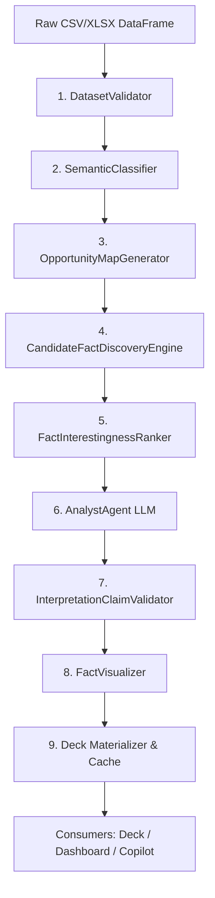

# Generic Analytics Pipeline

> **Parent:** [README.md](../../README.md) &rsaquo; [Architecture](system-overview.md)

## 1. Pipeline Execution Flow (`WorkflowOrchestrator`)

The core reporting engine (`backend/app/services/reporting/workflow_orchestrator.py`) coordinates a deterministic 9-stage sequence from uploaded tables to verified deliverables:

---

## 2. Stage Breakdown & Verified Classes

| Stage | Implementation Class | Module Path | Output Contract | Verification Guarantee |
| :--- | :--- | :--- | :--- | :--- |
| **1. Validation** | `DatasetValidator` | `services/data_engine/validator.py` | `DataQualityReport` | Validates null density, encoding, structure; halts on critical errors. |
| **2. Profiling** | `SemanticClassifier` | `services/data_engine/semantic_classifier.py` | `SemanticDatasetProfile` | Infers `entity_key`, `temporal_point`, `categorical_dimension`, `numeric_measure`, and primary row grain. |
| **3. Opportunity Map** | `OpportunityMapGenerator` | `services/data_engine/opportunity_map.py` | `AnalysisOpportunityMap` | Identifies valid univariate, bivariate, and longitudinal groupings; blocks invalid operations. |
| **4. Fact Discovery** | `CandidateFactDiscoveryEngine` | `services/data_engine/candidate_fact_discovery.py` | `list[CandidateFact]` | Calculates exact empirical facts tagged with `FACT-001`, `FACT-002`, baseline delta, and statistical info. |
| **5. Ranking** | `FactInterestingnessRanker` | `services/data_engine/interestingness_ranker.py` | `list[RankedFact]` | Scores findings by business impact and surprise magnitude; prioritizes user objectives. |
| **6. Interpretation** | `AnalystAgent` | `services/analyst/analyst_agent.py` | `InterpretationResponse` | Local `ANALYST` role (default `qwen3.5:9b`) drafts executive insights strictly bound to input facts. |
| **7. Claim Audit** | `InterpretationClaimValidator` | `services/analyst/interpretation_validator.py` | `InterpretationAuditResult` | Deterministic verification checking assertions against source facts; flags hallucinated numbers or flipped signs. |
| **8. Visualization** | `FactVisualizer` | `services/data_engine/fact_visualizer.py` | `list[VisualChartSpec]` | Synthesizes theme-compliant, accessible chart schemas (scatter, column, line, donut, boxplot). |
| **9. Materialization** | `WorkflowOrchestrator` | `services/reporting/workflow_orchestrator.py` | `WorkflowExecutionResult` | Builds slide specifications and caches results using dataset SHA-256 fingerprint (`_GENERIC_WORKFLOW_CACHE`). |

---

## 3. Single-Source-of-Truth SHA-256 Cache

The orchestrator computes an immutable fingerprint combining:
- Dataset name, user objective, DataFrame dimensions, column list, and preview sample rows.
- If identical data is requested again, execution returns in `< 10ms` without re-running data pipelines or LLM calls.
