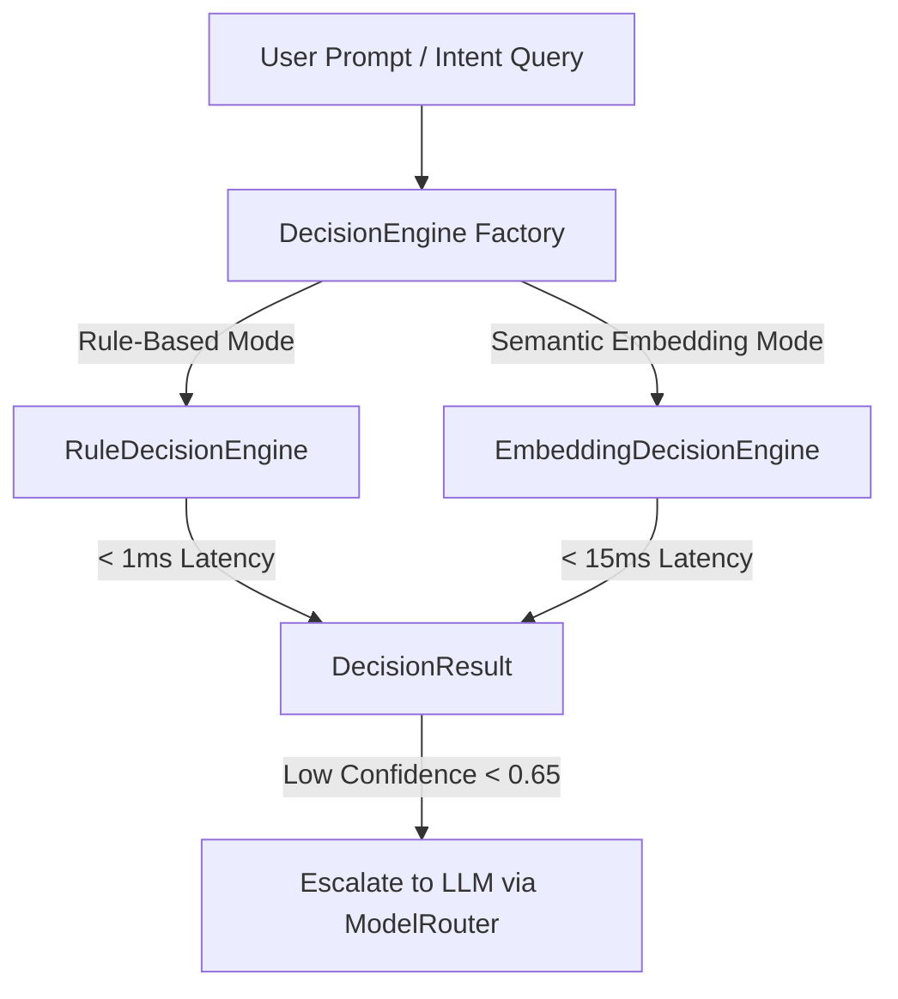

# Decision Intelligence Architecture

> **Parent:** [README.md](../../README.md) &rsaquo; [Architecture](system-overview.md)

## 1. Executive Decision Endpoints (`/api/analytics/decision-brief`)

Implemented in `backend/app/routers/decision_brief.py`:

| Method & Route | Purpose | Input / Behavior |
| :--- | :--- | :--- |
| `GET /api/analytics/decision-brief` | Generates deterministic executive brief | `sheet_id`: Computes top positive strengths, critical headwinds, and strategic initiatives without LLM latency. |
| `POST /api/analytics/decision-brief/prioritize` | Reorders candidate findings | Takes finding snapshot; prioritizes findings via `DecisionEngine` or model reasoning. |
| `POST /api/analytics/decision-brief/voiceover` | Generates spoken narration script | Creates presenter voiceover script grounded in verified findings. |
| `POST /api/analytics/decision-brief/report-plan` | Structures comprehensive report | Generates section outline and metric targets for written reports. |
| `GET /api/analytics/decision-brief/report-evidence` | Fetches evidence bundle | Returns verified facts, column statistics, and correlation metrics for reporting. |

---

## 2. Pluggable Decision Engine Hierarchy (`backend/app/services/decision_engine/`)

1. **`RuleDecisionEngine` (`rule_engine.py`)**:
   - High-performance compiled regex patterns and keyword classifiers.
   - Categorizes analytical requests in **< 1ms** with `confidence >= 0.90`.
   - Directly maps to:
     - `summary_positives` ("highlights", "good news", "top performers")
     - `summary_concerns` ("issues", "risk areas", "bottlenecks", "headwinds")
     - `summary_actions` ("recommendations", "next steps", "action plan")
2. **`EmbeddingDecisionEngine` (`embedding_engine.py`)**:
   - Evaluates cosine similarity of analytical intent against known query templates using `nomic-embed-text:latest`.
   - Operates in **< 15ms** without full LLM generation tokens.

---

## 3. Strict Permutation-Only Prioritization

When local AI ranks or prioritizes verified findings:
- **Permutation Invariant**: The model may only reorder existing candidate finding IDs (`EVID-XXX` / `FACT-XXX`).
- **Zero Math Alteration**: The model cannot alter percentages, change negative deltas to positive, or invent ungrounded assertions.
- **Fail-Safe Fallback**: If an LLM returns an invalid schema or corrupted ID, the system instantly restores the default statistical interestingness rank.
