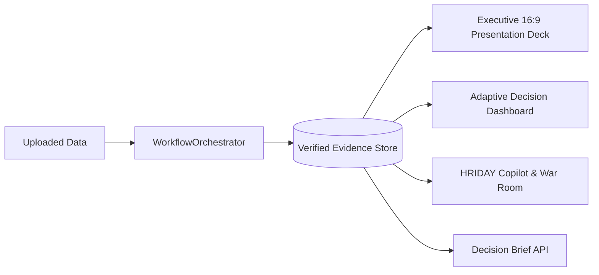

# System Overview & Core Philosophy

> **Parent:** [README.md](../../README.md) &rsaquo; **Architecture**

## 1. Product Identity: HighView Powered by HRIDAY

- **HighView**: The enterprise web platform for local spreadsheet analytics, multi-domain intelligence, and presentation automation.
- **HRIDAY**: The unified, domain-adaptive AI copilot and presentation assistant embedded throughout HighView.
- **Strict Separation of Concerns**:

```
┌─────────────────────────────────┐       ┌─────────────────────────────────┐
│       DETERMINISTIC CODE        │  ───> │        LANGUAGE MODELS          │
│   (Python, Pandas, NumPy, SQL)  │       │   (Ollama: Qwen, Phi, DeepSeek) │
├─────────────────────────────────┤       ├─────────────────────────────────┤
│ • Computes sums, ratios & means │       │ • Drafts strategic narratives   │
│ • Detects outliers & trends     │       │ • Synthesizes executive briefs  │
│ • Generates candidate facts     │       │ • Explains statistical findings │
│ • Validates arithmetic bounds   │       │ • STRICTLY FORBIDDEN FROM MATH  │
└─────────────────────────────────┘       └─────────────────────────────────┘
```

---

## 2. Core Architectural Axioms

1. **Spreadsheets are Sole Ground Truth**: Uploaded CSV, XLSX, and SQLite tables are the immutable source of analytical facts.
2. **Zero LLM Arithmetic**: Language models never execute arithmetic calculations, generate statistical percentages, or estimate metric aggregates.
3. **Dual Evidence Identification**:
   - `FACT-XXX`: Raw empirical candidate facts discovered by `CandidateFactDiscoveryEngine` (e.g., `FACT-001`, `FACT-042`).
   - `EVID-XXX`: Audited evidence claims anchored to presentation slides and decision briefs (e.g., `EVID-EXEC-01`, `EVID-KPI-01`).
4. **Cryptographic Integrity Ledger**: Findings are sealed with SHA-256 dataset hashes, source row/column provenance, and metric definitions.

---

## 3. One Pipeline, Multiple Consumers

Analytical truth is calculated once by the generic data engine and delivered consistently across all user-facing surfaces:



- **Executive Deck**: Slides inherit visual chart specs and facts directly from the evidence store.
- **Adaptive Dashboard**: Interactive cards display 3 progressive disclosure layers (`GLANCE`, `EXPLAIN`, `INSPECT`).
- **HRIDAY Copilot**: Chat answers reuse pre-computed facts, routing deterministic math questions directly to code.
- **Parity Guarantee**: A metric shown in an executive slide deck matches the exact value on the dashboard and in chat.
