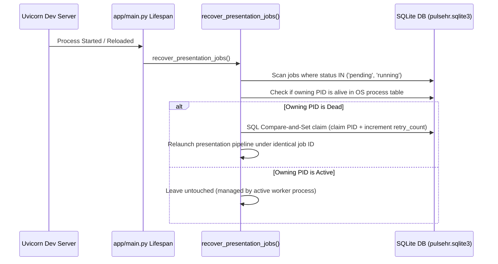

# Background Worker Lifecycle & Job Recovery

> **Parent:** [README.md](../../README.md) &rsaquo; Engineering

## 1. Startup Recovery Sequence (`app/main.py`)

Presentation generation executes asynchronously in background threads. When a development server reloads or an API process restarts, active generation jobs are recovered automatically:

---

## 2. Recovery Invariants & Guardrails

1. **PID Verification**: Jobs are verified against the local OS process table. If the owning PID has terminated, the job is reclaimed.
2. **Preserved Job Scope**: Source sheet selections, brief instructions, selected themes, and user objectives are retained; generation resumes with the exact original job ID.
3. **Bounded Recovery Attempts**: Automatic recovery is bounded to **3 attempts** (`retry_count <= 3`). Exceeding this threshold marks the job as terminally failed to prevent infinite reload loops.
4. **Terminal States Untouched**:
   - `ready` (completed successfully)
   - `cancelled` (user cancelled)
   - `failed` (validation or data failure)
   Terminal jobs are never retried by the startup recovery manager.
5. **Atomic Claiming**: Uses SQLite SQL compare-and-set updates to prevent race conditions during multi-process worker initialization.
