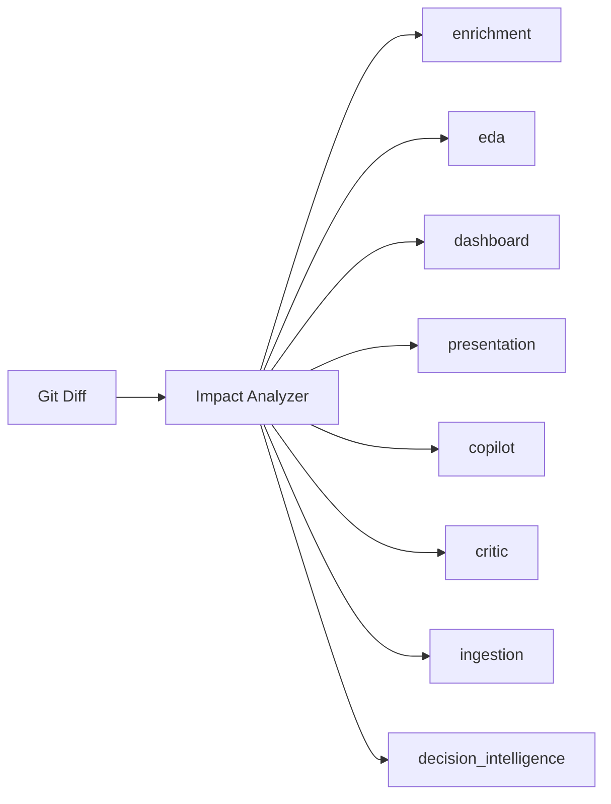

# Modular Test Architecture & Developer Policy

> **Parent:** [README.md](../../README.md) &rsaquo; Engineering

## 1. Test Pyramid & Execution Tiers

The test suite enforces a 3-tier pyramid configured in `backend/pytest.ini`:

| Tier | Pytest Marker | Speed Target | Purpose / Scope |
| :--- | :--- | :---: | :--- |
| **Tier 1: Unit** | `@pytest.mark.unit` | `< 50ms` / test | In-memory algorithmic data transformation. Zero DB, zero network, zero LLM. |
| **Tier 2: Integration** | `@pytest.mark.integration`, `@pytest.mark.db` | `0.5s - 5s` / mod | Endpoints, SQLite migrations, multi-stage pipelines. |
| **Tier 3: Benchmark** | `@pytest.mark.benchmark` | `30s - 15m` | Long-running LLM evaluations and latency scaling tests (quarantined). |

*Note: Pytest automatically excludes benchmarks by default (`addopts = -m "not benchmark"`).*

---

## 2. Registered Domain Modules in `pytest.ini`



- **`enrichment`**: Feature engineering, primitive derivation, formula registry.
- **`eda`**: Exploratory data analysis, distributions, group-by aggregations.
- **`dashboard`**: Adaptive multi-domain dashboard and executive metric cards.
- **`presentation`**: Slide director, pipeline orchestrator, layout selection, visual QA.
- **`copilot`**: Conversational Q&A, intent routing, multi-model war room.
- **`critic`**: Deterministic claim validation and evidence store traceability.
- **`ingestion`**: Dataset upload, Kaggle dataset loader, sheet catalog.
- **`decision_intelligence`**: Rule/embedding decision engines and executive briefing.

---

## 3. Intelligent Impact Runner (`scripts/run_impacted_tests.py`)

Developers never need to run all 600+ tests locally. The impact analyzer inspects `git status` and runs only the impacted module tests:

```bash
# Run tests strictly for modules impacted by your working changes
python scripts/run_impacted_tests.py --impacted

# Run only ultra-fast unit tests for impacted modules (< 2s)
python scripts/run_impacted_tests.py --impacted --unit

# Run a specific domain module
python scripts/run_impacted_tests.py --module presentation
python scripts/run_impacted_tests.py --module dashboard --unit

# List all registered modules and their test files
python scripts/run_impacted_tests.py --list

# Pre-push validation hook mode
python scripts/run_impacted_tests.py --pre-push
```
