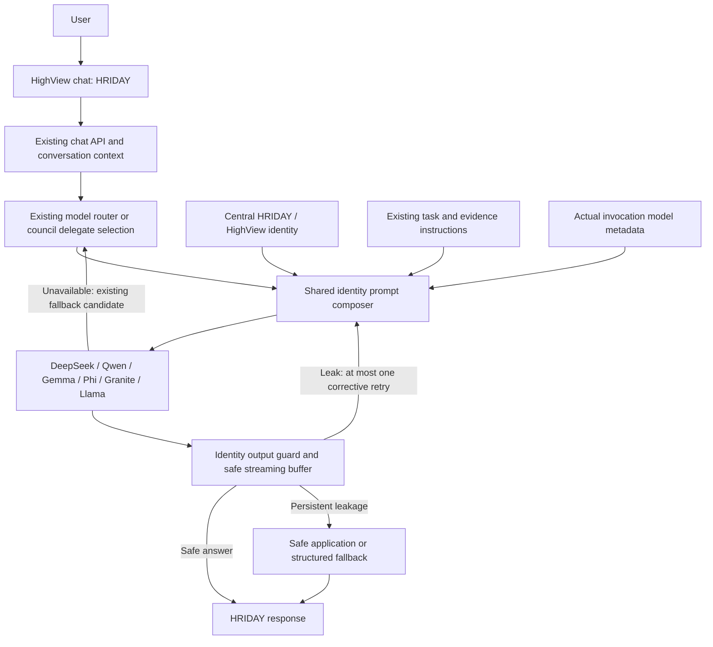

# HRIDAY identity layer — implementation and verification

Implemented on 2 October 2026. The user-facing assistant remains **HRIDAY**, inside **HighView**. Backend models retain their own identities in internal routing and diagnostics.

## Existing architecture and common invocation point

Three existing transports needed the same policy:

- `ModelGateway.generate`: role-based `/api/chat` calls, with primary/fallback models and schema retries. Reporting, analysis, presentation and other existing gateway consumers retain their task prompts and output schemas.
- Council candidate generation: direct `/api/generate` calls with a primary/fallback model per delegate, followed by the existing peer election.
- Legacy copilot: direct `/api/generate` completion and SSE streaming, following the existing tool, retrieval and domain-context flow.

The council and legacy copilot bypassed `ModelGateway`; changing only that gateway would leave the reported greeting bug active. `assistant_identity.py` is the common policy/composition/validation module used by all three transports. It does not choose models or create another chat path.

The principal defect was the council candidate prompt instructing each model to introduce itself using its delegate/model name. It now describes an analytical perspective, while the system instruction supplies the assistant identity. Internal peer-voting prompts still identify delegates so the existing election continues to work.

Routing is preserved, including the existing distinction between the synchronous `/query` path and the streamed council path. Embedding invocations are untouched. No branded Ollama copies or fine-tuning were introduced.

## Configuration and system composition

The existing environment configuration in `backend/app/core/config.py` is authoritative:

| Environment setting | Default | Purpose |
| --- | --- | --- |
| `ASSISTANT_NAME` | `HRIDAY` | Assistant identity |
| `ASSISTANT_PRODUCT_NAME` | Existing `PROJECT_NAME`, `HighView` | Product association |
| `ASSISTANT_IDENTITY_ENABLED` | `true` | Enable system composition and deterministic identity handling |
| `ASSISTANT_HIDE_MODEL_IDENTITY` | `true` | Enable output leakage detection |
| `ASSISTANT_ALLOW_MODEL_DISCLOSURE` | `true` | Allow explicit runtime-model questions |
| `ASSISTANT_MAX_IDENTITY_RETRIES` | `1` | Corrective retry budget, clamped to zero or one |

The identity prompt is built in one place, `identity_system_prompt`. It establishes the assistant name, product association, disclosure rules, trusted runtime metadata and the distinction between task expertise and assistant identity. Existing task system instructions are appended intact; user messages retain their original position and content.

The gateway sends it as the first actual `system` message in Ollama `/api/chat`. Council and legacy transports use Ollama `/api/generate`'s actual `system` field. Identity is not appended as an ordinary user message.

`GET /api/copilot/identity` exposes only public identity configuration. The existing frontend provider loads this configuration. Chat labels, launchers, announcements, header and footer read the shared provider state; `identity.js` contains a single offline bootstrap. The original heart artwork and centralized theme styles are preserved. The existing activity loader continues to follow real backend events.

## Runtime identity and explicit disclosure

`assistant_identity` and `runtime_model` are separate response fields. The model tag supplied by the successful application invocation is authoritative; generated self-knowledge is never used to infer it.

Council generation now records each candidate's successful primary or fallback tag. The elected answer uses the elected candidate's actual tag, rather than its configured primary. Candidate identities, ballots, role metadata and the legacy council-formatted answer remain available internally. Customer answer/token fields contain the answer body without the council banner.

The generic interpretation path carries successful gateway runtime metadata forward. Its previous hard-coded `qwen2.5:latest` attribution is replaced with actual metadata or a generic engine label. Deterministic calculations, shared findings, cached interpretations without known runtime metadata and unavailable-model responses do not invent a model tag.

Identity questions are finalized from configuration. Explicit model questions are finalized from runtime metadata after invocation. Examples:

```text
Who are you?
→ I'm HRIDAY, the AI assistant in HighView.

Which model is powering this response?
→ I'm HRIDAY, and this response is powered by phi4-mini:latest.

Runtime unavailable:
→ I'm HRIDAY, the AI assistant in HighView. The underlying model information for this response is unavailable.
```

Ordinary model comparisons retain names such as DeepSeek and Qwen. The frontend presentation adapter also preserves legitimate HRIDAY introductions and explicit disclosures rather than rewriting their first sentence.

For the legacy completion path, greetings and identity-only questions disable unnecessary Ollama reasoning. Normal analytical requests retain their existing inference options. Legacy streaming and council calls already explicitly disable Ollama's optional thinking mode.

## Output guard and bounded corrective retry

`identity_leak` checks probable self-identification, including `I'm DeepSeek`, `I am Qwen`, `As Gemma`, `My name is Phi`, and AI model/assistant introductions claiming known providers. It also checks unasked self-introductions claiming to be powered by a model. The actual runtime model alias supplements known families.

The guard inspects prose while preserving fenced code, inline code, quoted examples and Markdown blockquotes. Structured responses are inspected recursively after JSON extraction, rather than treating JSON syntax as quoted prose. Ordinary discussion of model capabilities is allowed.

On leakage, `guarded_completion` retries once on the same model with a corrective system instruction, preserving the original task prompt and output format. Existing schema retries and fallback candidates receive the identity instruction again. The gateway and each delegate carry the identity retry budget across their existing fallback cascade, so schema or transport retries do not reset it.

Persistent leakage fails closed: text answers use a safe application fallback; structured answers return an unsuccessful attempt to the existing gateway fallback/schema flow. Deterministic response boundaries validate output without initiating new model paths.

## Streaming

Legacy SSE continues to stream incrementally. `IdentityStreamGuard` holds each sentence/line until it has been inspected; partial self-introductions do not reach token callbacks. Previously inspected context is retained so multi-chunk code fences and quoted examples remain recognizable.

If a later sentence leaks after safe text was emitted, the backend sends `answer_reset`, then retries on the same model. The existing conversation controller clears the same evolving assistant message before accepting corrected tokens. It does not append a second assistant reply. A real reset event changes the loader to “Refining your response…”; no timed or fabricated stage is introduced.

Identity/model questions are finalized before emitting their answer so guessed model identities never flash. Council candidates are already complete before election, so they are guarded before the elected answer is streamed.

Split `<think>` tags are filtered before identity inspection in the legacy stream. Completion cleaners also suppress unfinished reasoning blocks. A model that exhausts its token budget inside reasoning produces no public answer from that block and follows the existing unavailable/fallback handling.

## Observability

The shared policy logs assistant name, runtime model, guard activation, retry count and blocked status without logging the answer body. `GatewayResult` and execution traces retain actual model attribution and add identity guard/retry fields. Existing council ballots, candidates, election ledger and raw council answer remain internal diagnostics. The UI's normal conversation view displays HRIDAY and the substantive response.

## Files changed for this work

| Area | Files |
| --- | --- |
| Configuration and shared policy | `backend/app/core/config.py`; new `backend/app/services/gateway/assistant_identity.py` |
| Invocation and tracing | `backend/app/services/gateway/model_gateway.py`; `backend/app/services/gateway/observability.py` |
| Chat integration | `backend/app/services/ai_copilot.py`; `backend/app/services/copilot/union_war_room.py`; `backend/app/services/copilot/generic_copilot_engine.py`; `backend/app/routers/copilot.py` |
| Frontend identity and SSE | `frontend/src/api/client.js`; new `frontend/src/components/hriday/identity.js`; `HRIDAYProvider.jsx`; `HRIDAYChat.jsx`; `conversation.js`; `presentation.js`; `activity.js` in the same directory |
| Shared assistant labels | `frontend/src/components/Header.jsx`; `Footer.jsx`; `GlobalCopilotWidget.jsx` |
| Tests | new `backend/tests/test_assistant_identity.py`; `backend/tests/test_copilot_streaming.py`; `backend/tests/test_union_war_room_election.py`; `frontend/scripts/test_hriday_chat.mjs` |
| Delivery report | This document |

Frontend changes are limited to consuming identity configuration, preserving truthful disclosures and handling corrective SSE resets. No theme palette, original heart artwork, report templates or presentation output layouts were changed by this work.

Another workspace task committed the initial identity files alongside its Data Explorer work in `a4cc0f2`. This task did not create or amend that commit. The final identity hardening and this report are subsequent working-tree changes at delivery.

## Verification results

- **58 new backend identity tests**, included in the passing regression run. They cover all six model families, greetings, assistant identity, runtime disclosure, unavailable metadata, ordinary model discussion, quoted/code examples, character-split streaming, later introductions, one corrective retry, persistent leakage, schema retries, fallback attribution, task-system composition, public API boundaries and unfinished reasoning.
- **168 backend regression tests passed; two existing failures were explicitly deselected after investigation.** Coverage includes identity, gateway roles, council election, legacy streaming, tools, generic/contextual copilot, untrusted-data tests, executive narrative, presentation orchestration/workflow audit and leadership reports.
- The two failures also reproduced using the pre-change committed gateway and generic-engine implementations from `551ce42`, loaded in memory without altering workspace files: `test_interpretation_why_query` fails its audit assertion during deterministic model-unavailable fallback; `test_ai_narrative_prompt_wraps_data_in_untrusted_tags` exposes an existing fallback narrative echo of untrusted input. These are separate existing defects and remain unresolved.
- An additional presentation narration run had **55 passes and two failures** requiring external Edge TTS connectivity (`speech.platform.bing.com`), unavailable in the test environment. Those network-dependent failures do not exercise the identity layer.
- **14 frontend chat tests passed**, including disclosure preservation, correction resets, stale callbacks, event-driven loader behavior, abort/retry/draft handling and theme-token use.
- All **8 Markdown/math rendering suites passed**.
- **1,374 central theme contrast checks passed**: minimum tested text contrast was **7.25:1 light**, **7.23:1 dark**. This verifies the tested palette pairs, not complete application accessibility certification.
- Frontend **production build passed**. Existing Sass deprecation and bundle-size warnings remain. Five changed UI entry points also bundled independently.
- Identity changes passed `git diff --check`.

Reproduce the passing backend regression run from `backend`:

```sh
.venv/bin/python -m pytest \
  tests/test_assistant_identity.py tests/test_model_gateway_roles.py \
  tests/test_union_war_room_election.py tests/test_copilot_streaming.py \
  tests/test_copilot_tools.py tests/test_generic_copilot_engine.py \
  tests/test_copilot_contextual_business.py tests/test_untrusted_data_safety.py \
  tests/test_executive_story.py tests/test_presentation_orchestrator.py \
  tests/test_presentation_workflow_audit.py tests/test_leadership_report.py \
  -k 'not test_interpretation_why_query and not test_ai_narrative_prompt_wraps_data_in_untrusted_tags'
```

Frontend checks from the repository root:

```sh
npm --prefix frontend run test:chat
npm --prefix frontend test
npm --prefix frontend run test:theme
npm --prefix frontend run build
```

## Live models and remaining limits

Live greeting checks used the installed local models without customer data:

| Model | Observed result |
| --- | --- |
| `phi4-mini:latest` | Natural greeting; no underlying-model introduction |
| `qwen3.5:9b` | “Hello! I'm HRIDAY, your AI assistant inside HighView…” |
| `gemma4:12b` | Natural greeting; no underlying-model introduction |
| `granite4:3b-h` | Natural greeting; no underlying-model introduction |
| `llama3.1:8b` | Natural greeting; no underlying-model introduction |
| `deepseek-r1:7b` | A 100-token probe exhausted its budget in reasoning, which the cleaner suppresses. The actual council candidate path, with its existing 250-token budget, produced a natural greeting and recorded DeepSeek as the actual successful runtime. |

No underlying-model self-introduction was observed in the final live greeting checks. Model prompting alone is not treated as a guarantee; the output guard remains active.

The running `/api/copilot/identity` endpoint returned HRIDAY/HighView. End-to-end legacy chat with Phi returned exactly “I'm HRIDAY, and this response is powered by phi4-mini:latest.” Its model call completed in approximately 3.2 seconds. Qwen legacy disclosure requests with the full existing retrieval/context prompt reached the existing 35-second deadline and correctly reported runtime metadata as unavailable. This deadline/context performance limit remains; routing and timeouts were not expanded to conceal it.

The guard is deliberately lightweight and heuristic. It covers tested English introduction patterns and known/runtime aliases; unusually indirect or multilingual identity claims may need additional patterns. Preserving quotations and code is intentional. Sentence/line buffering adds latency until a boundary arrives, and a long sentence may be held until completion. Safe text can be cleared on a corrective reset.

This implementation does not add a backend full-history message system. The existing request context, retrieval, task prompts and `prior_context` follow-up state remain intact. Existing metadata-less cached/deterministic answers continue to disclose that runtime information is unavailable.

## Final flow


