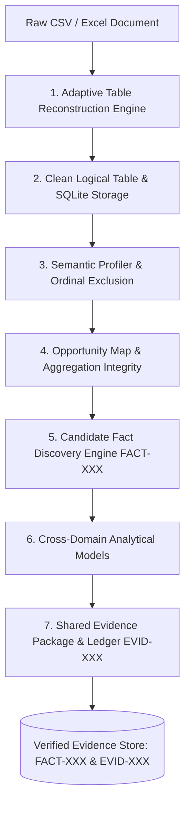

# Layer 1: Deterministic Truth & Evidence Engine

> **Parent:** [README.md](../../README.md) &rsaquo; [System Architecture](../system-architecture.md) &rsaquo; **Layer 1**

---

## 1. Architectural Mission: Zero LLM Math & Pre-Semantic Truth

Layer 1 is the immutable mathematical foundation of HighView. It reconstructs messy physical spreadsheet files into validated logical tables, infers semantic grains, excludes ordinals from numeric analytics, enforces non-additive aggregation rules, computes statistical anomalies, executes domain models, and seals empirical facts cryptographically. 

**Language models are strictly forbidden from performing calculations, computing aggregates, or altering mathematical signs.**

---

## 2. Core Subsystems & Codebase Proof

### A. Pre-Semantic Adaptive Table Reconstruction
- **Directory**: `backend/app/services/adaptive_table_reconstruction/`
- **Core Principle**: HighView **never assumes** one physical row equals one logical record. Analytical ingestion does not use raw `pd.read_csv(...)`.
- **Subsystem Pipeline**:
  1. `GridCapture`: Ingests raw file bytes into an immutable 2D token matrix, preserving whitespace, tabs, and delimiters without type coercion.
  2. `RowRoleClassifier`: Categorizes physical rows into `PREAMBLE`, `HEADER`, `DATA_RECORD`, `CONTINUATION_RECORD`, `FOOTNOTE`, or `BLANK`.
  3. `HeaderTreeBuilder`: Collapses stacked multi-row headers into canonical compound column identifiers while maintaining hierarchic lineage.
  4. `ContinuationDetector`: Detects lines wrapped across physical boundaries (e.g. city name split across lines 17 and 18) and merges them into parent records.
  5. `SentinelResolver`: Maps non-numeric domain tokens (`NM`, `-`, `NR`, `BDL`) into typed sentinel states. **Strictly forbids conversion to numeric zero**.
  6. `GovernedModelEscalator`: Invoked strictly upon deterministic ambiguity. Emits schema-validated Pydantic proposals (`ModelProposal`).
  7. `ConfidenceRiskEngine`: Computes 3D confidence ($C_{struct}, C_{sem}, C_{fid}$) and weights by column operational risk ($R_{field}$). Assigns dispositions (`VALIDATED`, `PROPOSED`, `REVIEW_REQUIRED`, `REJECTED`).
  8. `StructuralValidator`: Enforces 6 deterministic integrity gates prior to persistence.
- **Golden Regression Fixture**: The CPCB 2022 report (`Location_data_2022.csv`) is reconstructed from **455 physical rows $\times$ 8 columns** into **435 logical rows $\times$ 7 columns**, correctly joining split cities (`Rajahmundry/Rajamahend` + `ravaram`) and preserving sentinels without hardcoded logic.

### B. Clean Storage Lifecycle & Provenance
- **Files**: `backend/app/routers/upload.py`, `backend/app/services/sheet_catalog.py`, `backend/app/db/database.py`
- **Storage**: Clean logical dataframes are written to SQLite at `backend/data/db/pulsehr.sqlite3`.
- **Provenance Ledger**: Every row split, header collapse, record merge, and sentinel translation is recorded with line-by-line before/after provenance and surfaced in the Technical Tab.

### C. Semantic Profiling & Ordinal Exclusion
- **Files**: `backend/app/services/enrichment/profiler.py`, `backend/app/services/data_engine/semantic_classifier.py`
- **Output**: `SemanticDatasetProfile`
- **Column Role Classification**:
  - `entity_key`: Unique identifiers (City, Department, Employee ID).
  - `temporal_point`: Timestamps, dates, quarters. Drives chronological series.
  - `categorical_dimension`: Segment groups (State, Region, Status, Category).
  - `numeric_measure`: Continuous and discrete metrics (Concentration, Hours, Headcount).
- **Ordinal & Identifier Exclusion**:
  - Columns matching sequence markers, IDs, or document references (e.g. `Sr. No.`, `Serial Number`, `Record ID`, `EQ-11099/...`) are flagged as `is_ordinal_or_identifier = True`.
  - These columns are permanently barred from numeric aggregations, KPI rollups, and ranking analytics.
- **Cross-Domain Recognition**: Detects domain profiles across `environmental`, `workforce_hr`, `commercial_retail`, `operations_support`, `demographics_public`, `education_academic`, and `general_tabular`.

### D. Semantic Aggregation Integrity (`AggregationSemanticsIntegrity`)
- **File**: `backend/app/services/adaptive_dashboard/engine.py`
- **Non-Additive Metric Rules**:
  - Concentration measures ($\mu\text{g/m}^3$), percentages, rates, and unit averages cannot be summed.
  - Additive operations (`SUM`, `Total`) are banned on non-additive metrics (`Total SO2 annual average = 4,649` is rejected).
  - Central tendencies enforce arithmetic mean (`mean_measure`), median, or distribution quantiles with mandatory physical units.

### E. Mathematical Opportunity Mapping
- **File**: `backend/app/services/data_engine/opportunity_map.py`
- **Responsibility**: Enumerates defensible statistical combinations:
  - Univariate distributions (quantile spreads, outlier clusters).
  - Bivariate segment cross-tabs (dimensions against measures).
  - Continuous bivariate associations (measure by measure correlations).
  - Longitudinal period trends (only when `temporal_point` is confirmed).
  - Blocks meaningless operations (e.g. averaging `Sr. No.` or summing rates).

### F. Empirical Candidate Fact Discovery (`FACT-XXX`)
- **File**: `backend/app/services/data_engine/candidate_fact_discovery.py`
- **Contract**: `CandidateFact` tagged with unique `FACT-001`, `FACT-002`, baseline delta, sample size, and statistical confidence.
- **Pure Code Computation**: Calculates top/bottom performers, Pareto distributions, baseline drifts, and outlier clusters using pure Python, Pandas, and NumPy. Minimum subgroup sample sizes ($N \ge 4$ or $5$) are enforced.

### G. Cross-Domain Analytical & Industrial Models
- **Environmental Domain**: NAAQS statutory benchmark evaluation ($60\ \mu\text{g/m}^3$ annual threshold for $\text{PM}_{10}$), outlier concentration ratios, and cross-pollutant correlations ($\text{SO}_2$ vs $\text{NO}_2$).
- **Workforce Domain**: McKinsey 9-Box Matrix (`talent_9box_model.py`), Bradford Disruption Factor ($B = S^2 \times D$), Burnout Strain Index, and Holt-damped forecast models.
- **Commercial Retail Domain**: Margin contribution, average order value, conversion drift.

### H. Shared Evidence Package & Cryptographic Ledger (`EVID-XXX`)
- **File**: `backend/app/services/shared_evidence_package.py`
- **Output**: `SharedEvidencePackage`
- **Integrity**: Every finding is assigned an audited citation ID (`EVID-EXEC-01`, `EVID-KPI-01`, `EVID-STRENGTH-01`) sealed with a SHA-256 snapshot hash.

---

## 3. Layer Integration Contract (Output to Layer 2 & 3)

| Exposed Artifact | Contract Model | Downstream Consumers | Invariant Guarantee |
| :--- | :--- | :--- | :--- |
| **Reconstructed Logical Table** | `pd.DataFrame` / SQLite | Profiler, Catalog, Explorer | 100% logical record integrity; sentinels preserved as non-zeros. |
| **Candidate Facts** | `list[CandidateFact]` | Layer 2 `AnalystAgent`, `FactInterestingnessRanker` | Pure numerical observations; zero LLM interpretation. |
| **Evidence Ledger** | `list[dict]` (`EVID-XXX`) | Layer 2 `CriticAgent`, Layer 3 `PresentationEngine` | Cell-level source coordinates; immutable audit trail. |
| **Domain Profiles** | `DomainProfile` | Layer 3 Dashboard & Story Planner | Governed capabilities & vocabulary strictly bound to domain. |
