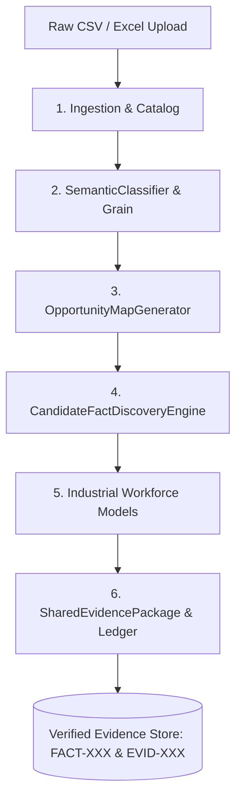

# Layer 1: Deterministic Truth & Evidence Engine

> **Parent:** [README.md](../../README.md) &rsaquo; [System Architecture](../system-architecture.md) &rsaquo; **Layer 1**

## 1. Architectural Mission: Zero LLM Math

Layer 1 is the immutable mathematical foundation of HighView. It ingests tabular files, infers semantic grains, calculates statistical anomalies, executes industrial workforce models, and seals facts cryptographically. **Language models are strictly forbidden from performing calculations, computing aggregates, or altering mathematical signs.**

---

## 2. Core Subsystems & Codebase Proof

### A. Ingestion & Storage Lifecycle
- **Files**: `backend/app/routers/upload.py`, `backend/app/services/sheet_catalog.py`, `backend/app/services/data_lifecycle.py`
- **Database**: SQLite storage at `data/db/pulsehr.sqlite3` with thread-safe lifecycle locks (`data_lifecycle_lock`).
- **Validation**: `DatasetValidator` verifies row boundaries, character encoding, and null densities; rejects corrupted datasets with structured `DataQualityReport`.

### B. Semantic Profiling & Grain Detection
- **File**: `backend/app/services/data_engine/semantic_classifier.py`
- **Output**: `SemanticDatasetProfile`
- **Classification**: Assigns columns into 4 operational roles without domain coupling:
  - `entity_key`: Identifiers (Employee ID, SKU). Never summed or averaged.
  - `temporal_point`: Timestamps, dates, quarters. Drives chronological series.
  - `categorical_dimension`: Segment groups (Department, Region, Shift, Status).
  - `numeric_measure`: Continuous and discrete metrics (Hours, Cost, Headcount).
- **Grain Inference**: Detects row-level granularity (e.g. employee-month, transaction-line).

### C. Analysis Opportunity Mapping
- **File**: `backend/app/services/data_engine/opportunity_map.py`
- **Output**: `AnalysisOpportunityMap`
- **Responsibility**: Enumerates all mathematically defensible combinations:
  - Univariate distributions (measures across observations).
  - Bivariate segment cross-tabs (dimensions against measures).
  - Multi-Factor Segment Disparity (`MULTI_FACTOR_SEGMENT_DISPARITY`: Dimension A × Dimension B × Measure).
  - Continuous correlations and longitudinal period trends.
  - Blocks meaningless operations (e.g., averaging ID numbers).

### D. Empirical Candidate Fact Discovery (`FACT-XXX`)
- **File**: `backend/app/services/data_engine/candidate_fact_discovery.py`
- **Contract**: `CandidateFact` tagged with unique `FACT-001`, `FACT-002`, baseline delta, sample size, and statistical confidence.
- **Pure Code Computation**: Calculates top/bottom performers, Pareto distributions, baseline drifts, multi-factor compound cohort disparities (concentration ratios, z-scores, intra-segment spread), and outlier clusters using pure Python, Pandas, and NumPy. Minimum subgroup sample sizes ($N \ge 4$ or $5$) are strictly enforced to suppress noise and small-sample bias.

### E. Analytical Function & Business Jargon Library (`function_library/`)
- **Files**: `backend/app/services/function_library/base.py`, `registry.py`, `storage.py`, `catalog/`
- **Permanent Metadata DB**: `data/db/system_function_library.sqlite3` (`system_function_catalog` table)
- **Decoupled Lifecycle**: Completely isolated from dataset/sheet lifecycles. Wiping or deleting sheets via `dataset_deletion.py` or the UI **never** deletes the system function library.
- **Token-Optimized Micro-Schema**: Pre-compiles an ultra-dense markdown DSL (`compact_token_repr`, <35 tokens/function) injecting the entire library into LLM prompts in under 400 tokens total.
- **Persona Jargon Translations**: Maps abstract statistical signals into crisp non-technical action items across **HR** (burnout, flight risk), **Finance** (payroll leaks, replacement costs), and **Project Management** (velocity drag, lost sprint hours).
- **Deterministic Business Impact Engine**: Attaches `BusinessImpactAssessment` ($ cost, lost productive hours, headcount at risk, margin leakage) to every reliable candidate fact without LLM arithmetic.

### F. Industrial People Analytics Models
Implemented in `backend/app/services/industrial/`:
1. **McKinsey / GE 9-Box Matrix (`talent_9box_model.py`)**:
   - 3×3 grid mapping Performance Rating vs Potential Rating.
   - Computes counts, percentages, high-potential succession pools, and retention flight-risk personnel.
2. **Bradford Factor Index ($B = S^2 \times D$) (`bradford_model.py`)**:
   - Quantifies operational disruption from frequent short-term unplanned absences ($S$ = spells, $D$ = days absent).
   - Proven non-linear disruption: 10 one-day absences ($10^2 \times 10 = 1,000$) produce $100\times$ the disruption of one 10-day absence ($1^2 \times 10 = 10$).
3. **Burnout Strain Index (`workforce_strain_model.py`)**:
   - Correlates overtime intensity against absence spikes and attrition risk markers.
4. **Longitudinal Trajectory Forecasting (`time_series_forecast.py`)**:
   - Holt-damped exponential smoothing with cyclical peak detection and historical variance bands.

### G. Shared Evidence Package & Cryptographic Ledger (`EVID-XXX`)
- **File**: `backend/app/services/shared_evidence_package.py`
- **Output**: `SharedEvidencePackage`
- **Integrity**: Every finding is assigned an audited citation ID (`EVID-EXEC-01`, `EVID-KPI-01`, `EVID-STRENGTH-01`) sealed with a SHA-256 snapshot hash.

---

## 3. Layer Integration Contract (Output to Layer 2 & 3)

| Exposed Artifact | Contract Model | Downstream Consumers | Invariant Guarantee |
| :--- | :--- | :--- | :--- |
| **Candidate Facts** | `list[CandidateFact]` | Layer 2 `AnalystAgent`, `FactInterestingnessRanker` | Pure numerical observations; zero LLM interpretation. |
| **Evidence Ledger** | `list[dict]` (`EVID-XXX`) | Layer 2 `CriticAgent`, Layer 3 `PresentationEngine` | Cell-level source coordinates; immutable audit trail. |
| **Industrial Metrics** | `dict[str, Any]` | Layer 3 `AdaptiveDashboard`, `VisualAnalyticsPanel` | Deterministic models executed identically across all surfaces. |
