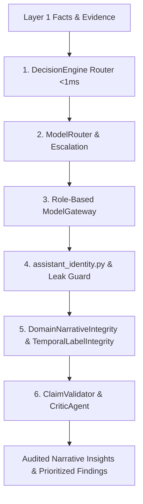

# Layer 2: Cognitive Routing & Governance Layer

> **Parent:** [README.md](../../README.md) &rsaquo; [System Architecture](../system-architecture.md) &rsaquo; **Layer 2**

---

## 1. Architectural Mission: Bounded Intelligence & Domain Integrity

Layer 2 provides the cognitive bridge between raw computed facts (Layer 1) and user-facing presentations and dashboards (Layer 3). It routes user intent via sub-millisecond classifiers, directs tasks across specialized local model roles, enforces the **HRIDAY** assistant persona, enforces narrative and temporal integrity gates, and deterministically audits all generated assertions against the factual ledger.

---

## 2. Core Subsystems & Codebase Proof

### A. Intent Routing & Classification (<1ms - <15ms)
Implemented in `backend/app/services/decision_engine/`:
- **`RuleDecisionEngine` (`rule_engine.py`)**:
  - Compiled regex patterns and keyword analyzers that classify standard analytical questions in **< 1ms** with `confidence >= 0.90`.
  - Routes directly to deterministic categories (`summary_positives`, `summary_concerns`, `summary_actions`).
  - Zero LLM tokens required for standard queries.
- **`EmbeddingDecisionEngine` (`embedding_engine.py`)**:
  - Uses `nomic-embed-text:latest` (768-dim) to calculate intent cosine similarity in **< 15ms**.
- **Factory**: `get_decision_engine(engine_type)` (`factory.py`) enables pluggable execution.

### B. Governed Model Escalation for Reconstruction & Analytics
- **Pre-Semantic Reconstruction Escalation**:
  - Implemented in `backend/app/services/adaptive_table_reconstruction/model_escalator.py`.
  - Triggers only when deterministic heuristics detect structural ambiguity in spreadsheet headers or record wraps.
  - Requires typed Pydantic proposals (`ModelProposal`, `ReconstructionProposal`) validated by downstream deterministic gates.
- **Dynamic Confidence Escalation**:
  - Implemented in `backend/app/services/gateway/model_router.py`:
  - `FAST` &rarr; `ANALYST` if confidence < 0.65 or schema invalid.
  - `ANALYST` &rarr; `REASONER` if confidence < 0.50 or schema invalid.

### C. Role-Based Model Gateway & AI Execution Layer (Phase A)
Defined in `backend/app/core/models_config.py`, `backend/app/services/gateway/contracts.py`, `model_health.py`, and `backend/app/services/gateway/model_gateway.py`:

1. **AI Task Taxonomy & Model Cascades (`AITaskType`)**:
   - `STRUCTURAL_AI`: Header reconstruction, row continuation ambiguity &rarr; Primary: `phi4-mini:latest`, Fallbacks: `qwen3.5:2b`, `llama3.1:8b`.
   - `SEMANTIC_AI`: Measure semantics, domain column classification &rarr; Primary: `qwen3.5:2b`, Fallbacks: `phi4-mini:latest`, `qwen3.5:9b`.
   - `NARRATIVE_AI`: Executive summary, concise explanation, short findings &rarr; Primary: `gemma4:12b`, Fallbacks: `qwen3.5:9b`, `phi4-mini:latest`.
   - `AGENTIC_AI`: Multi-step workflow planning, tool dispatch routing &rarr; Primary: `qwen3.5:9b`, Fallbacks: `gemma4:12b`, `phi4-mini:latest`.
   - `PRESENTATION_AI`: Slide narrative, visual storytelling &rarr; Primary: `gemma4:12b`, Fallbacks: `qwen3.5:9b`, `phi4-mini:latest`.
   - `DETERMINISTIC_CALCULATION`: **NO MODEL** &rarr; Complete mathematical bypass with 0 tokens and immediate execution.

2. **Unified `AIRequest` & `AIResponse` Execution Envelope**:
   - Strongly-typed request containing task type, dataset ID, required capability, max latency budget, reasoning level, structured schema, and optional deterministic fallback.
   - Emits `AIExecutionRecord` with SHA-256 `structured_input_hash` and `structured_output_hash` for immutable cryptographic provenance.

3. **Fleet Health Monitor & Circuit Breaker (`ModelHealthService`)**:
   - Real-time probing of installed local models via Ollama tags endpoint.
   - Circuit breaker trips to `DEGRADED` after consecutive failures ($\ge 3$), automatically diverting traffic to healthy models without incurring repetitive timeout latency.
   - Half-open probation window allows models to recover after cool-down.
   - **Zero-Downtime Offline Resilience**: If local LLMs are unreachable, core analytics and deterministic features gracefully return rule-verified outputs without crashing.

| Logical Role | Primary Model | Fallback Model | Max Tokens | Timeout | Primary Responsibility |
| :--- | :--- | :--- | :---: | :---: | :--- |
| **`FAST`** | `phi4-mini:latest` | `llama3.1:8b` | 2,048 | 25s | Schema naming, column classification (<250ms). |
| **`ANALYST`** | `qwen3.5:9b` | `gemma4:12b` | 2,048 | 120s | Finding synthesis, pattern explanation (~1.5s). |
| **`REASONER`** | `deepseek-r1:7b` | `qwen3.5:9b` | 4,096 | 60s | Root-cause analysis, strategic trade-offs (~3.5s). |
| **`WRITER`** | `gemma4:12b` | `qwen3.5:9b` | 4,096 | 45s | Executive prose, slide takeaways, leadership memos (~1.8s). |
| **`CRITIC`** | `deepseek-r1:7b` | `llama3.1:8b` | 3,072 | 50s | Factual claim verification, contradiction checks. |

### D. Unified Assistant Identity & Leakage Guard
Implemented in `backend/app/services/gateway/assistant_identity.py`:
- **Unified Persona**: Across `ModelGateway`, Multi-Model Council (`union_war_room.py`), and Copilot (`copilot.py`), the assistant is strictly **HRIDAY** inside **HighView**.
- **Output Leakage Guard (`identity_leak`)**: Scans LLM output for unauthorized self-identifications (e.g. `I am DeepSeek`, `As Qwen`, `My name is Phi`) outside of code blocks.
- **Bounded Retry**: On leakage, executes at most **1 corrective retry** with an identity reminder, preserving original prompt parameters and schema.

### E. Domain Narrative Integrity (`DomainNarrativeIntegrity`)
Implemented in `backend/app/services/adaptive_dashboard/story_builder.py`:
- **Cross-Domain Sanitization**: Strips legacy workforce vocabulary (`policy adherence`, `logging discrepancies`, `department`, `attendance`, `leave`) from non-workforce domain presentations.
- **Grounded Domain Vocabularies**:
  - Environmental: Replaces generic anomaly phrases with statutory copy (e.g. `"PM10 Pollution Outlier Concentration"`, referencing NAAQS $60\ \mu\text{g/m}^3$ annual benchmarks and source-intervention directives).
  - Retail: Emits margin and basket-size narratives.

### F. Temporal Label Integrity (`TemporalLabelIntegrity`)
Implemented in `backend/app/services/adaptive_dashboard/composition_planner.py`:
- **No Synthetic Time Labels**: When a dataset lacks a genuine temporal column (`temporal_point == null`), story builders and visual compilers are **strictly prohibited** from generating dummy time labels (`Week 1`, `Week 2`, `Month 1`).
- Bivariate associations are directed to continuous scatter plots or discrete entity comparisons.

### G. Factual Claim Audit & Permutation-Only Invariants
Implemented in `backend/app/services/analyst/interpretation_validator.py` and `backend/app/services/critic/`:
- **Claim Verification**: Deterministically compares every number and sign in generated sentences against the input `CandidateFact` objects. Hallucinated numbers trigger validation errors.
- **Permutation-Only Prioritization**: AI prioritization is restricted to reordering existing finding IDs (`EVID-XXX` / `FACT-XXX`). The model cannot alter percentages, invert signs, or invent claims.
- **Query Grain Invariant**: Retrieving a department-level average is never accepted as an answer for an employee-level calculation.

### H. Governed MCP Capability Layer (Phase B)
Implemented in `backend/app/mcp/`:
- **Architecture**:
  - Exposes governed tools across 6 distinct capability groups:
    1. `Dataset MCP`: `get_schema`, `get_entities`, `get_measures`, `get_time_dimensions`, `get_dataset_profile`, `get_relationships`.
    2. `Analytics MCP`: `rank_entities`, `compare_segments`, `calculate_distribution`, `get_trend`, `find_outliers`, `analyze_relationship`, `get_benchmark_comparison`.
    3. `Evidence MCP`: `get_evidence`, `verify_claim`, `get_source_rows`, `trace_provenance`, `get_calculation`, `get_related_evidence`.
    4. `Scenario MCP`: `get_valid_levers`, `run_counterfactual`, `compare_scenarios`, `get_scenario_assumptions` (enforces $EVID \neq SCEN$, prefixes $SCEN-$, stamps `evidence_class="SCENARIO"`).
    5. `Presentation MCP`: `create_deck`, `regenerate_slide`, `generate_visual`, `export_pdf`, `get_presentation_status` (requires non-empty verified `evidence_ids`).
    6. `Governance MCP`: `check_entitlement`, `check_dataset_scope`, `check_claim`, `check_scenario_permission`, `request_approval`, `get_decision_provenance`.
- **Governed MCP Gateway (`GovernedMCPGateway`)**:
  - Central pre-flight executor verifying tool definitions, risk levels (`LOW`, `MEDIUM`, `HIGH`, `CRITICAL`), and `DatasetIsolationIntegrity`.
  - Rejects foreign dataset requests when active dataset scope is present.
  - Validates typed Pydantic input and output schemas for every tool call.
  - Zero model calls for deterministic operations; AI-requiring operations route strictly through `ModelGateway`.
- **MCP Execution Ledger (`MCPExecutionLedger`)**:
  - Thread-safe cryptographic audit ledger recording `execution_id`, `caller`, `dataset_id`, SHA-256 `arguments_hash`, `evidence_ids`, `governance_status`, and `duration_ms`.
- **Bypass Auditors**:
  - `ControlPlaneBypassAuditor` and `MCPBypassAuditor` scan the codebase to ensure 0 direct bypass violations.

### I. HRIDAY LangGraph Orchestration (Phase C)
Implemented in `backend/app/agent/`:
- **Lightweight Pointer State (`HighviewAgentState`)**:
  - Contains IDs and metadata (`conversation_id`, `request_id`, `dataset_id`, `evidence_ids`, `scenario_ids`, `provenance_ids`, `verified_claims`, `tool_history`, `pending_approval`).
  - Strict mathematical invariant: Never holds raw DataFrames, bulk tables, or SQL query records.
  - Strict epistemological separation: Empirical observations (`[EVID-xxx]`) are strictly isolated from counterfactual scenario projections (`[SCEN-xxx]`).
- **Deterministic StateGraph Execution Engine (`StateGraph`, `CompiledGraph`, `GraphInterrupt`)**:
  - Native, typed LangGraph graph execution engine supporting static transitions, conditional edge branching, and execution step counting.
  - Human-in-the-loop interruption: Raises `GraphInterrupt` on `ToolRiskLevel.CRITICAL` actions or required approvals, permitting safe pause and resumption.
- **Four Bounded Workflows**:
  1. `QuickAnswerWorkflow`: Fast-path execution for direct questions (ranking, comparison, trend, lookup) with deterministic bypass.
  2. `AnalyticalInvestigationWorkflow`: Multi-step diagnostic loop for 'why' and root-cause questions, verifying claim grounding and evidence sufficiency across segments.
  3. `ScenarioAnalysisWorkflow`: Counterfactual policy simulation, isolating simulations from historical observations.
  4. `PresentationCreationWorkflow`: Grounded executive presentation deck creation requiring verified empirical evidence.
- **Safety Boundaries & Guards**:
  - `WorkflowLoopLimits`: Hard caps on iterations (`max_graph_steps = 16`, `max_tool_calls = 10`, `max_same_tool_calls = 3`, `max_retries_per_node = 2`) diverting safely to `FAILED_SAFE`.
  - `CausalLanguageGuard`: Detects and converts unjustified causal verbs ("caused", "drove the decline of", "leads to") into associational language ("was associated with") unless counterfactual/experimental validation is established.
  - `GovernanceCheckNode`: Validates dataset isolation and caller entitlement constraints before analytical execution.
- **HRIDAY Orchestrator & Provenance Ledger (`HRIDAYOrchestrator`, `WorkflowExecutionLedger`)**:
  - Master entry point routing user intent to designated bounded workflows.
  - Thread-safe ledger recording execution history, tool sequences, evidence gathered, latencies, and final status (`COMPLETED`, `PARTIAL`, `DENIED`, `REVIEW_REQUIRED`, `FAILED_SAFE`).
- **Bypass Audit Guarantee**:
  - `LangGraphBypassAuditor`: Scans `backend/app/agent/` to verify zero direct imports of SQLite, internal engines, or raw Ollama endpoints (0 violations).

### J. AI Observability, Evaluation & Runtime Intelligence (Phase D)
Implemented in `backend/app/observability/`:
- **Unified Correlated Trace Model (`AITrace`)**:
  - Correlates `WorkflowExecutionRecord`, `MCPExecutionRecord`, and `AIExecutionRecord` under a shared `trace_id`.
  - Captures `request_id`, `conversation_id`, `dataset_id`, `status`, `total_latency_ms`, granular `NodeExecutionMetric` steps, tools invoked, model calls, pointer IDs (`evidence_ids`, `scenario_ids`, `provenance_ids`), human approvals, and sentence-level `ClaimAttribution` mappings.
- **Continuous Evaluation Engine**:
  - `AgentIntentAlignmentEvaluator`: Evaluates whether HRIDAY matched user inquiry to intent, workflow, and tools; computes `alignment_score`.
  - `ToolSelectionQualityEvaluator`: Measures tool precision, recall, duplicate rates, and retry counts.
  - `GroundingEvaluator`: Sentence-level attribution verifying that 100% of factual assertions map to `[EVID-xxx]` or `[SCEN-xxx]`. Detects ungrounded and conflicting assertions.
  - `EvidenceQualityEvaluator`: Validates multi-dimensional evidence sufficiency (e.g. comparison + correlation for diagnostic 'why' questions).
  - `ModelRoutingEvaluator` & `ComputeCostMetric`: Evaluates model cascade selection efficiency, token counts, and estimated CPU/GPU execution cost.
  - `GovernanceHealthEvaluator`: Aggregates governance checks, isolation denials, entitlement rejections, and approval requests.
  - `WorkflowOutcomeEvaluator`: Produces composite `RuntimeQualityScore` using weighted dimensions (grounding 25%, intent 20%, tool efficiency 15%, completion 15%, governance 10%, latency 10%, model routing 5%).
- **Latency Budgets & SLA Compliance (`WorkflowLatencyBudget`)**:
  - Quick Answer: P50 $\le 500\text{ms}$, P95 $\le 1500\text{ms}$.
  - Analytical Investigation: P50 $\le 2.5\text{s}$, P95 $\le 6.0\text{s}$.
  - Scenario Analysis: P50 $\le 3.0\text{s}$, P95 $\le 8.0\text{s}$.
  - Presentation Creation: P50 $\le 8.0\text{s}$, P95 $\le 20.0\text{s}$.
  - Capability groups: Dataset $\le 100\text{ms}$, Analytics $\le 300\text{ms}$, Evidence $\le 300\text{ms}$, Governance $\le 100\text{ms}$, Scenario $\le 500\text{ms}$, Presentation $\le 2500\text{ms}$.
- **Deterministic Anomaly Detection (`AnomalyDetector`)**:
  - Flags tool call overuse (> 8 tools), latency spikes (> 12s), grounding drops (< 95%), `FAILED_SAFE` halts, and scenario/evidence cross-contamination without using non-deterministic models.
- **Benchmark Corpus & Evaluation Suite (`BenchmarkRunner`)**:
  - 50+ diverse benchmark cases across 16 analytical categories and multiple domains (`workforce`, `environmental`, `retail`).
  - Automated reporting on intent accuracy, workflow selection accuracy, grounding coverage, and P50/P95 latencies.
- **Technical Explorer Surface**:
  - Dedicated API router (`backend/app/routers/observability.py`) delivering compact health cards, KPIs, recent traces, anomaly alerts, and full execution drilldowns.

---

## 3. Layer Integration Contract (Output to Layer 3)

| Exposed Artifact | Contract Model | Downstream Consumers | Invariant Guarantee |
| :--- | :--- | :--- | :--- |
| **Audited Insights** | `InterpretationResponse` | Layer 3 `WorkflowOrchestrator`, `StoryBuilder` | 100% of claims verified against Layer 1 facts. |
| **Prioritized Findings** | `list[str]` (Ordered IDs) | Layer 3 `DecisionBrief`, `VisualAnalyticsPanel` | Permutation only; zero math mutation. |
| **Grounded Narratives** | `StoryNarrative` | Layer 3 `ExecutiveVisualStory` | Domain-grounded; zero cross-domain terminology leakage. |
| **Grounded Answers** | SSE Stream / JSON | Layer 3 `HRIDAY Copilot Chat` | Identity-sealed (`HRIDAY`); grain-preserved calculations. |
| **Slide Mutations** | `SlideMutationResult` | Layer 3 `DeckStudioView`, `HRIDAYChat` | Deterministic recalculation with full Revert checkpoint. |
