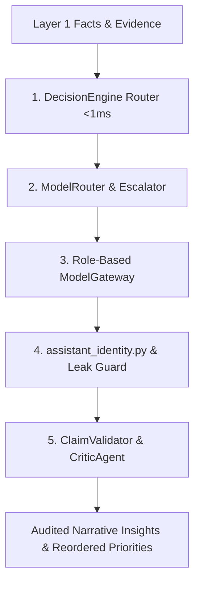

# Layer 2: Cognitive Routing & Governance Layer

> **Parent:** [README.md](../../README.md) &rsaquo; [System Architecture](../system-architecture.md) &rsaquo; **Layer 2**

## 1. Architectural Mission: Bounded Intelligence

Layer 2 provides the cognitive bridge between raw computed facts (Layer 1) and user-facing presentations (Layer 3). It routes user intent via sub-millisecond classifiers, directs tasks across specialized local model roles, enforces the **HRIDAY** assistant persona, and deterministically audits all generated assertions against the factual ledger.

---

## 2. Core Subsystems & Codebase Proof

### A. Intent Routing & Classification (<1ms - <15ms)
Implemented in `backend/app/services/decision_engine/`:
- **`RuleDecisionEngine` (`rule_engine.py`)**:
  - Compiled regex patterns and keyword analyzers that classify standard analytical questions in **< 1ms** with `confidence >= 0.90`.
  - Routes directly to deterministic categories:
    - `summary_positives` ("highlights", "top performers")
    - `summary_concerns` ("issues", "risk areas", "headwinds")
    - `summary_actions` ("recommendations", "next steps")
  - Zero LLM tokens required for standard queries.
- **`EmbeddingDecisionEngine` (`embedding_engine.py`)**:
  - Uses `nomic-embed-text:latest` (768-dim) to calculate intent cosine similarity in **< 15ms**.
- **Factory**: `get_decision_engine(engine_type)` (`factory.py`) enables pluggable execution.

### B. Central ModelRouter & Confidence Escalation
Implemented in `backend/app/services/gateway/model_router.py`:
- Routes tasks based on workload characteristics:
  - `naming`, `schema`, `metadata` &rarr; `ModelRole.FAST`
  - `narrative`, `story`, `presentation_slide` &rarr; `ModelRole.WRITER`
  - `root_cause`, `deep_reasoning`, `tradeoff` &rarr; `ModelRole.REASONER`
  - `structured_stats`, `ranking`, `correlation` &rarr; `ModelRole.ANALYST`
- **Dynamic Confidence Escalation**:
  - `FAST` &rarr; `ANALYST` if confidence < 0.65 or schema invalid.
  - `ANALYST` &rarr; `REASONER` if confidence < 0.50 or schema invalid.

### C. Role-Based Model Gateway & Config
Defined in `backend/app/core/models_config.py` and `backend/app/services/gateway/model_gateway.py`:

| Logical Role | Primary Model | Fallback Model | Max Tokens | Timeout | Responsibility |
| :--- | :--- | :--- | :---: | :---: | :--- |
| **`FAST`** | `phi4-mini:latest` | `llama3.1:8b` | 2,048 | 25s | Schema naming, column classification (<250ms). |
| **`ANALYST`** | `qwen3.5:9b` | `gemma4:12b` | 2,048 | 120s | Finding synthesis, pattern explanation (~1.5s). |
| **`REASONER`** | `deepseek-r1:7b` | `qwen3.5:9b` | 4,096 | 60s | Root-cause analysis, strategic trade-offs (~3.5s). |
| **`WRITER`** | `gemma4:12b` | `qwen3.5:9b` | 4,096 | 45s | Executive prose, slide takeaways, leadership memos (~1.8s). |
| **`CRITIC`** | `deepseek-r1:7b` | `llama3.1:8b` | 3,072 | 50s | Factual claim verification, contradiction checks. |

### D. Unified Assistant Identity & Leakage Guard
Implemented in `backend/app/services/gateway/assistant_identity.py`:
- **Unified Persona**: Across `ModelGateway`, Multi-Model Council (`union_war_room.py`), and Legacy Copilot (`copilot.py`), the assistant is strictly **HRIDAY** inside **HighView**.
- **Output Leakage Guard (`identity_leak`)**: Scans LLM output for unauthorized self-identifications (e.g. `I am DeepSeek`, `As Qwen`, `My name is Phi`) outside of code blocks.
- **Bounded Retry**: On leakage, executes at most **1 corrective retry** with an identity reminder, preserving original prompt parameters and schema.

### E. Factual Claim Audit & Permutation-Only Invariants
Implemented in `backend/app/services/analyst/interpretation_validator.py` and `backend/app/services/critic/`:
- **Claim Verification**: Deterministically compares every number and sign in generated sentences against the input `CandidateFact` objects. Hallucinated numbers trigger validation errors.
- **Permutation-Only Prioritization**: AI prioritization is restricted to reordering existing finding IDs (`EVID-XXX` / `FACT-XXX`). The model cannot alter percentages, invert signs, or invent claims.
- **Query Grain Invariant**: Retrieving a department-level average is never accepted as an answer for an employee-level calculation.

---

## 3. Layer Integration Contract (Output to Layer 3)

| Exposed Artifact | Contract Model | Downstream Consumers | Invariant Guarantee |
| :--- | :--- | :--- | :--- |
| **Audited Insights** | `InterpretationResponse` | Layer 3 `WorkflowOrchestrator`, `PresentationEngine` | 100% of claims verified against Layer 1 facts. |
| **Prioritized Findings** | `list[str]` (Ordered IDs) | Layer 3 `DecisionBrief`, `VisualAnalyticsPanel` | Permutation only; zero math mutation. |
| **Grounded Answers** | SSE Stream / JSON | Layer 3 `HRIDAY Copilot Chat` | Identity-sealed (`HRIDAY`); grain-preserved calculations. |
