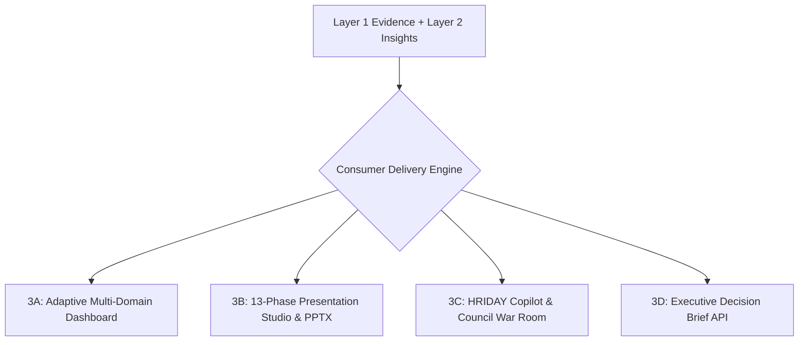

# Layer 3: Multi-Surface Consumer Delivery Engine

> **Parent:** [README.md](../../README.md) &rsaquo; [System Architecture](../system-architecture.md) &rsaquo; **Layer 3**

## 1. Architectural Mission: Direct Visual Parity

Layer 3 delivers the verified analytical findings (Layer 1) and audited cognitive insights (Layer 2) across 4 unified consumer surfaces. **Core Guarantee: 100% direct inheritance.** A KPI, percentage, or ranking displayed on a presentation slide is identical to the value on the adaptive dashboard, in the decision brief, and in copilot chat.

---

## 2. The 4 Consumer Delivery Subsystems

### Consumer 3A: Adaptive Multi-Domain Dashboard
Implemented in `backend/app/services/adaptive_dashboard/` and `backend/app/routers/adaptive_dashboard.py`:
- **7 Registered Business Domains**:
  - `commercial_retail`: Commercial Retail Revenue Analyst (AOV, conversion, margin)
  - `workforce_hr`: People Analytics Business Partner (headcount, turnover, Bradford factor)
  - `demographics_public`: Public Policy Demographer (population cohorts, socioeconomic indices)
  - `household_budget`: Household Financial Specialist (burn rate, discretionary spend)
  - `operations_support`: Operations & Logistics Engineer (latency, defect rate, throughput)
  - `education_academic`: Academic Performance Specialist (completion rates, test trends)
  - `general_tabular`: Senior Quantitative Analyst (distributions, quantiles, correlations)
- **3 Progressive Disclosure Tiers**:
  1. `GLANCE`: Immediate render; dominant number, familiar label, short badge.
  2. `EXPLAIN`: Non-interactive tooltip on hover/focus with plain-language definition.
  3. `INSPECT`: Clickable accessible modal containing exact formula, excluded null rows, and source coordinates.
- **Initial Load Invariant**: Every sheet displays exactly **2 primary dashboard elements** on load to prevent cognitive overload.
- **Endpoints**:
  - `GET /api/adaptive-dashboard/primary-element?sheet_id=...`
  - `GET /api/adaptive-dashboard/findings?sheet_id=...`

### Consumer 3B: Automated 13-Phase Presentation Engine
Implemented in `backend/app/services/presentation/pipeline_orchestrator.py`:
- **13 Discrete Phases (`PIPELINE_PHASES`)**:
  `0: brief_setup` &rarr; `1: evidence_audit` &rarr; `2: narrative_arc` &rarr; `3: headlines` &rarr; `4: layout_selection` &rarr; `5: math_reconciliation` &rarr; `6: graphics_charts` &rarr; `7: executive_polish` &rarr; `8: visual_qa` &rarr; `9: animation` &rarr; `10: speaker_notes` &rarr; `11: export_qa` &rarr; `12: ready`.
- **7 Standard Slide Layout Primitives**:
  - `title_hero`: Full-width title, metadata tags, narrative block (deck cover).
  - `kpi_summary`: 3 or 4 metric cards with labels, deltas, and trends (executive summary).
  - `full_chart_takeaway`: Full-width high-resolution chart + takeaway callout (macro trends).
  - `chart_narrative`: 66% visual chart (col-8) + 33% strategic facts panel (col-4) (core deep-dives).
  - `comparison_split`: 50/50 paired cards (9-Box matrix, Strengths vs Headwinds).
  - `table_detail`: Multi-column structured data table with multi-page continuation (audit ledgers).
  - `action_plan`: 3 prioritized initiatives with owners and timelines (strategic roadmap).
- **Structured 5-Part Speaker Notes Contract**:
  Every slide includes notes generated by `generate_structured_speaker_notes()`:
  1. *WHAT TO NOTICE*: Highlighted title focus and key metric values.
  2. *WHY IT MATTERS*: Executive operational context and strategic implications.
  3. *SUPPORTING EVIDENCE*: Provenance sheet label and `EVID-XXX` audit citations.
  4. *TIME BUDGET*: Estimated speaking seconds evaluated against presentation time target.
  5. *TRANSITION*: Logical narrative bridge connecting to the next slide.
- **Conversational Co-Pilot Slide Mutation & Re-Slicing Engine**:
  Implemented in `backend/app/services/presentation/slide_mutator.py` and `backend/app/routers/presentations.py` (`POST /api/presentations/mutate-slide`):
  - Enables live structural modification of generated slides via HRIDAY natural language or quick action prompts:
    - `RESLICE_SLIDE`: Regroups and aggregates underlying sheet tabular records deterministically via pandas in <15ms.
    - `RETYPE_CHART`: Instant transformation to `variance_waterfall`, `breakdown_tree`, `donut`, `line`, or `column`.
    - `FILTER_COHORT`: Slices slide visuals by category/department/region without altering source files.
    - `CHANGE_THEME`: Live switching of palette styling (`midnight_navy`, `executive_platinum`, `emerald_growth`, `sunset_amber`, `crimson_alert`).
    - `REVERT_MUTATION`: Instant 100% rollback to pre-mutation snapshot.
  - Zero LLM Math Guarantee: Intent classification only yields action contracts; all metrics recalculate through pandas aggregations against verified sheet records.
- **Endpoints**:
  - `POST /api/presentations/generate`: Trigger background generation pipeline.
  - `POST /api/presentations/scope-preview`: Preflight slide count, evidence items, and layouts.
  - `POST /api/presentations/mutate-slide`: Programmatic slide mutation engine with snapshotting.
  - `GET /api/reports/presentation/latest`: Download latest generated 16:9 PowerPoint deck.

### Consumer 3C: HRIDAY Copilot & Council War Room
Implemented in `backend/app/services/copilot/` and `backend/app/routers/copilot.py`:
- **0-LLM Math Factual Q&A**: `GenericCopilotEngine` resolves numerical queries directly in code with zero LLM math hallucinations.
- **Conversational Slide Mutation Routing**: Intent classification recognizes slide transformation commands ("group by department", "convert to waterfall", "switch to midnight navy theme"), mutates the active slide spec, attaches a visual mutation badge, and synchronizes live with the presentation studio via window events.
- **Multi-Model Council War Room**: `union_war_room.py` gathers candidate answers across multiple local models, executing internal peer election to surface consensus recommendations.
- **Query Grain Invariant**: Employee queries calculate at employee row grain; department queries calculate at department grain. Follow-ups preserve scope.
- **Endpoints**:
  - `POST /api/copilot/generic`: Factual Q&A.
  - `POST /api/copilot/query/stream`: Server-Sent Events (SSE) streaming chat with slide mutation event payload.
  - `POST /api/copilot/war-room`: Multi-model council consensus.
  - `GET /api/copilot/identity`: Frontend identity hydration.

### Consumer 3D: Executive Decision Brief API
Implemented in `backend/app/routers/decision_brief.py`:
- **Sub-Second Executive Briefing**:
  - `GET /api/analytics/decision-brief?sheet_id=...`: Computes highlights, concerns, and actions without LLM latency.
  - `POST /api/analytics/decision-brief/prioritize`: Reorders findings via `RuleDecisionEngine` (<1ms) or LLM reasoning.
  - `POST /api/analytics/decision-brief/voiceover`: Produces presenter voiceover script.
  - `POST /api/reports/orchestrate`: Full generic workflow orchestration (Validation &rarr; Profiling &rarr; Opportunities &rarr; Facts &rarr; Ranking &rarr; Interpretation &rarr; Audit &rarr; Visuals &rarr; Deck Spec).

---

## 3. Layer Integration Contract (Output to Layer 4)

| Exposed Artifact | Contract Model | Downstream Consumers | Invariant Guarantee |
| :--- | :--- | :--- | :--- |
| **Slide Deck Spec** | `dict[str, Any]` | Layer 4 PPTX, PDF, and React Studio | Uses standardized 16:9 baseline geometry (`960 × 540 pt`). |
| **Chart Specifications** | `list[VisualChartSpec]` | Layer 4 `echarts` / `python-pptx` | Bound to verified `FACT-XXX` data points. |
| **Data Tables** | `dict[str, Any]` | Layer 4 Table Wrapper | Weighted column widths with multi-page continuation. |
