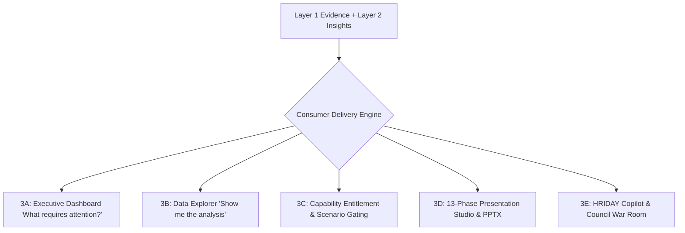

# Layer 3: Multi-Surface Consumer Delivery Engine

> **Parent:** [README.md](../../README.md) &rsaquo; [System Architecture](../system-architecture.md) &rsaquo; **Layer 3**

---

## 1. Architectural Mission: Direct Visual Parity & Surface Separation

Layer 3 delivers verified analytical findings (Layer 1) and audited cognitive insights (Layer 2) across 5 unified consumer surfaces. 

**Core Guarantees:**
1. **100% Direct Inheritance:** A KPI, percentage, or ranking displayed on a presentation slide is identical to the value on the executive dashboard, in the data explorer, in the decision brief, and in copilot chat.
2. **Clear Responsibility Boundary:** The Executive Dashboard answers *"What requires my attention?"* with compact, curated signals. The Data Explorer answers *"Show me the analysis behind it."* with deep, multi-tab technical and statistical modules.
3. **Capability Entitlement Gating:** Specialized analytical tools (such as workforce scenario simulations) are strictly gated by domain governance.

---

## 2. The Consumer Delivery Subsystems

### Consumer 3A: Executive Dashboard ("What requires my attention?")
Implemented in `backend/app/services/adaptive_dashboard/` and `frontend/src/pages/AdaptiveDashboardPage.jsx`:
- **Core Purpose**: Compact executive decision surface designed for rapid situational awareness without information overload.
- **Strict Composition Grammar**:
  1. **Dataset Context & Briefing Card**: High-level provenance, entity count, and high-impact executive summary.
  2. **Governed 5-KPI Strip**: Single-line summary metrics with domain-appropriate aggregation (e.g. Mean $\text{PM}_{10}$, Mean $\text{PM}_{2.5}$, Station Coverage) and explicit units ($\mu\text{g/m}^3$). Additive `SUM`/`Total` operations are strictly banned on rates and concentrations.
  3. **Executive Visual Diversity & Density Engine (Governed 8–15 Visual Envelope, Target 10–12)**:
     - *Governed Portfolio Optimization*: Evaluated by `VisualPortfolioOptimizer` using multi-factor portfolio scoring (importance + confidence + business relevance + diversity bonuses - redundancy penalties) weighted by `DomainVisualPriority`.
     - *Domain-Specific Decision Prioritization*: The hero and top supporting slots reflect domain decision priorities (`DomainVisualPriority`). For workforce, WFO policy compliance (`TARGET_VS_ACTUAL`, P1) anchors the Hero card, followed by leader rankings (`RANKING`, P1), period cross-tabulation matrix (`MATRIX`, P1), and capacity reconciliation (`COMPOSITION`, P1).
     - *Perceptual Diversity (Visual Morphology)*: Evaluated by `VisualMorphology` (`LENGTH`, `POINT`, `RANGE`, `AREA`, `TEMPORAL_PATH`, `MATRIX`, `DISTRIBUTION`, `ICONIC`, `HIERARCHICAL`, `FLOW`). HighView strictly caps `max_same_morphology <= 2` and enforces $\ge 5$ distinct morphologies, ensuring that length-based bars never visually dominate the portfolio.
     - *Intent & Family Diversity Quotas*: Enforces $\ge 4$ distinct analytical intents (max 3 per intent) and $\ge 5$ distinct chart families (max 2 per family).
     - *Gated Visual Archetypes & Spatial Profiles*:
       - `HERO / LARGE (span 12, 8)`: Primary benchmark ranking or policy compliance hero, and 2D cross-tabulation heatmaps (`heatmap`).
       - `MEDIUM (span 6)`: Distribution box plots (`box_plot`), bivariate relationship scatter plots (`scatter`), capacity composition (`100_percent_stacked_bar`), and statistical anomaly variance bars (`variance_bar`).
       - `COMPACT (span 4)`: Olympic Top 3 podium (`podium_top_3` with gold/silver/bronze pedestals and strict $\le 20$ character label truncation), target vs actual bullet charts (`bullet`), metric comparisons (`lollipop`), and disparity range spreads (`dumbbell`).
     - *Intelligent Spatial Composition Engine (`SpatialCompositionOptimizer`)*:
       Server-side layout optimizer packages the selected portfolio into a structured `DashboardLayoutPlan` containing sections, rows, and cards:
       - Resolves visual spans dynamically based on archetype intrinsic shape profiles (`VisualSpatialProfile`) rather than rigid static hints.
       - Guarantees zero orphan cards and $\ge 85\%$ row utilization (achieving 100% on live datasets) via canonical row packing templates (`12`, `8+4`, `6+6`, `7+5`, `4+4+4`).
       - Enforces `ReadableSpanIntegrity` and `ContentDensityAnalyzer` (`LabelDensityScore`): prevents chart cramming by forbidding spans below minimum readable bounds; long labels (>= 20 chars) bump ranking charts to effective min span 8.
       - Employs multi-objective row layout optimization: $\text{Score} = 0.40 \cdot \text{adjacency} + 0.30 \cdot \text{readability} + 0.20 \cdot \text{efficiency} + 0.10 \cdot \text{height}$.
       - Synchronizes card and viewport heights across paired row companions (`HeightBalanceIntegrity`), eliminating ragged row baselines.
       - Emits server-driven `topic.spatial_placement` consumed by `ExecutiveVisualCard.jsx` (`span-12`, `span-8`, `span-6`, `span-4`) with synchronized height classes (`height-short`, `height-standard`, `height-tall`), sorted by `order_index` to guarantee strict DOM reading order.
     - *Semantic Visual Compression Layer (`SemanticVisualCompressionLayer`)*: Level-1 executive cards eliminate report prose in favor of high visual density:
       - `short_title`: $\le 7$ words (executive noun phrase).
       - `short_context`: $\le 8$ words (cohort context & scope).
       - `short_finding`: $\le 12$ words (single clear takeaway sentence).
       - `cta`: $\le 3$ words (e.g. "Inspect →").
       - `SemanticIconRegistry`: Deterministic mapping to SVG icons (`target`, `trophy`, `users`, `calendar`, `alert`, `trend`, `distribution`, `compare`, `relationship`, `shield`, `matrix`, `wind`).
       - **Zero Permanent Action Clutter**: `recommended_action` is never rendered permanently inside Level-1 dashboard cards. Unabridged business questions, full explanations, recommended action steps, and cryptographic evidence citations are preserved on demand inside the Quick Inspect Drawer and Data Explorer.
     - *Truth > Quota Invariant*: HighView never synthesizes artificial stories, fabricated entities, or fake temporal dimensions to satisfy a count quota.
  4. **Top 3 / Bottom 3 Ranking Card**: Compact ranking overview with polarity awareness (`HIGHER_IS_BETTER` vs `LOWER_IS_BETTER`). Enforces a maximum of 6 unique entities and avoids duplicate entries on small cohorts ($N \le 6$). Deep-links via `"Explore full ranking →"`.
  5. **Compact Scenario Summary**: High-level simulation impact card, strictly gated to entitled domains.
- **Semantic DOM Hierarchy & Page Landmarks**:
  - *Single Document H1*: Exactly one `<h1>Executive Dashboard</h1>` on the page.
  - *Logical H2 Section Groups*: Major decision sections are encapsulated in `<section aria-labelledby="...">` with styled `<h2>` headers:
    - `H2: Executive Summary` (`dashboard-section--summary`)
    - `H2: Key Performance Indicators` (`dashboard-section--kpis` using semantic `<dl>`, `<dt>`, `<dd>`)
    - `H2: Priority Decisions` (`dashboard-section--priority` containing hero & large P1 decisions)
    - `H2: Diagnostic Insights` (`dashboard-section--diagnostics` containing distributions, correlations, and podiums)
    - `H2: Supporting Analysis` (`dashboard-section--supporting` containing comparative rankings and anomalies)
    - `H2: Scenario Analysis` (`dashboard-section--scenario` when domain-entitled)
    - `H2: Evidence & Governance` (`dashboard-section--evidence` as a semantic `<aside>`)
  - *Independent `<article>` Visual Cards with `<h3>`*: Every visual story is an `<article className="executive-visual-card">` with an `<h3>` heading, guaranteeing a strict non-skipping heading outline (`H1` &rarr; `H2` &rarr; `H3`).
  - *Semantic `<figure>` and `<figcaption>` Boundary*: Charts live inside `<figure className="visual-card__figure">` with an accessible `
` description and `<figcaption className="visual-card__figcaption">` containing the short finding and deep-link action.
  - *Standardized `CardActions` Component*: Unifies primary ("Inspect") and secondary ("Deep dive") controls into accessible buttons and anchors.
  - *Portal `<dialog>` Quick Inspect*: Quick inspect context is rendered through React Portal (`createPortal(..., document.body)`) using a native `<dialog open>` element with keyboard focus trap, `Escape` key dismissal, and automatic focus restoration to the originating trigger button.
- **Redundancy Suppression (`VisualStoryRedundancyIntegrity`)**: Standalone scalar cards that duplicate values in the KPI strip are suppressed from the visual stories grid.
- **Multi-Viewport Responsive Sizing & Zero Overflow**: 12-column grid system collapses compact cards to 6-span on tablets (max-width 1024px) and 12-span single-column on mobile (<768px), guaranteeing zero horizontal clipping, zero orphan cards, and zero CSS `order:` reordering.

### Consumer 3B: Data Explorer ("Show me the analysis behind it.")
Implemented in `frontend/src/pages/DataExplorerPage.jsx` and `frontend/src/components/explorer/`:
- **Core Purpose**: Unrestricted deep analytical workbench preserving dataset, sheet, and entity context across 7 specialized tabs:
  1. `Overview`: Dataset summary, column data types, null distribution, and dataset-level hygiene.
  2. `Rankings`: Generic entity ranking workbench (`GenericRankingExplorer.jsx`) with dynamic entity switcher, metric selector, polarity controls (`HIGHER_IS_BETTER`, `LOWER_IS_BETTER`), distribution histogram, and virtualized data table.
  3. `Trends`: Chronological series, Holt-damped forecast projections, and seasonality decompositions.
  4. `Relationships`: Bivariate correlation matrices, scatter plots, and cross-source reconciliations.
  5. `Distributions`: Quantile spans (min, p25, median, p75, p90, max), box plots, and frequency bins.
  6. `Evidence`: Cryptographic audit ledger displaying `FACT-XXX` and `EVID-XXX` items with source cell coordinates.
  7. `Technical`: Reconstruction safety telemetry, 3D confidence scores (Structural, Semantic, Fidelity), model escalation proposals, and complete row-by-row provenance logs.
- **Deep-Link Navigation**: The Executive Dashboard deep-links into specific Explorer tabs with context preserved:
  - `Explore full ranking →` &rarr; `#explorer?tab=rankings&metric=...`
  - `Explore relationship →` &rarr; `#explorer?tab=relationships&x=...&y=...`

### Consumer 3C: Capability Entitlement & Scenario Gating
Implemented in `backend/app/services/adaptive_dashboard/scenario_engine.py` and `frontend/src/pages/AdaptiveDashboardPage.jsx`:
- **Gated Header Action**: The `Scenario Explorer` button in the top navigation header is conditionally rendered based on `domain_profile.governed_scenario_domain == "workforce"` or `domain == "workforce"`.
- **Domain Suppression**: For environmental air quality, commercial retail, operations, or education datasets, the scenario explorer button and the scenario summary card are cleanly hidden.

### Consumer 3D: Automated 13-Phase Presentation Engine
Implemented in `backend/app/services/presentation/pipeline_orchestrator.py`:
- **13 Discrete Phases (`PIPELINE_PHASES`)**:
  `0: brief_setup` &rarr; `1: evidence_audit` &rarr; `2: narrative_arc` &rarr; `3: headlines` &rarr; `4: layout_selection` &rarr; `5: math_reconciliation` &rarr; `6: graphics_charts` &rarr; `7: executive_polish` &rarr; `8: visual_qa` &rarr; `9: animation` &rarr; `10: speaker_notes` &rarr; `11: export_qa` &rarr; `12: ready`.
- **7 Slide Primitives**: `title_hero`, `kpi_summary`, `full_chart_takeaway`, `chart_narrative`, `comparison_split`, `table_detail`, `action_plan`.
- **Conversational Slide Mutator (`slide_mutator.py`)**: Enables live natural language modification (`RESLICE_SLIDE`, `RETYPE_CHART`, `FILTER_COHORT`, `CHANGE_THEME`, `REVERT_MUTATION`) with 1-click snapshot rollback and zero LLM arithmetic.

### Consumer 3E: HRIDAY Copilot & Multi-Model Council
Implemented in `backend/app/services/copilot/` and `backend/app/routers/copilot.py`:
- **0-LLM Math Factual Q&A**: `GenericCopilotEngine` executes queries via deterministic Python code.
- **Multi-Model War Room**: Multi-model consensus generation across local LLMs.
- **Grounded Chat Visuals**: Resolves charts dynamically into ECharts specifications.
- **Query Grain Invariant**: Maintains requested grain (employee vs department vs city) across conversation turns.

---

## 3. Layer Integration Contract (Output to Layer 4)

| Exposed Artifact | Contract Model | Downstream Consumers | Invariant Guarantee |
| :--- | :--- | :--- | :--- |
| **Visual Stories** | `list[ExecutiveStory]` | Layer 4 ECharts Renderer | Truthful visual types: scatter for correlation, bars for ranking. |
| **Slide Deck Spec** | `dict[str, Any]` | Layer 4 PPTX, PDF, React Studio | Standardized 16:9 spatial baseline (`960 × 540 pt`). |
| **Chart Specifications** | `list[VisualChartSpec]` | Layer 4 `echarts` / `python-pptx` | Bound to verified `FACT-XXX` data points. |
| **Data Tables** | `dict[str, Any]` | Layer 4 Table Wrapper | Weighted column widths with multi-page continuation. |
