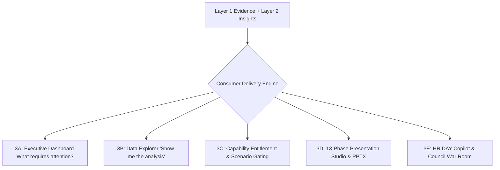

# Layer 3: Multi-Surface Consumer Delivery Engine

> **Parent:** [README.md](../../README.md) &rsaquo; [System Architecture](../system-architecture.md) &rsaquo; **Layer 3**

---

## 1. Architectural Mission: Direct Visual Parity & Surface Separation

Layer 3 delivers verified analytical findings (Layer 1) and audited cognitive insights (Layer 2) across 5 unified consumer surfaces. 

**Core Guarantees:**
1. **100% Direct Inheritance:** A KPI, percentage, or ranking displayed on a presentation slide is identical to the value on the executive dashboard, in the data explorer, in the decision brief, and in copilot chat.
2. **Clear Responsibility Boundary:** The Executive Dashboard answers *"What requires my attention?"* with compact, curated signals. The Data Explorer answers *"Show me the analysis behind it."* with deep, multi-tab technical and statistical modules.
3. **Capability Entitlement Gating:** Specialized analytical tools (such as workforce scenario simulations) are strictly gated by domain governance.

---

## 2. The Consumer Delivery Subsystems

### Consumer 3A: Executive Dashboard ("What requires my attention?")
Implemented in `backend/app/services/adaptive_dashboard/` and `frontend/src/pages/AdaptiveDashboardPage.jsx`:
- **Core Purpose**: Compact executive decision surface designed for rapid situational awareness without information overload.
- **Strict Composition Grammar**:
  1. **Dataset Context & Briefing Card**: High-level provenance, entity count, and high-impact executive summary.
  2. **Governed 5-KPI Strip**: Single-line summary metrics with domain-appropriate aggregation (e.g. Mean $\text{PM}_{10}$, Mean $\text{PM}_{2.5}$, Station Coverage) and explicit units ($\mu\text{g/m}^3$). Additive `SUM`/`Total` operations are strictly banned on rates and concentrations.
  3. **Executive Visual Diversity & Density Engine (Governed 8–15 Visual Envelope, Target 10–12)**:
     - *Governed Portfolio Optimization*: Evaluated by `VisualPortfolioOptimizer` using multi-factor portfolio scoring (importance + confidence + business relevance + diversity bonuses - redundancy penalties).
     - *Intent & Family Diversity Quotas*: Enforces $\ge 4$ distinct analytical intents (max 3 per intent) and $\ge 5$ distinct chart families (max 2 per family).
     - *Gated Visual Archetypes*:
       - `HERO / LARGE (span 12)`: Primary benchmark ranking (e.g. Ambient air quality vs NAAQS standard, or Department Attendance vs Policy Benchmark).
       - `MEDIUM (span 6)`: Distribution box plots (`box_plot`), bivariate relationship scatter plots (`scatter`), capacity composition (`100_percent_stacked_bar`), and statistical anomaly variance bars (`variance_bar`).
       - `COMPACT (span 4) / MICRO (span 3)`: Olympic Top 3 podium (`podium_top_3` with gold/silver/bronze pedestals and strict $\le 20$ character label truncation), target vs actual bullet charts (`bullet`), metric comparisons (`lollipop`), and disparity range spreads (`dumbbell`).
     - *Truth > Quota Invariant*: HighView never synthesizes artificial stories, fabricated entities, or fake temporal dimensions to satisfy a count quota.
  4. **Top 3 / Bottom 3 Ranking Card**: Compact ranking overview with polarity awareness (`HIGHER_IS_BETTER` vs `LOWER_IS_BETTER`). Enforces a maximum of 6 unique entities and avoids duplicate entries on small cohorts ($N \le 6$). Deep-links via `"Explore full ranking →"`.
  5. **Compact Scenario Summary**: High-level simulation impact card, strictly gated to entitled domains.
- **Redundancy Suppression (`VisualStoryRedundancyIntegrity`)**: Standalone scalar cards that duplicate values in the KPI strip are suppressed from the visual stories grid.
- **Responsive Sizing & Zero Overflow**: 12-column grid system collapses compact/micro cards to 6-span on tablets (max-width 1024px) and 12-span single-column on mobile (<768px), guaranteeing zero horizontal clipping or overflow.

### Consumer 3B: Data Explorer ("Show me the analysis behind it.")
Implemented in `frontend/src/pages/DataExplorerPage.jsx` and `frontend/src/components/explorer/`:
- **Core Purpose**: Unrestricted deep analytical workbench preserving dataset, sheet, and entity context across 7 specialized tabs:
  1. `Overview`: Dataset summary, column data types, null distribution, and dataset-level hygiene.
  2. `Rankings`: Generic entity ranking workbench (`GenericRankingExplorer.jsx`) with dynamic entity switcher, metric selector, polarity controls (`HIGHER_IS_BETTER`, `LOWER_IS_BETTER`), distribution histogram, and virtualized data table.
  3. `Trends`: Chronological series, Holt-damped forecast projections, and seasonality decompositions.
  4. `Relationships`: Bivariate correlation matrices, scatter plots, and cross-source reconciliations.
  5. `Distributions`: Quantile spans (min, p25, median, p75, p90, max), box plots, and frequency bins.
  6. `Evidence`: Cryptographic audit ledger displaying `FACT-XXX` and `EVID-XXX` items with source cell coordinates.
  7. `Technical`: Reconstruction safety telemetry, 3D confidence scores (Structural, Semantic, Fidelity), model escalation proposals, and complete row-by-row provenance logs.
- **Deep-Link Navigation**: The Executive Dashboard deep-links into specific Explorer tabs with context preserved:
  - `Explore full ranking →` &rarr; `#explorer?tab=rankings&metric=...`
  - `Explore relationship →` &rarr; `#explorer?tab=relationships&x=...&y=...`

### Consumer 3C: Capability Entitlement & Scenario Gating
Implemented in `backend/app/services/adaptive_dashboard/scenario_engine.py` and `frontend/src/pages/AdaptiveDashboardPage.jsx`:
- **Gated Header Action**: The `Scenario Explorer` button in the top navigation header is conditionally rendered based on `domain_profile.governed_scenario_domain == "workforce"` or `domain == "workforce"`.
- **Domain Suppression**: For environmental air quality, commercial retail, operations, or education datasets, the scenario explorer button and the scenario summary card are cleanly hidden.

### Consumer 3D: Automated 13-Phase Presentation Engine
Implemented in `backend/app/services/presentation/pipeline_orchestrator.py`:
- **13 Discrete Phases (`PIPELINE_PHASES`)**:
  `0: brief_setup` &rarr; `1: evidence_audit` &rarr; `2: narrative_arc` &rarr; `3: headlines` &rarr; `4: layout_selection` &rarr; `5: math_reconciliation` &rarr; `6: graphics_charts` &rarr; `7: executive_polish` &rarr; `8: visual_qa` &rarr; `9: animation` &rarr; `10: speaker_notes` &rarr; `11: export_qa` &rarr; `12: ready`.
- **7 Slide Primitives**: `title_hero`, `kpi_summary`, `full_chart_takeaway`, `chart_narrative`, `comparison_split`, `table_detail`, `action_plan`.
- **Conversational Slide Mutator (`slide_mutator.py`)**: Enables live natural language modification (`RESLICE_SLIDE`, `RETYPE_CHART`, `FILTER_COHORT`, `CHANGE_THEME`, `REVERT_MUTATION`) with 1-click snapshot rollback and zero LLM arithmetic.

### Consumer 3E: HRIDAY Copilot & Multi-Model Council
Implemented in `backend/app/services/copilot/` and `backend/app/routers/copilot.py`:
- **0-LLM Math Factual Q&A**: `GenericCopilotEngine` executes queries via deterministic Python code.
- **Multi-Model War Room**: Multi-model consensus generation across local LLMs.
- **Grounded Chat Visuals**: Resolves charts dynamically into ECharts specifications.
- **Query Grain Invariant**: Maintains requested grain (employee vs department vs city) across conversation turns.

---

## 3. Layer Integration Contract (Output to Layer 4)

| Exposed Artifact | Contract Model | Downstream Consumers | Invariant Guarantee |
| :--- | :--- | :--- | :--- |
| **Visual Stories** | `list[ExecutiveStory]` | Layer 4 ECharts Renderer | Truthful visual types: scatter for correlation, bars for ranking. |
| **Slide Deck Spec** | `dict[str, Any]` | Layer 4 PPTX, PDF, React Studio | Standardized 16:9 spatial baseline (`960 × 540 pt`). |
| **Chart Specifications** | `list[VisualChartSpec]` | Layer 4 `echarts` / `python-pptx` | Bound to verified `FACT-XXX` data points. |
| **Data Tables** | `dict[str, Any]` | Layer 4 Table Wrapper | Weighted column widths with multi-page continuation. |
