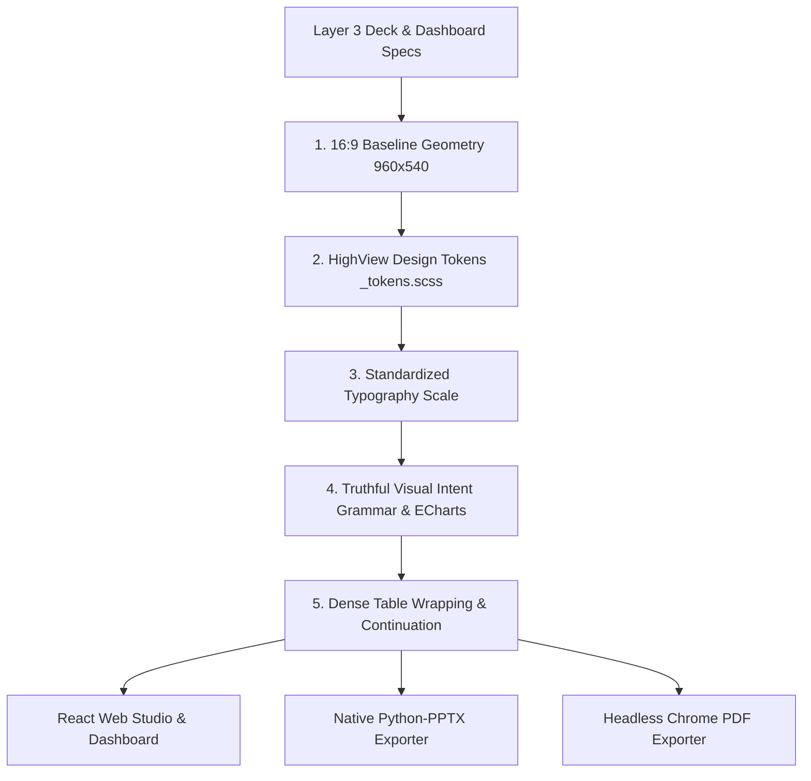

# Layer 4: Visual Grammar & Spatial Contract

> **Parent:** [README.md](../../README.md) &rsaquo; [System Architecture](../system-architecture.md) &rsaquo; **Layer 4**

---

## 1. Architectural Mission: Spatial & Visual Invariants

Layer 4 governs the visual presentation layer across all rendering surfaces (React browser components, headless PDF exporter, and native Microsoft PowerPoint decks). It enforces strict WCAG AAA contrast standards, an immutable 16:9 spatial layout contract, a cohesive typography scale, and a **truthful visual intent grammar** where chart types strictly mirror analytical intent.

---

## 2. Core Subsystems & Codebase Proof

### A. HighView Design Tokens (`frontend/src/styles/_tokens.scss`)
Defined canonically in SCSS; JavaScript chart tokens and presentation themes inherit directly from this file:
- **Palette Identity**: Calm navy, emerald, and warm neutral surfaces.
- **Accessibility Standard**: Text tokens target &ge; 7:1 contrast ratio across semantic surfaces (WCAG AAA).
- **Theme Validation**: Verified via `npm run test:theme` in `frontend/`.

| Token Variable | Light Mode (`:root`) | Dark Mode (`[data-theme="dark"]`) | Semantic Usage |
| :--- | :---: | :---: | :--- |
| `--color-bg-page` | `#F6F5F0` | `#101B27` | Canvas and viewport background |
| `--color-bg-surface` | `#FFFFFF` | `#172635` | Card panels, slide canvas, modal dialogs |
| `--color-bg-elevated` | `#FFFFFF` | `#203445` | Dropdowns, popovers, floating menus |
| `--color-bg-subtle` | `#EEEFE9` | `#1C2E3E` | Table header fills, neutral badges |
| `--color-text-primary` | `#172B3A` | `#F4F5EF` | Headings, table cells, active labels |
| `--color-text-secondary`| `#334B57` | `#D3DED9` | Subtitles, field labels, metadata notes |
| `--color-text-muted` | `#3C5059` | `#BDCBC5` | Timestamp notes, inactive captions |
| `--color-brand-primary` | `#183B56` | `#A9CAE8` | HighView brand navy; primary navigation |
| `--color-brand-secondary`| `#075443`| `#82D9B5` | Emerald action buttons, active focus |
| `--color-border` | `#D4DDD6` | `#3B4E5A` | Standard structural borders & dividers |
| `--color-border-strong` | `#78877F` | `#82968F` | Form input borders, high-contrast boundaries |
| `--color-success` | `#075443` | `#82D9B5` | Positive indicators, healthy benchmarks |
| `--color-warning` | `#65470C` | `#E8C675` | Restrained gold; caution & moderate volatility |
| `--color-error` | `#8E1938` | `#FFB3C0` | Deep crimson; critical headwinds, high turnover |

### B. Truthful Visual Intent Grammar & ECharts Renderers
Implemented in `backend/app/services/adaptive_dashboard/composition_planner.py` and `frontend/src/components/adaptive/VisualSpecRenderer.jsx`:
1. **`RELATIONSHIP` Intent &rarr; True Scatter Plots**:
   - Correlation and bivariate measures render as native **ECharts scatter plots**.
   - Plotted coordinates: $X$-axis = measure 1, $Y$-axis = measure 2.
   - Point metadata: Carries entity identifier (e.g. city name) into interactive tooltips.
   - Strictly replaces legacy synthetic categorical bar charts.
2. **`TemporalLabelIntegrity`**:
   - Synthetic time labels (`Week 1...5`, `Month 1...`, `Quarter 1...`) are permanently banned when the source table lacks a true `temporal_point` column.
3. **`RANKING` Intent &rarr; Directional Bar Charts**:
   - Polarity-aware color rendering (`HIGHER_IS_BETTER` vs `LOWER_IS_BETTER`).
   - Benchmark reference lines (e.g. NAAQS statutory $60\ \mu\text{g/m}^3$ annual standard).
4. **`ANOMALY` / `OUTLIER` Intent &rarr; Variance Bars**:
   - Diverging or baseline-anchored variance bars highlighting statistical outlier distance.

### C. Unified 16:9 Spatial Baseline
Implemented in `backend/app/services/presentation/slide_layout.py`, `resolved_slides.scss`, and `resolved_pdf.py`:
- **Baseline Resolution**: `960 × 540 pt` (scaled $2\times$ to `1920 × 1080 px` for high-DPI displays).
- **Usable Content Area**: `864 pt` width ($48\mathrm{pt}$ left/right margins), `460 pt` height ($40\mathrm{pt}$ top header, $40\mathrm{pt}$ footer).
- **Full-Width Hero Reclamation**: Text and cover layouts reclaim the full 864 pt width; side metrics only allocate space when explicitly present.

### D. Standardized Typography Hierarchy

| Element | Size | Weight | Line Height | Usage Target |
| :--- | :---: | :---: | :---: | :--- |
| **Cover Title** | `38 pt` | Bold (700) | `1.15` | Hero title on deck cover slide |
| **Slide Header** | `30 pt` | Bold (700) | `1.20` | Main slide title across all interior slides |
| **Panel Title** | `20 pt` | Semi-bold (600) | `1.30` | Section headings, KPI card titles |
| **Body Narrative** | `18 pt` | Regular (400) | `1.40` | Strategic takeaway paragraphs, bullet points |
| **Table Cells** | `16 pt` | Regular (400) | `1.22` | Structured data table rows |
| **Chart Labels** | `14 pt` | Medium (500) | `1.20` | Category axis labels, legend keys, datalabels |
| **Footnotes & Provenance** | `11 pt` | Regular (400) | `1.20` | `EVID-XXX` evidence citations & source labels |

### E. Dense Table Protection & Overflow Handling
Implemented in `backend/app/services/presentation/slide_layout.py` and `resolved-slides.scss`:
1. **Weighted Column Widths**: Allocated based on semantic content types (compact for IDs, currencies, dates; wide for strings).
2. **Multi-Page Continuation**: Tables exceeding the 460 pt content boundary generate continuation slides with repeated column headers.
3. **Hard Row Safety**: Single rows exceeding maximum allowable height fail gracefully with actionable diagnostics rather than clipping off-slide.

### F. Native Multi-Format Exporters
- **Native PowerPoint (`python-pptx`)**: Generates real editable shape tables and native vector chart objects—never low-resolution screenshots.
- **Executive PDF (`resolved_pdf.py`)**: Headless browser render enforcing identical 960×540 pt geometry and print CSS rules.
- **Interactive Web Studio (`FrontendSlidesDeck.jsx`, `DeckStudioView.jsx`)**: Responsive slider navigation, live conversational slide mutation with rollback, and speaker notes drawer.
