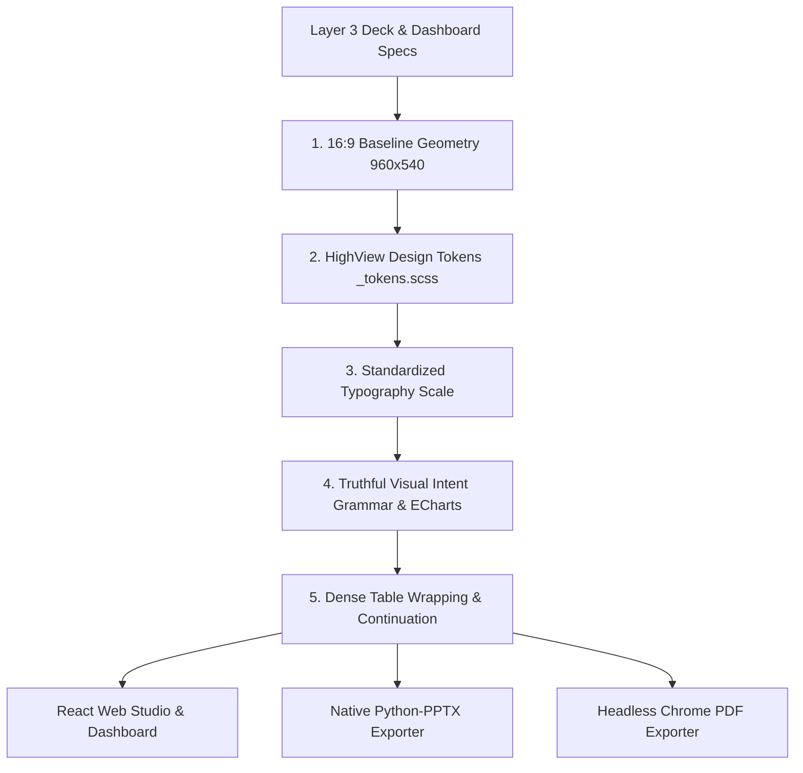

# Layer 4: Visual Grammar & Spatial Contract

> **Parent:** [README.md](../../README.md) &rsaquo; [System Architecture](../system-architecture.md) &rsaquo; **Layer 4**

---

## 1. Architectural Mission: Spatial & Visual Invariants

Layer 4 governs the visual presentation layer across all rendering surfaces (React browser components, headless PDF exporter, and native Microsoft PowerPoint decks). It enforces strict WCAG AAA contrast standards, an immutable 16:9 spatial layout contract, a cohesive typography scale, and a **truthful visual intent grammar** where chart types strictly mirror analytical intent.



---

## 2. Core Subsystems & Codebase Proof

### A. HighView Design Tokens (`frontend/src/styles/_tokens.scss`)
Defined canonically in SCSS; JavaScript chart tokens and presentation themes inherit directly from this file:
- **Palette Identity**: Calm navy, emerald, and warm neutral surfaces.
- **Accessibility Standard**: Text tokens target &ge; 7:1 contrast ratio across semantic surfaces (WCAG AAA).
- **Theme Validation**: Verified via `npm run test:theme` in `frontend/`.

| Token Variable | Light Mode (`:root`) | Dark Mode (`[data-theme="dark"]`) | Semantic Usage |
| :--- | :---: | :---: | :--- |
| `--color-bg-page` | `#F6F5F0` | `#101B27` | Canvas and viewport background |
| `--color-bg-surface` | `#FFFFFF` | `#172635` | Card panels, slide canvas, modal dialogs |
| `--color-bg-elevated` | `#FFFFFF` | `#203445` | Dropdowns, popovers, floating menus |
| `--color-bg-subtle` | `#EEEFE9` | `#1C2E3E` | Table header fills, neutral badges |
| `--color-text-primary` | `#172B3A` | `#F4F5EF` | Headings, table cells, active labels |
| `--color-text-secondary`| `#334B57` | `#D3DED9` | Subtitles, field labels, metadata notes |
| `--color-text-muted` | `#3C5059` | `#BDCBC5` | Timestamp notes, inactive captions |
| `--color-brand-primary` | `#183B56` | `#A9CAE8` | HighView brand navy; primary navigation |
| `--color-brand-secondary`| `#075443`| `#82D9B5` | Emerald action buttons, active focus |
| `--color-border` | `#D4DDD6` | `#3B4E5A` | Standard structural borders & dividers |
| `--color-border-strong` | `#78877F` | `#82968F` | Form input borders, high-contrast boundaries |
| `--color-success` | `#075443` | `#82D9B5` | Positive indicators, healthy benchmarks |
| `--color-warning` | `#65470C` | `#E8C675` | Restrained gold; caution & moderate volatility |
| `--color-error` | `#8E1938` | `#FFB3C0` | Deep crimson; critical headwinds, high turnover |

### B. Truthful Visual Intent Grammar & ECharts Renderers
Implemented in `backend/app/services/adaptive_dashboard/composition_planner.py`, `visual_portfolio_optimizer.py`, and `frontend/src/components/adaptive/VisualSpecRenderer.jsx`:
1. **`RELATIONSHIP` Intent &rarr; True Scatter Plots**:
   - Correlation and bivariate measures render as native **ECharts scatter plots**.
   - Plotted coordinates: $X$-axis = measure 1, $Y$-axis = measure 2.
   - Point metadata: Carries entity identifier (e.g. city name) into interactive tooltips.
   - Strictly replaces legacy synthetic categorical bar charts. Gate: requires 2 continuous numeric measures and $N \ge 3$ points.
2. **`DISTRIBUTION` Intent &rarr; Five-Number Summary Box Plots**:
   - Renders median, upper/lower quartiles (Q1, Q3), and min/max whiskers.
   - Gate: requires numeric measure with $\ge 5$ observations (prefers $\ge 10$).
3. **`RANKING` Intent &rarr; Directional Bar Charts & Podium Top 3**:
   - Ranked horizontal bars with polarity-aware color rendering (`HIGHER_IS_BETTER` vs `LOWER_IS_BETTER`) and benchmark reference lines (e.g. NAAQS statutory $60\ \mu\text{g/m}^3$ annual standard).
   - Olympic Podium (`podium_top_3`): Gold (#1), Silver (#2), and Bronze (#3) pedestals with medal badges. Strict label truncation ($\le 20$ chars, $\le 2$ lines, full label in hover tooltip).
4. **`TARGET_VS_ACTUAL` Intent &rarr; Bullet Charts**:
   - Horizontal performance bars with benchmark threshold indicators and gap badges.
5. **`COMPARISON` Intent &rarr; Lollipop & Dumbbell Charts**:
   - Lollipops for clean entity-level measure comparisons without heavy ink.
   - Dumbbells for pairwise disparity spreads (e.g. SO2 vs NO2 gap across urban centers).
6. **`COMPOSITION` Intent &rarr; 100% Stacked Bars & Treemaps**:
   - Capacity breakdown across categorical cohorts or multi-sheet reconciliation.
7. **`ANOMALY` / `OUTLIER` Intent &rarr; Variance Bars**:
   - Diverging or baseline-anchored variance bars highlighting statistical outlier distance.
8. **`TemporalLabelIntegrity`**:
   - Synthetic time labels (`Week 1...5`, `Month 1...`, `Quarter 1...`) are permanently banned when the source table lacks a true `temporal_point` column. Line/trend charts are only permitted when genuine temporal dimensions exist.

### C. Unified 16:9 Spatial Baseline
Implemented in `backend/app/services/presentation/slide_layout.py`, `resolved_slides.scss`, and `resolved_pdf.py`:
- **Baseline Resolution**: `960 × 540 pt` (scaled $2\times$ to `1920 × 1080 px` for high-DPI displays).
- **Usable Content Area**: `864 pt` width ($48\mathrm{pt}$ left/right margins), `460 pt` height ($40\mathrm{pt}$ top header, $40\mathrm{pt}$ footer).
- **Full-Width Hero Reclamation**: Text and cover layouts reclaim the full 864 pt width; side metrics only allocate space when explicitly present.

### D. Standardized Typography Hierarchy

| Element | Size | Weight | Line Height | Usage Target |
| :--- | :---: | :---: | :---: | :--- |
| **Cover Title** | `38 pt` | Bold (700) | `1.15` | Hero title on deck cover slide |
| **Slide Header** | `30 pt` | Bold (700) | `1.20` | Main slide title across all interior slides |
| **Panel Title** | `20 pt` | Semi-bold (600) | `1.30` | Section headings, KPI card titles |
| **Body Narrative** | `18 pt` | Regular (400) | `1.40` | Strategic takeaway paragraphs, bullet points |
| **Table Cells** | `16 pt` | Regular (400) | `1.22` | Structured data table rows |
| **Chart Labels** | `14 pt` | Medium (500) | `1.20` | Category axis labels, legend keys, datalabels |
| **Footnotes & Provenance** | `11 pt` | Regular (400) | `1.20` | `EVID-XXX` evidence citations & source labels |

### E. Dense Table Protection & Overflow Handling
Implemented in `backend/app/services/presentation/slide_layout.py` and `resolved-slides.scss`:
1. **Weighted Column Widths**: Allocated based on semantic content types (compact for IDs, currencies, dates; wide for strings).
2. **Multi-Page Continuation**: Tables exceeding the 460 pt content boundary generate continuation slides with repeated column headers.
3. **Hard Row Safety**: Single rows exceeding maximum allowable height fail gracefully with actionable diagnostics rather than clipping off-slide.

### F. Native Multi-Format Exporters
- **Native PowerPoint (`python-pptx`)**: Generates real editable shape tables and native vector chart objects—never low-resolution screenshots.
- **Executive PDF (`resolved_pdf.py`)**: Headless browser render enforcing identical 960×540 pt geometry and print CSS rules.
- **Interactive Web Studio (`FrontendSlidesDeck.jsx`, `DeckStudioView.jsx`)**: Responsive slider navigation, live conversational slide mutation with rollback, and speaker notes drawer.

### G. Executive Visual Diversity & Density Engine (8–15 Visual Envelope)
Implemented in `backend/app/services/adaptive_dashboard/visual_portfolio_optimizer.py`, `composition_planner.py`, and `frontend/src/styles/executive-cockpit.scss`:

1. **Dashboard Visual Budget Contract (`DashboardVisualBudget`)**:
   ```python
   min_visuals: int = 8
   target_visuals: int = 10
   max_visuals: int = 15
   max_same_intent: int = 3
   max_same_family: int = 2
   max_same_morphology: int = 2   # Strictly caps same geometric visual structure
   min_distinct_morphologies: int = 5
   min_distinct_families: int = 5
   min_distinct_intents: int = 4
   ```
2. **Visual Morphology Classification (`VisualMorphology`)**:
   Prevents length-based bar chart perceptual monotony across the dashboard:
   - `LENGTH`: `ranked_bar`, `horizontal_bar`, `bullet`, `waterfall`, `variance_bar`
   - `POINT`: `lollipop`, `scatter`, `dot_plot`
   - `RANGE`: `dumbbell`, `range_plot`
   - `AREA`: `100_percent_stacked_bar`, `stacked_bar`, `donut`, `pie`
   - `TEMPORAL_PATH`: `line`, `area`, `slope` (gated by real temporal dimension)
   - `MATRIX`: `heatmap` (2D categorical cross-tabulation)
   - `DISTRIBUTION`: `box_plot`, `histogram`
   - `ICONIC`: `podium_top_3`
   - `HIERARCHICAL`: `treemap`, `dendrogram`
   - `FLOW`: `sankey`
3. **Multi-Factor Portfolio Optimization**:
   The optimizer ranks candidate stories using a balanced utility score:
   $$\text{Score} = w_{\text{bus}} \cdot \text{business\_value} + w_{\text{imp}} \cdot \text{importance} + w_{\text{conf}} \cdot \text{confidence} + w_{\text{dec}} \cdot \text{domain\_decision\_value} + \text{Bonuses} - \text{Penalties}$$
   - **Bonuses**: `new_morphology_bonus` (+0.40), `new_intent_bonus` (+0.25), `new_family_bonus` (+0.20), `hero_anchor_bonus` (+0.15).
   - **Penalties**: `same_morphology_penalty` (-0.25), `same_family_penalty` (-0.30), `same_intent_penalty` (-0.20), `redundancy_penalty` (-0.50).
4. **Semantic Visual Compression Layer (`SemanticVisualCompressionLayer`)**:
   Transforms Level-1 cards into high-density, minimal-chrome decision surfaces:
   - `short_title`: $\le 7$ words (executive noun phrase).
   - `short_context`: $\le 8$ words (cohort context & scope).
   - `short_finding`: $\le 12$ words (single clear takeaway sentence).
   - `cta`: $\le 3$ words (e.g. "Inspect →").
   - `SemanticIconRegistry`: Deterministic SVG icons (`target`, `trophy`, `users`, `calendar`, `alert`, `trend`, `distribution`, `compare`, `relationship`, `shield`, `matrix`, `wind`).
   - **Reduced Card Chrome**: Never permanently renders `recommended_action` inside Level-1 cards. Visual area takes > 85% of card space. Full business questions, unabridged explanations, recommended action steps, and evidence citations live inside the Quick Inspect Drawer and Data Explorer.
5. **Intelligent Spatial Composition Engine (`SpatialCompositionOptimizer`)**:
   Implemented in `backend/app/services/adaptive_dashboard/spatial_composition_optimizer.py` and rendered via `frontend/src/components/adaptive/ExecutiveVisualCard.jsx` & `executive-cockpit.scss`:
   - **Core Purpose**: Replaces rigid static layout hints with dynamic, server-driven multi-viewport spatial arrangement. Eliminates orphan cards, enforces intrinsic archetype shape profiles, synchronizes companion card heights, and guarantees balanced row packing in a 12-column grid.
   - **Intrinsic Visual Shape Profiles (`VisualSpatialProfile`)**:
     Every visual archetype defines its natural span, allowable span envelope, natural aspect ratio, and height class:
     - `heatmap`: Natural span 8 (envelope 7–12), natural aspect ratio `2.4`, height class `tall`.
     - `podium_top_3`: Natural span 4 (envelope 4–6), natural aspect ratio `1.2`, height class `tall` (promoted to match paired heatmap).
     - `scatter`: Natural span 6 (envelope 6–8), natural aspect ratio `1.5`, height class `standard`.
     - `box_plot`: Natural span 6 (envelope 5–8), natural aspect ratio `1.6`, height class `standard`.
     - `bullet`: Natural span 12 or 4 (envelope 4–12), natural aspect ratio `3.0`, height class `short` (wide compact strip).
     - `100_percent_stacked_bar`: Natural span 6 (envelope 4–8), natural aspect ratio `1.6`, height class `standard`.
     - `ranked_bar`, `horizontal_bar`: Natural span 6 (envelope 4–8), natural aspect ratio `1.4`, height class `standard`.
     - `dumbbell`, `lollipop`, `variance_bar`: Natural span 4 (envelope 4–6), natural aspect ratio `1.3`, height class `standard`.
   - **Deterministic Row Packing Solver (`_pack_section_into_rows`)**:
     Partitions visual cards within decision sections (`priority`, `diagnostic`, `supporting`) into balanced rows matching canonical 12-column templates:
     - `12`: Single Hero or wide visual (100% row utilization).
     - `8 + 4` / `4 + 8`: Asymmetric focal pair (e.g. Heatmap matrix + Podium top 3, 100% row utilization).
     - `6 + 6`: Balanced diagnostic pair (e.g. Scatter plot + Box plot or Stacked Capacity, 100% row utilization).
     - `7 + 5` / `5 + 7`: Weighted analytical pair (100% row utilization).
     - `4 + 4 + 4`: Balanced triplet of compact comparative cards (100% row utilization).
   - **Synchronized Row Height Balancing (`HeightBalanceIntegrity`)**:
     Paired cards in a single row share a synchronized visual height class (`short` ~250px, `standard` ~310px, `tall` ~390px) calculated via `_resolve_row_height_class`. When an intrinsically tall visual (like a Heatmap) pairs with a companion (like an Olympic Podium), both cards and their internal chart viewports share the tall height class, preventing ragged row bottoms.
   - **Adjacency Compatibility Scoring (`score_adjacency_compatibility`)**:
     Evaluates candidate companion pairs before row assignment:
     - **Intent Complementarity Bonus (+0.30)**: Pairs `RELATIONSHIP` with `DISTRIBUTION` or `TARGET_VS_ACTUAL` with `RANKING`.
     - **Morphology Contrast Bonus (+0.25)**: Pairs contrasting geometries (e.g. `MATRIX` with `ICONIC`, or `POINT` with `AREA`).
     - **Identical Morphology Penalty (-0.20)**: Discourages placing two identical length-based bars adjacent to each other.
   - **Spatial Composition QA Gates & Invariants**:
     - `RowUtilizationIntegrity`: Average row utilization $\ge 85\%$ (achieves 100% on live workforce and environmental datasets).
     - `OrphanCardIntegrity`: 0 orphan cards. Rejects single 4-span or 6-span cards marooned on incomplete rows.
     - `PriorityAreaIntegrity`: The primary Hero visual receives span 12 and precedes any supporting analysis.
     - `Zero CSS Masonry / Zero CSS Order`: Reading order in the DOM strictly mirrors spatial layout order. CSS `order:` is permanently banned.
   - **Multi-Viewport Responsive Contract**:
     - **Desktop ($\ge 1025\mathrm{px}$)**: Full server-optimized multi-column layout (`span-12`, `span-8`, `span-6`, `span-4`).
     - **Tablet ($\le 1024\mathrm{px}$)**: Cards with span $>6$ collapse to span 12; cards with span $\le 6$ scale to span 6 (balanced 2-column grid).
     - **Mobile ($\le 768\mathrm{px}$)**: All cards collapse to full width (`span 1` in single-column grid) with zero horizontal overflow.

