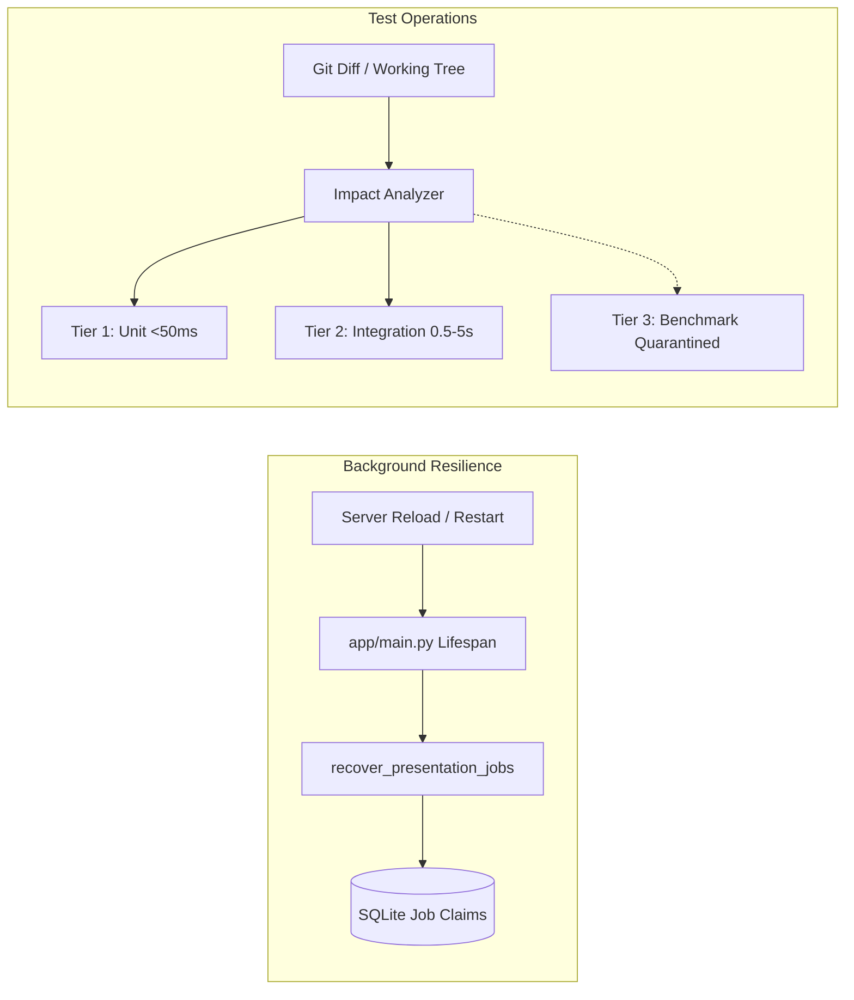
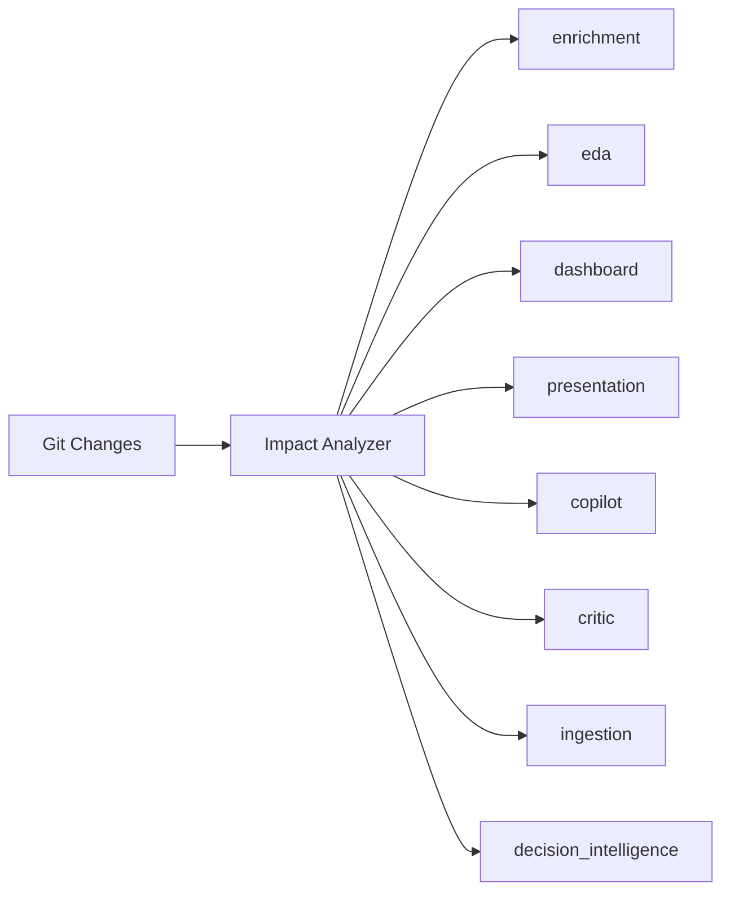

# Layer 5: Platform Reliability & Test Operations

> **Parent:** [README.md](../../README.md) &rsaquo; [System Architecture](../system-architecture.md) &rsaquo; **Layer 5**

## 1. Architectural Mission: Operational Resilience & Fast Feedback

Layer 5 is the cross-cutting engineering backbone supporting all active application layers. It ensures that long-running background generation jobs survive process reloads, and that local developers can verify code modifications with sub-second feedback without suite pollution.



---

## 2. Core Subsystems & Codebase Proof

### A. Startup Background Job Recovery
Implemented in `backend/app/services/presentation/pipeline_orchestrator.py` and invoked during `app/main.py` lifespan:
1. **PID Verification**: Scans jobs where status is `pending` or `running`. Checks the recorded worker PID against the host OS process table.
2. **Atomic SQLite Reclaim**: If the owning PID is no longer alive, claims the job atomically via SQLite compare-and-set updates, incrementing `recovery_attempt_count`.
3. **Preserved Generation Scope**: Resumes execution using the identical job ID, retaining source sheet IDs, brief settings, instructions, and theme tokens.
4. **Bounded Recovery Attempts**: Automatic recovery is bounded to **3 attempts** (`retry_count <= 3`). If a job fails 3 times, it transitions to terminal failure to prevent infinite reload loops.
5. **Terminal State Protection**: Completed (`ready`), user-cancelled (`cancelled`), or validation-failed (`failed`) jobs are never relaunched.

### B. Modular Test Pyramid (`backend/pytest.ini`)

| Execution Tier | Pytest Marker | Latency Target | Scope & Invariants |
| :--- | :--- | :---: | :--- |
| **Tier 1: Unit** | `@pytest.mark.unit` | `< 50ms` / test | Pure in-memory algorithmic transformers. Zero DB writes, zero network, zero LLM calls. |
| **Tier 2: Integration** | `@pytest.mark.integration`, `@pytest.mark.db` | `0.5s - 5s` / mod | FastAPI endpoints, SQLite schema migrations, multi-stage pipelines. |
| **Tier 3: Benchmark** | `@pytest.mark.benchmark` | `30s - 15m` | Multi-case LLM evaluations, large matrix latency profiling (quarantined by default). |

### C. The 8 Registered Domain Modules (`tests/module_registry.py`)



1. **`enrichment`**: Semantic enrichment, formula discovery, table synthesizer.
2. **`eda`**: Exploratory data analysis, distributions, group-by metrics.
3. **`dashboard`**: Adaptive multi-domain dashboard and disclosure cards.
4. **`presentation`**: Slide director, pipeline orchestrator, layout selection, visual QA.
5. **`copilot`**: Conversational Q&A, query planner, multi-model war room.
6. **`critic`**: Deterministic claim validation and evidence store traceability.
7. **`ingestion`**: Dataset upload, Kaggle dataset loader, sheet catalog.
8. **`decision_intelligence`**: Rule/embedding decision engines and executive briefing.

### D. Pre-Push Impact Runner (`scripts/run_impacted_tests.py`)
Inspects `git status` and `git diff` against `origin/main` to identify modified files and executes only the affected module tests:

```bash
# Run tests strictly for modules impacted by your working changes
python scripts/run_impacted_tests.py --impacted

# Run only ultra-fast unit tests for impacted modules (< 2s)
python scripts/run_impacted_tests.py --impacted --unit

# Run a specific domain module
python scripts/run_impacted_tests.py --module presentation
python scripts/run_impacted_tests.py --module dashboard --unit

# List all registered modules and their test files
python scripts/run_impacted_tests.py --list

# Git pre-push hook mode (used before git push)
python scripts/run_impacted_tests.py --pre-push
```
