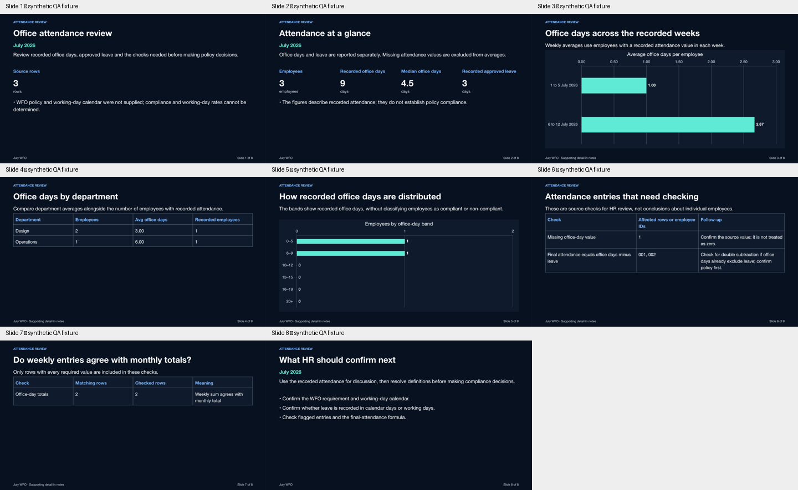
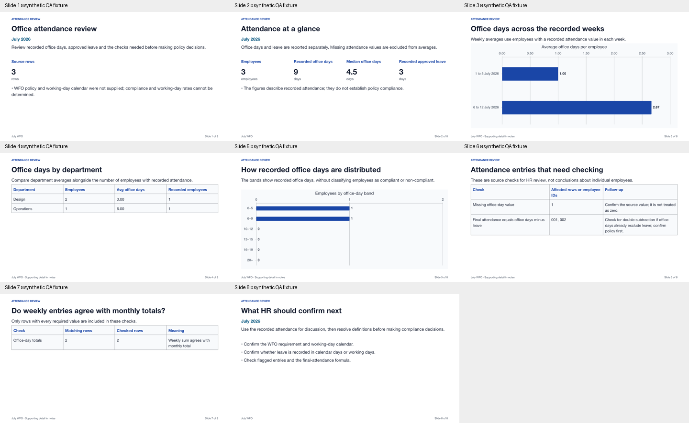

# Presentation space usage: fixes and verification

Implementation update: 3 October 2026. The application fixes below implement the layout recommendations from the original review. The historical findings and diagnostic screenshots follow this update.

## Implemented changes

| Review finding | Implemented behavior |
|---|---|
| Empty hero column and oversized panels | Standard text and cover layouts reclaim the full 864-point content width. Metrics only allocate space when present. |
| Charts do not use the available space | A chart uses the full content width with one introduction. Supporting bullets and measures are explicitly included in presenter notes. A browser wrapper also limited a 355-pixel chart region to 230 pixels; its inner canvas now fills all 355 pixels, verified in the live studio. |
| Missing comparison table and silently truncated takeaways | Comparison tables now export as editable tables. Every row and column is retained. All KPI takeaways are rendered, or excessive content produces an actionable error. |
| Small typography and inconsistent geometry | A shared 960 × 540 layout contract drives browser, PPTX and PDF placement: 30-point titles, 18-point body, 16-point tables, 14-point chart labels, and 11-point ancillary source notes. Covers use 38-point titles. |
| Dense tables cross the footer | Tables use measured wrapping estimates plus native-font allowance, weighted column widths, repeated headers and continuation pages. The studio has keyboard-accessible page controls outside the slide canvas. Oversized individual rows fail instead of being clipped. |
| Missing action dependencies | Action rows retain owners/status, supplied timing, success measures and dependencies. Other supplied rationale is encapsulated in notes. Unspecified owners and targets remain unconfirmed. |
| Donut labels unavailable or unreadable | Editable native composition charts include a separate category/count/share value key. PDF uses the same readable key approach; text stays on the themed background. Browser charts have visible values and a screen-reader data table with exact values. |
| Cached verification approves incorrect old content | Export re-evaluates review gates and evidence checks. Legacy count-as-percent, unsupported majority and broken continuation-title cases fail validation. Existing content and notes seals remain enforced. Recorded odometer units are explicitly km in the grounded fallback. |
| Studio PDF still used old print layout | The PDF button now exports the current editor spec through the shared-layout PDF endpoint, with validation, busy state and readable error feedback. A specialized slide no longer sends every standard slide through the older PDF adapter. |

Colors still come from the centralized slide themes. No new slide palette or separate dark/light switch was introduced. Technical supporting detail is encapsulated in notes rather than discarded. Normal exports enforce content verification; the replay script has an explicit diagnostic-only legacy-content bypass for layout inspection, without bypassing immutable content/notes seals.

The core implementation is in [shared geometry](../backend/app/services/presentation/templates/layout_geometry.json), [layout resolver](../backend/app/services/presentation/slide_layout.py), [native PPTX adapter](../backend/app/services/pptx/resolved_layout.py), [PDF adapter](../backend/app/services/presentation/resolved_pdf.py), and [browser adapter](../frontend/src/components/presentation/slides/ResolvedSlideContent.jsx).

## Verification and review samples

- Presentation regression suite: **273 passed**, with the two live narration/service tests excluded. Local test output includes pre-existing pandas/FastAPI warnings and unavailable Ollama background embedding calls; the presentation assertions passed.
- Frontend deck controls, job recovery, business-content and resolved-canvas tests passed. Production build passed; existing Sass deprecation and bundle-size warnings remain.
- **5,400 slide contrast checks passed** across the 10 centralized palettes and 11 layouts. This verifies token contrast, not complete WCAG certification.
- Visually inspected the nine-slide frozen legacy replay, its table continuation pages, and an eight-slide synthetic HR fixture in dark and light PPTX plus light PDF. Separate donut exports and dense-table pagination were checked. The table-font allowance was increased after a rendered diagnostic exposed a footer collision.
- Live studio verified at mobile/reflow and desktop breakpoints. The expanded chart's browser canvas was measured at the same width and height as its resolved chart region. The accessibility tree exposes the exact category values. The temporary desktop viewport override was reset after testing.

These are **synthetic three-employee QA examples**, not the user's July HR results or the 259-employee reference deck:

[Dark sample PPTX](reviews/presentation-space-usage/fixed/readable-dark-fixture.pptx) · [Light sample PPTX](reviews/presentation-space-usage/fixed/readable-light-fixture.pptx) · [Dark PDF](reviews/presentation-space-usage/fixed/readable-dark-fixture.pdf) · [Light PDF](reviews/presentation-space-usage/fixed/readable-light-fixture.pdf).





## Limits and delivery handoff

The original legacy deck's unsupported commercial claims were not rewritten or re-certified. It needs a fresh evidence-grounded deck before business use; a layout-only diagnostic is not an approved presentation. Existing saved source records were not edited for these tests. Rendered results use the bundled PPTX renderer and PDF renderer, not Microsoft PowerPoint itself. Font metrics and internal chart plotting differ between adapters, even though their content regions and table pagination are shared. Native Office verification remains the final visual check.

The shared contract covers the 11 standard layouts in its registry. Specialized image stories, visual-intelligence layouts and talent/burnout panels retain their existing adapters and require separate visual review. Standalone HTML export remains a separate renderer; the PDF button now uses the tested PDF adapter rather than that HTML print path.

| Delivery role | Handoff |
|---|---|
| Project manager | Standard-layout repairs are implemented and regression-tested. Review the supplied before/after evidence; do not approve the historical legacy claims as a deliverable. |
| Lead developer | Keep all future standard-layout changes in the shared resolver and exercise the readable-layout regression suite. Preserve table rows, exact chart values and explicit notes assignments. |
| Solution architect | The three standard output adapters now share one geometry contract. Extending specialized layouts and standalone HTML should consume that contract rather than introduce another geometry implementation. |
| AI director | Planning owns evidence-supported meaning; deterministic layout owns placement and overflow. Unsupported claims must be refreshed from evidence rather than concealed by improved visuals. |

---

# Original slide-by-slide review (historical baseline)


Review date: 3 October 2026. Reviewed through the requested presentation-design, storytelling, data-visualization and architecture lenses.

The main problem is a fixed panel layout with small text, combined with incomplete preview/export parity. Enlarging the chart helps, but some slides also contain the wrong business interpretation. Repair those separately so better design does not make unsupported claims look more convincing.

## What was tested

The browser at `http://localhost:5175/?sheet_id=9967380#presentation` opened a nine-slide **Multi store performance, footfall & unit sales executive review**, Executive Obsidian theme. Its slide titles and contents match saved deck `deck_e467ac80193f`, created 2 October 2026 at 16:31 UTC. This is a legacy saved deck without the newer business-content contract; later pipeline fixes do not automatically rewrite it.

I navigated all nine slides directly in the existing browser. I froze the saved JSON through a read-only database connection, replayed it through the current PowerPoint exporter, and rendered and inspected every exported slide. No generation job, model call, source-data update or saved-deck update was performed. The saved spec's SHA-256 remained `a76681d18314826e82287f212e8397d2e45cee851fd208a1557fe987a49f8473`.

The diagnostic copy uses the existing centralized slide theme. The original cached PPTX could not be imported by the diagnostic renderer because it contains a negative chart-axis ID. Replaying the same saved data through the current exporter produces valid unsigned IDs and renders all nine slides. Findings below concern that current export replay unless stated otherwise.

Browser screenshot capture was unavailable, so browser observations use its accessibility tree and read-only DOM inspection. Export images use the bundled presentation renderer, not a Microsoft PowerPoint screen capture. Native Office wrapping and donut-label behavior still require a final PowerPoint check.


## Slide-by-slide findings and recommended action

| Slide | Finding from direct inspection | Recommended composition / action |
|---|---|---|
| 1 — Title | `title_hero` has no metrics but reserves the right metric column. The 6.8-inch narrative card occupies only part of the 11.7-inch content width; approximately 42% of that width remains unallocated to content. Text sits in an oversized rounded panel. Footfall/store claims do not match the recorded fields. | Use a spacious full-width cover with one plain-language title, reporting scope and one supporting line. Collapse an absent metric column. Confirm the objective against source capabilities before approving the title. |
| 2 — Baseline | Four 2.2-inch-high KPI panels use 9-point labels and 22-point values. Repeated audit text competes with the numbers. Browser displays three takeaways; the native exporter silently takes only the first two. `$131,073.71` is the average **odometer**, not a currency benchmark. | Show a short row of useful, correctly labelled measures, with larger values and readable definitions. Encapsulate technical verification in notes/evidence details. Paginate or explicitly assign the third takeaway to notes; never silently truncate it. Correct the unit binding before design approval. |
| 3 — Volume | Chart rectangle is 6.7 × 4.8 inches, only 32.2% of the whole slide and 57.3% of the common body envelope. The plot inside it is smaller still. A 4.7-inch-wide panel repeats generic bullets and completeness metrics. Actual chart is **total odometer by Make**, unrelated to a time-based throughput/resilience claim. Labels show long numbers with unnecessary decimals. | Give the verified chart approximately 75–85% of the body, with one concise takeaway. Use a faithful title and explicit km units. Format a display scale such as million km while retaining exact editable values. Encapsulate supporting audit detail in notes. |
| 4 — Dispersion | Reuses slide 3's identical chart. A 1.1× **average** dispersion claim sits next to **total** odometer bars; these totals have a roughly 4.37× max/min ratio and depend on group size. Repeated commentary again takes 40% of body width. | Only keep a separate dispersion slide if it answers a distinct question. Bind a verified average-by-Make chart, with group counts, to the average comparison; otherwise consolidate the repeated visual in the story. Do not label totals as productivity. |
| 5 — Composition | Donut represents Colour counts `[407, 321, 99, 94, 79]`, but its saved unit is `%`. White is 40.7%, not a majority. Browser donut labels are explicitly disabled; the diagnostic render also lacks direct numeric labels. The native exporter enables labels, so Office behavior must be checked separately. | Prefer directly labelled horizontal bars, showing count and share. If retaining the donut, show category, count and calculated share visibly and provide an accessible data equivalent. Use centralized palette tokens and boundaries; interpretation must not depend on hue. |
| 6 — Diagnostics | Browser shows a six-row table alongside interpretation text. Current native `comparison_split` ignores `slide.table` entirely and renders one full-width text panel. This is missing evidence, not just empty space. The talent/retention narrative is unrelated to this car dataset. | First fix table support or select a compatible table layout. Then show only business-relevant recorded findings; encapsulate technical audit columns in supporting details. Reject the export if a required table is absent. |
| 7 — Actions | Three fixed 3.7 × 4.1-inch cards contain 9–13-point text and large unused areas. Long generic roles and technical prose crowd the usable text area. Targets include an unsupported 15% reduction in 90 days and zero disruption. Dependency information appears in preview but is not written by the native action renderer. | Use three readable action rows: proposed action, confirmed owner/status, confirmed timing and success measure. Keep unknown commitments explicitly unconfirmed. Encapsulate deeper rationale in notes while preserving dependencies. Do not infer targets or owners from a presentation template. |
| 8 — Governance | The supposed SLA responsibility matrix is an evidence ledger, with no actual responsibility/SLA columns. Five equally sized native columns wrap long text awkwardly; the browser allocates different widths. Six rows use 12-point text. This slide is fairly full, but much of the space is consumed by technical IDs and repeated source/status text. | If confirmed ownership exists, use Action / Owner / Due / Status. Otherwise rename the purpose and show recorded findings. Share column widths and wrapping rules across renderers. Encapsulate IDs and repeated verification details in the appendix/evidence view. |
| 9 — Evidence | Six technical rows occupy a five-column table. Long IDs wrap; a store-week claim appears despite absent store/date fields. Title says `(1/2)`, but this is the last slide and no second part exists. | Keep lineage accessible as an optional appendix. Present human-readable measure, result, unit and source definition; hide internal identifiers in the normal presentation view. Validate continuity labels against actual slide count. Do not certify the legacy store-week claim. |

Individual export images: [1](/Users/vinayksharma/Developer/pulsehr-ai/docs/reviews/presentation-space-usage/slide-1.png), [2](/Users/vinayksharma/Developer/pulsehr-ai/docs/reviews/presentation-space-usage/slide-2.png), [3](/Users/vinayksharma/Developer/pulsehr-ai/docs/reviews/presentation-space-usage/slide-3.png), [4](/Users/vinayksharma/Developer/pulsehr-ai/docs/reviews/presentation-space-usage/slide-4.png), [5](/Users/vinayksharma/Developer/pulsehr-ai/docs/reviews/presentation-space-usage/slide-5.png), [6](/Users/vinayksharma/Developer/pulsehr-ai/docs/reviews/presentation-space-usage/slide-6.png), [7](/Users/vinayksharma/Developer/pulsehr-ai/docs/reviews/presentation-space-usage/slide-7.png), [8](/Users/vinayksharma/Developer/pulsehr-ai/docs/reviews/presentation-space-usage/slide-8.png), [9](/Users/vinayksharma/Developer/pulsehr-ai/docs/reviews/presentation-space-usage/slide-9.png).

## Root causes with code evidence

1. **Layout selection does not guarantee physical geometry.** The registry advertises a 65% chart budget for `CHART_INSIGHT`, but exports route directly through legacy layout names. Fixed chart/narrative rectangles consume different proportions. The registry has families and budgets, not shared positions, measured text regions and typography. See [registry](/Users/vinayksharma/Developer/pulsehr-ai/backend/app/services/presentation/visual/layout_registry.py:149), [export routing](/Users/vinayksharma/Developer/pulsehr-ai/backend/app/services/report_generator.py:104), [native chart layout](/Users/vinayksharma/Developer/pulsehr-ai/backend/app/services/pptx/pptx_visual_layouts.py:20).
2. **Absent content does not consistently reclaim space.** The native title hero reserves 6.8 inches for narrative irrespective of metric presence. The preview always emits its metric column with a fixed two-column grid. See [native hero](/Users/vinayksharma/Developer/pulsehr-ai/backend/app/services/pptx/pptx_card_layouts.py:87), [preview hero](/Users/vinayksharma/Developer/pulsehr-ai/frontend/src/components/presentation/slides/SlideLayoutViews.jsx:169), [grid](/Users/vinayksharma/Developer/pulsehr-ai/frontend/src/styles/refinements.scss:5835).
3. **Small fonts hide capacity problems.** Native body text is commonly 10–11 pt, KPI labels 9 pt, table text 12 pt and slide titles 22 pt. Large container coverage therefore does not mean readable information coverage. Native chart labels are 10 pt and axes 11 pt. See [KPI renderer](/Users/vinayksharma/Developer/pulsehr-ai/backend/app/services/pptx/pptx_card_layouts.py:188), [chart styling](/Users/vinayksharma/Developer/pulsehr-ai/backend/app/services/pptx/pptx_charts.py:94).
4. **Renderers do not share content visibility or dimensions.** Most slides in this deck use `SlideLayoutViews`, even though they also have `visual_spec`; merely creating a canonical spec does not activate the canonical browser renderer. Native comparison never reads the table. KPI bullets are capped at two; table renderers cap rows at different counts. See [browser dispatch](/Users/vinayksharma/Developer/pulsehr-ai/frontend/src/components/PresentationSlideContent.jsx:133), [comparison export](/Users/vinayksharma/Developer/pulsehr-ai/backend/app/services/pptx/pptx_card_layouts.py:235), [KPI truncation](/Users/vinayksharma/Developer/pulsehr-ai/backend/app/services/pptx/pptx_card_layouts.py:226).
5. **Layout QA estimates overflow, rather than proving the rendered result.** The monitor estimates text wrapping on a 1920 × 1080 canvas with a 680-pixel content budget. Its flags focus on excess characters, rows and categories. It does not measure underused regions, visible-value coverage, exported missing objects or actual font readability. All replayed objects fit the native canvas boundaries, yet slide 6 is missing its table. See [monitor](/Users/vinayksharma/Developer/pulsehr-ai/backend/app/services/presentation/spatial_overflow_monitor.py:35).
6. **Repetitive and misbound content consumes space.** Identical evidence/benchmark/action bullets appear on every saved slide. Persona framing, units and visual bindings in this legacy deck remain unsafe. This is a separate content-version problem; changing SCSS or an AI prompt alone cannot repair it.

## One-slide experiment, generation bypassed

I replayed **slide 3 only**, changing its layout selector from `chart_narrative` to the already available `full_chart_takeaway`. The four chart values and centralized background were verified unchanged.

| Measurement | Existing layout | Isolated layout test |
|---|---:|---:|
| Chart rectangle | 6.7 × 4.8 in | 11.7 × 3.9 in |
| Chart rectangle area | 32.16 in² | 45.63 in² |
| Share of 13.333 × 7.5 in canvas | 32.2% | 45.6% |
| Share of common 11.7 × 4.8 in body envelope | 57.3% | 81.2% |

The chart receives **41.9% more rectangle area**. These percentages measure allocated objects, not plotted marks or painted text. The body envelope is a diagnostic reference, not a claim that every layout currently shares one geometry contract.

This is a layout proof, **not an approved presentation slide**. The full-chart renderer hides the metrics/bullets from the visible canvas; they remain in the frozen source. It leaves the legacy title/narrative unchanged, retains small fonts and has less plot height. A final design must explicitly decide which supporting content belongs in notes and verify that nothing required is lost.

[Single-slide editable test PPTX](/Users/vinayksharma/Developer/pulsehr-ai/docs/reviews/presentation-space-usage/slide-3-layout-test.pptx) · [Test image](/Users/vinayksharma/Developer/pulsehr-ai/docs/reviews/presentation-space-usage/slide-3-layout-test.png) · [Measured replay geometry](/Users/vinayksharma/Developer/pulsehr-ai/docs/reviews/presentation-space-usage/geometry.json).

The reusable [replay script](/Users/vinayksharma/Developer/pulsehr-ai/scripts/review_presentation_layout.py) reads a saved deck or a frozen JSON file. It supports one-based slide selection and a layout-only override, writes unique diagnostic files outside production exports, and never updates the saved deck. Existing content verification stays active; a selected contract slide keeps its existing seals rather than resealing changed content. Immutable decision briefs can only be replayed as complete decks.

```sh
backend/.venv/bin/python scripts/review_presentation_layout.py \
  --deck-id deck_e467ac80193f --slide 3 \
  --output-dir /tmp/highview-layout-before

backend/.venv/bin/python scripts/review_presentation_layout.py \
  --spec /tmp/highview-slide-space-review/current-deck.json --slide 3 \
  --layout full_chart_takeaway --output-dir /tmp/highview-layout-after
```

Use the first run's frozen source path for subsequent experiments to avoid differences caused by intervening edits. Render the resulting PPTX, inspect it at full size and compare geometry and source values before moving to the next slide.

## Handoff to delivery roles

| Role | Recommended action | Completion evidence |
|---|---|---|
| Project manager | Treat missing content and incorrect metric meaning as P0. Then deliver one approved slide family at a time: table parity, empty hero, chart, KPI, actions, appendix. Keep each family independently reviewable. | A before/after slide, source-value checks, preview/PPTX/PDF review and accessibility results for each family. |
| Lead developer | Start with slide 6's missing table and slide 2's silent bullet cap. Introduce an explicit visible-content/notes mapping, handle empty regions, increase typography and allocate chart/table space from content. Preserve current business-content contracts. | Required tables/charts/values and agreed visible text appear in the native export. No unreported truncation. No font-shrinking fallback. |
| Solution architect | Define one resolved layout contract: canvas units, safe margins, region rectangles, font roles, column widths, overflow decisions and semantic content assignments. Browser, PPTX and PDF consume it through adapters. Reuse centralized theme tokens. | Same content and relative composition across all three outputs. A changed theme changes tokens, not layout meaning. |
| AI director | Have planning choose an evidence-supported message and visual purpose. It may propose a composition; deterministic layout code owns geometry. Encapsulate audit/model details in supporting views. Record content/exporter versions so older decks are revalidated explicitly. | Every headline, unit, comparison, commitment and visual references the appropriate evidence; repeated boilerplate and invented business context fail review. |

The presentation-design recommendation is a flat, data-led composition: one conclusion headline, one dominant visual, a short explanation and a restrained source note. Intentional whitespace supports hierarchy; empty structural columns and huge panels around small text do not.

## Acceptance checks for the first approved slide

- Use the current centralized dark/light palettes, with no new local color literals. Retain editable chart/table objects and exact numeric data.
- Target 30–36 pt slide titles, 18–22 pt substantive body text, 14–16 pt chart labels and 11–12 pt ancillary source notes. These are proposed projection-readability targets, not WCAG font-size mandates. Split a crowded table or simplify its public columns before shrinking text.
- Give a single chart approximately 75–85% of the safe body when it is the main evidence; use fewer regions for less content. Do not enforce a blanket filled-area percentage on covers or sparse slides.
- Keep the project's 7:1 text-contrast target against actual rendered backgrounds in both themes. WCAG AAA enhanced contrast requires 7:1 for ordinary text and allows 4.5:1 for large text; it does not make tiny text readable or certify overall accessibility by itself. [W3C enhanced-contrast guidance](https://www.w3.org/WAI/WCAG22/Understanding/contrast-enhanced.html).
- Check reading order, useful alt text, keyboard access in the studio, visible category/value labels and an accessible data equivalent. Do not rely on tooltip-only values, scrollable regions or color alone inside exported slides.
- Match visible content, chart values/units, table rows, notes and pagination across preview, PPTX and PDF. Verify native Office rendering before approving download quality.
- Check both overflow and underuse after rendering: absent columns collapse; required objects are present; labels fit; no text is clipped or silently dropped. The replay geometry report is supporting evidence, not a replacement for visual inspection.

Original review verification (before the implementation above): all nine replayed slides rendered and were visually inspected; original saved JSON stayed unchanged; the single-slide chart values/background matched; the replay script was checked against a valid sealed fixture, modified sealed content, invalid slide selection and a production-output path. No application renderer or production generation behavior was changed during this review.
